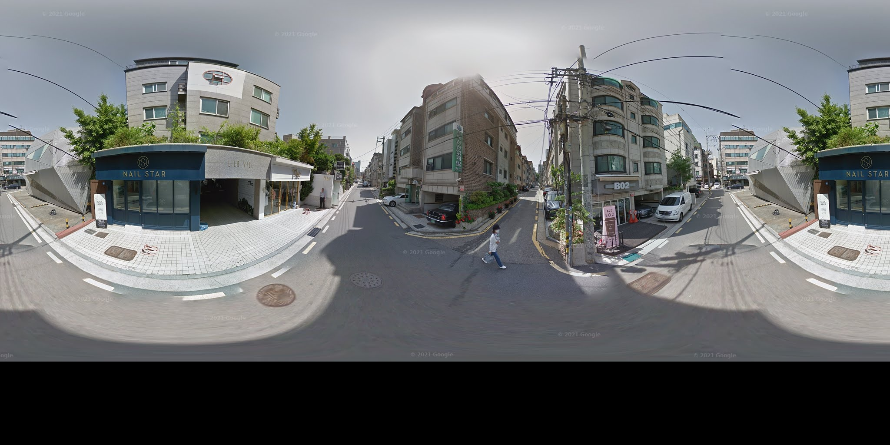
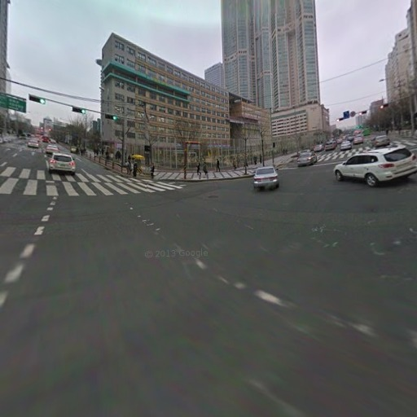
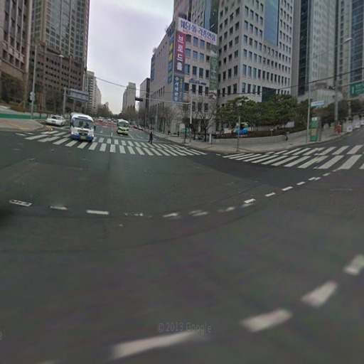
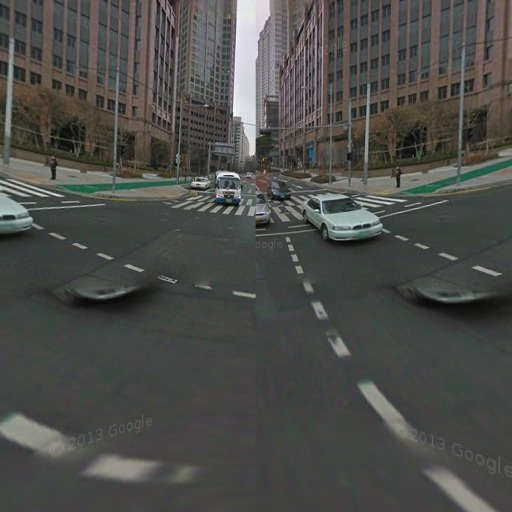
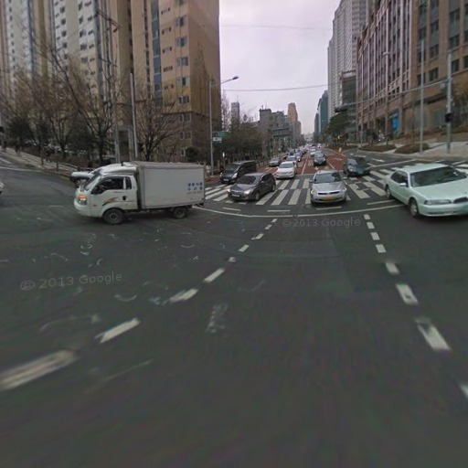

# Seoul Road Environment and Street View Sampling

This repository contains a Seoul road-environment sampling workflow and prototype Google Street View acquisition utilities.

The current road sampling pipeline:

- builds a 500 m Seoul grid in EPSG:5186
- reads/caches OpenStreetMap roads from Geofabrik via `osmextract`
- filters road classes used for urban road-environment sampling
- constructs a unified Seoul road network
- generates dense regular candidate points along roads
- applies reproducible greedy Euclidean thinning to avoid clustered samples
- assigns final points to 500 m grids only after sampling
- writes a no-geometry parquet output
- renders an interactive Leaflet diagnostic map

The current Street View prototype pipeline:

- runs metadata-first Google Street View checks from sampled points
- stores Street View metadata and pilot summaries in parquet
- downloads a small benchmark set of unique panoramas
- reuses existing panorama JPGs when available
- generates local directional crops from panoramas using `py360convert`
- writes download manifests, logs, and crop-projection debug contact sheets

## Repository Layout

Tracked source files are intentionally lightweight:

- `R/road_environment_sampling.R`: reusable functions
- `scripts/build_seoul_grid_500m.R`: builds the 500 m Seoul grid
- `scripts/run_road_network_sampling_global.R`: runs the full global road-network sampling workflow
- `scripts/render_leaflet_global.R`: rerenders only the Leaflet visualization from existing outputs
- `tests/test_road_environment_sampling.R`: lightweight global sampling tests
- `tests/test_gsv_metadata_pilot.py`: metadata-only Street View pilot for the first 1000 sampled points
- `tests/test_obtain_gsv_one.py`: one-point end-to-end Street View panorama prototype
- `tests/test_obtain_gsv_100.py`: small cached/benchmark panorama acquisition and crop-regeneration pipeline

Generated outputs, cached OSM extracts, spatial files, parquet files, Leaflet HTML, and local reference corpora are ignored by Git.

## Data Architecture

Generated data live under `data/`:

- `data/geodata/`: source/admin geodata such as the Seoul boundary
- `data/grid_500m/`: 500 m aggregation/visualization grid
- `data/osm/`: cached Geofabrik/OSM downloads and filtered Seoul road network
- `data/sampling_global/`: global road-network sample outputs and Leaflet map
- `data/streetview/`: Street View metadata, panoramas, crops, manifests, logs, previews, and debug sheets

Current road sampling outputs:

- `data/sampling_global/seoul_road_network_samples.parquet`: final no-geometry point sample table
- `data/sampling_global/seoul_road_network_sampling_map.html`: lightweight Leaflet map
- `data/sampling_global/seoul_road_network_sampling_map_files/`: htmlwidget dependencies

Street View output layout:

```text
data/streetview/
  metadata/
    gsv_metadata_pilot_1000.parquet
    gsv_metadata_pilot_summary.parquet
    gsv_pano_duplication_counts.parquet
    gsv_capture_year_distribution.parquet
    gsv_metadata_test.parquet
  panoramas/raw/
  crops/front/
  crops/right/
  crops/rear/
  crops/left/
  manifests/
    gsv_download_manifest_100.parquet
  logs/
  previews/
  debug/
```

## Visual Examples

The road-network sampling workflow writes an interactive Leaflet map under `data/`. A lightweight copy is tracked for README access:

[Open the interactive Leaflet map](docs/assets/seoul_road_network_sampling_map.html)

The Street View prototype stores raw panoramas and local directional crops. Example panorama `z_3m1MPKrsDvaRndk5YKlQ`:



| Front | Left | Rear | Right |
| --- | --- | --- | --- |
|  |  |  |  |

The full generated outputs remain under ignored `data/` directories. Only this small curated README subset is tracked under `docs/assets/`.

## Reproducible Workflow

Run the lightweight tests:

```bash
Rscript tests/test_road_environment_sampling.R
```

Build the 500 m grid:

```bash
Rscript scripts/build_seoul_grid_500m.R
```

Run the full sampling workflow:

```bash
Rscript scripts/run_road_network_sampling_global.R
```

Rerender only the Leaflet map without rerunning OSM downloads or sampling:

```bash
Rscript scripts/render_leaflet_global.R
```

Run the Street View metadata pilot. The API key is read from `GOOGLE_MAPS_API_KEY`; do not hardcode it.

```bash
python tests/test_gsv_metadata_pilot.py
```

If the key is exported from an interactive-only section of `~/.bashrc`, run through interactive bash:

```bash
bash -ic 'python tests/test_gsv_metadata_pilot.py'
```

Run the one-point panorama prototype:

```bash
python tests/test_obtain_gsv_one.py
```

Run the 100-panorama benchmark from metadata pilot results:

```bash
python tests/test_obtain_gsv_100.py
```

Regenerate crops from existing cached panoramas without redownloading:

```bash
env GSV_EXISTING_PANOS_ONLY=true GSV_OVERWRITE_CROPS=true GSV_BENCHMARK_N_PANOS=20 python tests/test_obtain_gsv_100.py
```

Useful environment variables:

- `SEOUL_TARGET_SAMPLE_COUNT`: final target point count, default `40000`
- `SEOUL_CANDIDATE_SPACING_M`: regular spacing for road candidates, default `10`
- `SEOUL_MIN_SAMPLE_SPACING_M`: greedy Euclidean thinning distance, default `50`
- `SEOUL_SAMPLE_SEED`: deterministic shuffle seed, default `20260517`
- `SEOUL_CANDIDATE_WORKERS`: parallel workers for road candidate generation, default `40`
- `SEOUL_CANDIDATE_CHUNK_SIZE`: road features per candidate-generation chunk, default `2000`
- `SEOUL_FORCE_GRID=true`: rebuild the 500 m grid
- `SEOUL_FORCE_OSM=true`: refresh the cached Geofabrik road extract
- `SEOUL_SAMPLES_PARQUET`: parquet path used by the Leaflet-only renderer
- `SEOUL_LEAFLET_MAX_POINTS`: sampled points rendered in Leaflet, default `30000`

The Leaflet diagnostic map intentionally renders only the Seoul boundary, 500 m grid boundaries, and sampled points. Road geometries are excluded from the interactive map to keep browser rendering stable; roads are still used by the sampling pipeline.

Street View environment variables:

- `GOOGLE_MAPS_API_KEY`: required for official Street View metadata endpoint calls
- `GSV_METADATA_PILOT_SIZE`: metadata pilot row count, default `1000`
- `GSV_METADATA_THROTTLE_SECONDS`: polite metadata request delay, default `0.05`
- `GSV_BENCHMARK_N_PANOS`: number of unique panoramas for benchmark/crop validation, default `100`
- `GSV_BENCHMARK_WORKERS`: thread-pool workers for panorama benchmark, default `6`
- `GSV_BENCHMARK_ZOOMS`: tile zoom fallback list, default `2,1`
- `GSV_EXISTING_PANOS_ONLY=true`: reuse existing panorama JPGs and skip download attempts
- `GSV_OVERWRITE_CROPS=true`: regenerate directional crops even if crop JPGs already exist

Street View acquisition remains prototype-scale. Do not use these scripts for full-dataset downloading without adding batching, rate-limit controls, failure recovery, and quota safeguards.

## Ignored Outputs

The `.gitignore` excludes generated and heavyweight artifacts, including:

- `data/`: generated grids, OSM extracts, sampling parquet, Street View images, manifests, logs, debug sheets, and Leaflet files
- `*.gpkg`, shapefile sidecars, GeoJSON, rasters, parquet, Arrow/Feather, and CSV files
- Leaflet/htmlwidget exports such as `*.html` and `*_files/`
- image exports such as `*.png` and `*.jpg`
- `fuse_ref/`: local PDF/reference corpus
- `pre_models/`: external model checkout and large model data
- R session files and local caches

Existing outputs are not deleted by this setup. They remain available locally but are intentionally untracked because they are reproducible, large, machine-specific, or derived from external data.

## Optional renv

This repository can be initialized with `renv` if you want package-version pinning:

```r
install.packages("renv")
renv::init()
renv::snapshot()
```

The local `renv/library/` directory is ignored; `renv.lock` should be tracked if you initialize it.
