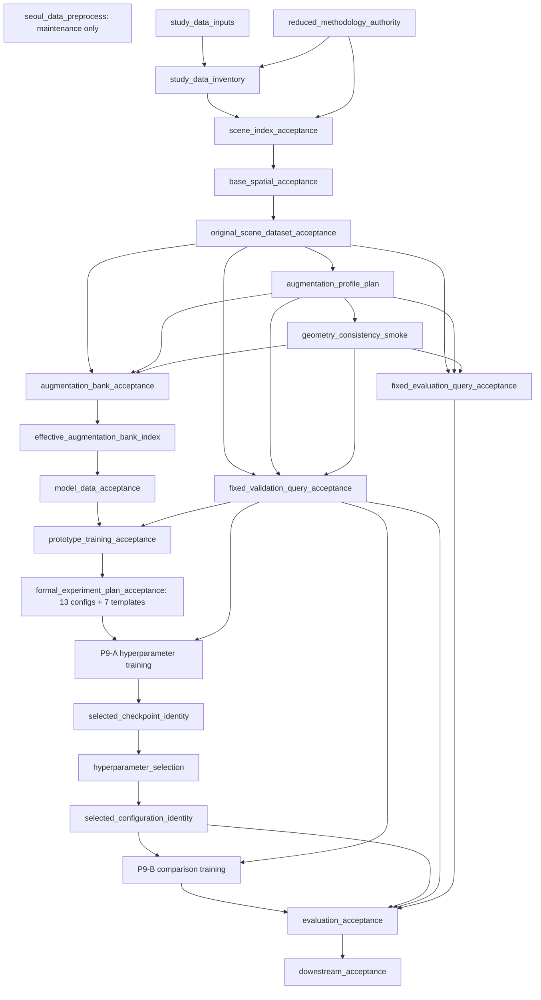

# Reduced Methodology Targets Implementation Blueprint

## 0. Document Status and Authority

- **상태:** 승인된 read-only audit를 반영한 active implementation blueprint.
- **개정 시각:** 2026-08-30 KST.
- **구현 저장소 기준:** `/members/dhnyu/fuse`, branch `reduced`; P8 implementation commit is bound by the published P8 authority.
- **논문 방법론 기준:** `/members/dhnyu/dhnyu-masters-dissertation`, branch `reduced`, commit `ad8c8b5c17c5ca72dce7f30c2eb283f6041dbc9a`.
- **Active status:** P0-P7 accepted; P7 runtime acceptance `p7rta_c780441a553abe26772827d0`; P8 nested-comparison republication is the current plan-only implementation unit.
- **승인 근거:** [20260827_1748 reduced methodology read-only audit](../reports/20260827_1748_reduced_methodology_read_only_audit.md).
- **방법론 권위:** dissertation reduced Typst 원문, 승인 감사 보고서, 이 blueprint, 기존 구현/artifact 순이다.
- **작업 범위:** 이 개정은 P8-P9 comparison 계획과 그 plan-only publication contract만 변경한다. P1-P7 scientific artifacts, P9 training, evaluation and maintenance execution remain outside scope.

이 문서의 active roadmap은 [P0 Authority](#p0-authority)부터 [P11 Downstream Evaluation](#p11-downstream-evaluation)까지다. 이전 I/C/T milestone은 active 순서를 결정하지 않으며 [Legacy Lineage](#9-legacy-lineage)에 disposition과 실행 이력만 보존한다.

## 1. Non-Negotiable Boundaries

### 1.1 Maintenance and research separation

| Existing target | Definition retained by this blueprint |
|---|---|
| `seoul_data_preprocess` | `KEEP_AS_IS`; independent maintenance target with no research dependency edge. |
| `study_data_inputs` | Accepted Seoul files and official-grid components are tracked read-only; no maintenance dependency. |
| `study_data_inventory` | The inventory/QC logic is retained, but its artifact is regenerated under P0/P1 identity. |

`seoul_data_preprocess`는 독립 maintenance target으로 유지한다.

- `_targets_maintenance.R`과 maintenance store를 유지한다.
- Research graph는 `seoul_data_preprocess` target에 dependency edge를 만들지 않는다.
- Research graph는 accepted Seoul files를 `study_data_inputs`로 read-only 추적하고 `study_data_inventory`에서 acceptance한다.
- Raw/canonical Seoul inputs를 이 roadmap 때문에 재생성하지 않는다.
- Maintenance output을 변경하는 별도 작업이 승인되기 전에는 research target이 그 파일을 쓰거나 덮어쓰지 않는다.
- CPU/data production은 model/GPU acceptance에 의존하지 않는다. P1-P4 production data는 해당 CPU/data gate만 통과하면 진행할 수 있다.

```text
seoul_data_preprocess                     # maintenance graph, no research edge

study_data_inputs
  -> study_data_inventory
  -> spatial_scene_index
  -> active research graph
```

### 1.2 Active methodology constants

| Contract | Active value |
|---|---|
| CRS | EPSG:5186 |
| Scene window | center-based, axis-aligned 500 m x 500 m |
| Source coverage | Seoul boundary plus 400 m buffer |
| Training centers | official 500 m grid centers inside Seoul boundary only |
| Intermediate/sliding centers | prohibited; no 250 m stride |
| Training/validation/evaluation | 2,421 / 400 / 1,600; total 4,421 |
| Off-grid exclusion | nearest training center distance at least 50 m |
| Model dimensions | `d=64`, `d_c=64`, `d_t=16`, `d_r=32` |
| Main augmentation bank | fixed before training; effective `K_aug=8` |
| K study master | common physical 16-view master; nested K=2/4/8/16 indices |
| Global dropout | 0.2 |
| Peak learning rate | `1 x 10^-3` |
| `lambda_IP` | 1 |
| Effective batch | 32 scenes |
| Validation interval/patience | every 5 epochs / 4 validation events |

### 1.3 Artifact publication rules retained from the previous blueprint

1. Scene-level production targets are cost-balanced dynamic branches, not one target per scene.
2. Each branch writes only its own staging/output path. Shared GeoPackage, Parquet, Zarr group, tar, checkpoint, or manifest writers are prohibited.
3. Publication order is staging, local QC, checksum, same-filesystem atomic rename, aggregate acceptance.
4. Plan/spec and file artifacts use `format="file"`; branch specifications use canonical JSON and stable hashes.
5. A failed aggregate acceptance does not force successful branches to recompute unless their scientific inputs changed.
6. R owns `targets`, spatial operations, plans and QC. Python owns ragged loading, augmentation, PyTorch model/training and GPU inference.
7. Long-running Python/GPU work runs in a subprocess, not `reticulate`.
8. Worker/thread/device/path changes are execution provenance unless they change numeric semantics.

## 2. Disposition and First Invalidation Boundary

Disposition terms in this document mean:

| Status | Blueprint meaning |
|---|---|
| `active` | Contract and artifact may remain an active parent unchanged. |
| `retained code` | Reusable computation logic remains, but it is not accepted until connected to the new contract. |
| `regenerate` | Code is retained while artifact identity and bytes must be regenerated from the new upstream. |
| `superseded` | Old target/contract is replaced by a new target family and cannot be an active parent. |
| `legacy` | Historical/reference only. No active outgoing scientific dependency. |

The last retained upstream is the accepted canonical Seoul source set. The first active invalidation is the old methodology fingerprint and reduced scene-population contract. The downstream boundary is:

```text
KEEP_AS_IS
  seoul_data_preprocess
  accepted canonical Seoul files
  study_data_inputs

FIRST INVALIDATION
  old methodology_contract
  -> old spatial_scene_index identity
  -> old population-bound membership/observation artifacts

SERIALIZATION HARD BOUNDARY
  old serialization v2
  -> old training_dataset_acceptance
  -> old DataLoader
  -> online two-view augmentation
  -> d=128 forward/DDP smoke
  -> old training/checkpoint/validation/evaluation
```

`KEEP_CODE_REGENERATE_ARTIFACT` applies to the source inventory, scene index, prototype selection, membership artifacts, base vector/raster/relation artifacts, spatial acceptance and geometry roundtrip. `REMOVE` means removal from active dependencies only; no file, store row, report, checkpoint, or artifact is deleted by this plan.

| Audit disposition | Blueprint implementation |
|---|---|
| `KEEP_AS_IS` | `seoul_data_preprocess`, maintenance/research separation, accepted Seoul files, `study_data_inputs`, generic target/resource infrastructure. |
| `KEEP_CODE_REGENERATE_ARTIFACT` | P1 inventory/index/selection, P2 membership/observations/relations/acceptance and P3 geometry roundtrip retain code but publish new identities/artifacts. |
| `MODIFY` | P2 topology fields, P3 serialization schema, P6 d64 model/loader, P7/P9 training contracts and P11 downstream integration. |
| `REPLACE` | Old methodology contract, serialization-v2 dataset acceptance, online augmentation, old DataLoader, prototype validation/checkpoint selection and old sweep plans. |
| `REMOVE` | Legacy authorization and obsolete artifact families lose active outgoing edges; bytes/files are not deleted. |
| `ADD` | P0 reduced authority, P4 banks, P5 fixed queries, P8 13-config plus 7-template plan, P9 selector identities, P10 held-out evaluation and P11 leakage gates. |

## 3. Scientific Identity, Seeds, and Fingerprints

### 3.1 Identity layers

Every artifact manifest declares its identity layer and parent identities. The layers are separate and never inferred from a filename alone.

| Identity | Required content |
|---|---|
| Source identity | accepted source paths, bytes/checksums, source manifest, CRS/provenance contract |
| Methodology identity | dissertation branch/commit, ordered imported Typst file set and hashes, module contract hashes |
| Scene identity | source + methodology + scene contract + center/grid/split/scene ID |
| Original observation identity | scene + membership/vector/raster/relation/topology config/schema/implementation hashes |
| Augmentation-view identity | original observation + profile + master view index + seed + augmenter implementation hash |
| Bank identity | ordered view identities, physical K, effective subset index, split and acceptance hash |
| Fixed-query identity | source original scene + query namespace/profile/query index/seed; no run/config identity |
| Model configuration identity | architecture and loss configuration; no worker/device/path fields |
| Training-run identity | model config + scientific training config + bank subset + run seed |
| Checkpoint identity | run identity + epoch/step + complete model/optimizer/scheduler/EMA/queue/sampler state hash |
| Evaluation identity | selected checkpoint + fixed query/gallery identity + metric/analysis contract |

All scientific manifests include `schema_version`, `methodology_authority_id`, upstream artifact IDs, canonical config SHA-256, implementation SHA-256, content SHA-256, and immutable output paths. Old artifacts missing required identity fields cannot be adopted as active parents.

<a id="32-canonical-seed-derivation"></a>
### 3.2 Canonical seed derivation

Canonical strings are UTF-8, field order is fixed as shown, separators are literal `|`, and the version is explicit.

- **Bank seed:** `SHA256(version|training-bank|profile_id|scene_id|master_view_id|operation|entity_id|attempt)`
- **Pair seed:** `SHA256(version|run_id|epoch|scene_id|training_inclusion_index)`
- **Modality-mask seed payload:** `run_id|inclusion_index|scene_id|selected_view_id|entity_id|modality`
- **Validation query namespace:** `validation-query`
- **Evaluation query namespace:** `evaluation-query`
- Validation/evaluation query seed payload excludes run ID and configuration ID.
- **View ID** includes base dataset ID, scene ID, augmentation profile, master view index and augmenter implementation hash.
- Workers, threads, device mapping and runtime path are excluded from scientific hashes and recorded in execution records.

Pair sampling is deterministic from the pair seed but uniform over unordered distinct pairs. Modality masks use a separate RNG stream, are resampled per inclusion and selected view, and never change stored view bytes.

### 3.3 Module methodology contracts

P0 publishes scoped contracts for scene construction, base spatial truth, original cache, augmentation, model, training, evaluation and downstream evaluation. A target depends on the immutable aggregate authority plus only the scoped contract(s) that affect its scientific result. Exact target names are defined in P0 below.

<a id="4-active-roadmap-p0-p11"></a>
## 4. Active Roadmap P0-P11

Each phase uses the same promotion fields: purpose, authoritative inputs, targets/dependencies, output, schema, fingerprint, invariants, smoke, pilot, production, promotion, invalidation and prohibited execution.

<a id="p0-authority"></a>
### P0 Authority

| Field | Contract |
|---|---|
| Purpose | Freeze the dissertation reduced branch and imported Typst source set as immutable methodology authority. |
| Authoritative inputs | Dissertation `reduced` at `109355b3d744248ca14749c5f74511537970d660`; ordered imports; approved baseline audit plus the tracked revised P4 authority supplement. |
| Output artifact | Source-set manifest, git-state record, module contracts, conflict-gate result, aggregate authority manifest. |
| Schema requirements | Branch, full commit, dirty flag, ordered path/hash list, import edges, module name/version/hash, conflict list, audit SHA, authority ID. |
| Scientific fingerprint | SHA-256 of commit + ordered imported file hashes + module contract hashes + schema/implementation versions. |
| Acceptance invariants | Branch/commit exact, clean dissertation tree, every import resolved once, no unclassified conflict, audit readable. |
| Smoke fixture | Parser fixture with nested imports and an intentional conflict that must block. |
| Pilot scale | Full ordered imported Typst set; no downstream computation. |
| Production scale | Same immutable authority; there is no larger scale. |
| Promotion criteria | All module contracts valid and `reduced_methodology_conflict_gate=PASS`. |
| Downstream invalidation | Any authority/content hash change invalidates scoped scientific descendants. |
| Prohibited early execution | No P1 scientific acceptance or later target may run without P0 PASS. |

Targets are defined in dependency order:

| Target | Direct dependencies | Role |
|---|---|---|
| `reduced_methodology_source_files` | literal authoritative Typst entry paths | Resolve the ordered imported source set as tracked files. |
| `reduced_methodology_git_state` | dissertation repository path | Require branch/commit/clean state and emit immutable git record. |
| `reduced_methodology_source_set` | source files, git state | Publish ordered file hashes and import graph. |
| `reduced_methodology_conflict_gate` | source set, approved audit | Emit PASS or `BLOCKED_BY_DISSERTATION_CONFLICT`; no silent interpretation. |
| `scene_methodology_contract` | source set, conflict gate | Scene/grid/split/CRS/buffer contract. |
| `base_spatial_methodology_contract` | source set, conflict gate | Membership/vector/raster/SN/CNT/WIT/INT/CON contract. |
| `original_cache_methodology_contract` | source set, conflict gate | Lossless original-scene cache and topology contract. |
| `augmentation_methodology_contract` | source set, conflict gate | Bank, absorption, geometry and consistency contract. |
| `model_methodology_contract` | source set, conflict gate | Full d64 architecture table contract. |
| `training_methodology_contract` | source set, conflict gate | Loss, optimizer, schedule, validation and checkpoint contract. |
| `evaluation_methodology_contract` | source set, conflict gate | Fixed-query, retrieval and held-out evaluation contract. |
| `downstream_methodology_contract` | source set, conflict gate | Frozen-embedding downstream protocol. |
| `reduced_methodology_authority` | all module contracts, source set, conflict gate | Immutable P0 authority consumed by every later scientific acceptance. |

#### P0 Implementation Record (2026-08-27 KST)

| Field | Implemented result |
|---|---|
| Status | `P0_AUTHORITY_PASS`; P1-P11 were not executed. |
| Target graph | The 13 targets above are registered in the research graph and the ancestry of `reduced_methodology_authority` contains only those 13 targets. |
| Schema version | `1.0.0` for git state, source set, module contract, conflict gate and aggregate authority. |
| Authority identity | `mta_f90fecff7bc7bb5d231cc79f`; aggregate content SHA-256 `3aefba92db08ac9f8b0b4b303c2a1239749dd9a1d65ebfcab4aea11e506e77bf`. |
| Artifact | `/mnt/hdd002/dhnyu/fusedata/scene_data/reduced/authority/mta_f90fecff7bc7bb5d231cc79f/`; immutable collision checks are enforced. |
| Source resolution | `template/main.typ`; 44 ordered files, 64 import edges, 21 duplicate-edge diagnostics, zero unresolved imports, zero unsupported dynamic imports and zero cycles. |
| Conflict gate | 14 normalized cross-source records; zero blocking conflicts, zero missing-evidence records, `PASS`. |
| Validation | R parse, Python AST, YAML/JSON parse, five JSON schemas, P0 unit/integration tests, full non-execution test suites and `tar_validate()` passed. |
| Execution | Explicit `/mnt/hdd002/dhnyu/fusedata/targets/fuse-research` selection completed 13 P0 targets; the repeated request skipped all 13 as current; non-P0 metadata changes were zero. |
| Pre-commit worktree | Approved blueprint revision plus P0 implementation/config/schema/tests only; target store and authority artifacts remain outside Git. |

<a id="p1-inputs-and-scene-index"></a>
### P1 Inputs and Scene Index

| Field | Contract |
|---|---|
| Purpose | Adopt existing accepted Seoul files read-only and publish the reduced 4,421-scene population. |
| Authoritative inputs | P0 authority, scene contract, accepted Seoul files, official 500 m grid and accepted off-grid source. |
| Output artifact | Source inventory/acceptance, scene plan/index/acceptance and 256/32/32 representative pilot selection. |
| Schema requirements | EPSG:5186 point center, 500 m bounds, split, stable scene ID, official-grid source ID, nearest-training distance, Seoul-boundary flag, source coverage. |
| Scientific fingerprint | Source identity + P0 + scene contract + split seed + scene-index implementation. |
| Acceptance invariants | Exactly 2,421/400/1,600 and 4,421 total; split disjointness; all centers Seoul-boundary-centered; training centers official grid only; no 250 m intermediates; off-grid distance >=50 m; 400 m source coverage. |
| Smoke fixture | Synthetic official grid/boundary/off-grid points including boundary and 49.999/50 m cases. |
| Pilot scale | Rebuilt 256/32/32 representative selection from the new index. |
| Production scale | Full 4,421-row index and accepted split manifests. |
| Promotion criteria | Inventory PASS, counts/IDs/spatial predicates exact and deterministic rerun identity equal. |
| Downstream invalidation | Scene identity change invalidates P2 onward; accepted source bytes remain reusable. |
| Prohibited early execution | No membership or observation generation before scene-index acceptance. No maintenance execution. |

| Target | Direct dependencies | Disposition/role |
|---|---|---|
| `study_data_inputs` | accepted Seoul literal paths only | `KEEP_AS_IS`; no maintenance target dependency. |
| `study_data_inventory` | study inputs, P0 authority | Retain code, regenerate acceptance manifest under new source/methodology identity. |
| `accepted_off_grid_source` | study inputs, scene contract | Retain approved 2,000-center source and verify identity read-only. |
| `reduced_scene_index_plan` | inventory, accepted off-grid source, scene contract | Define exact 2,421/400/1,600 scene membership and output paths. |
| `spatial_scene_index` | scene-index plan, study inputs | Retain computation code and regenerate artifact with official 500 m centers only. |
| `scene_index_acceptance` | scene index, plan, inventory, P0 authority | Publish accepted 4,421-scene manifest. |
| `prototype_scene_selection` | accepted scene index | Regenerate deterministic 256/32/32 smoke/pilot selection; mark `scope=prototype`. |

#### P1 Implementation Record (2026-08-27 KST)

| Field | Implemented result |
|---|---|
| Status | `P1_INPUTS_SCENE_INDEX_PASS`; P2-P11 and maintenance targets were not executed. |
| Target graph | `study_data_inputs` -> inventory/source verification -> reduced plan -> full index -> hard acceptance -> prototype selection; final-target ancestry contains P0 and P1 only. |
| Accepted inputs | Existing 12-file Seoul research input set and immutable off-grid source `ogs_19933828d3de55d16b8861d7`; source seed `26082501` and approved first-400/remaining-1,600 split retained. |
| Scene identity | Plan `rsp_cabb8d792c3684c97f5fc437`; index `rsi_80031f1493c75163f91b7c71`; P0 authority `mta_f90fecff7bc7bb5d231cc79f`. |
| Population | Training 2,421, validation 400, evaluation 1,600, total 4,421; EPSG:5186 and exact 500 m bounds. |
| Acceptance | `sia_0a997e576367b1133517bf6a`; zero count, identity, boundary, buffer, off-grid-distance, intermediate-center, 250 m-center and training-overlap violations. |
| Prototype | `rps_4dfda380e54a9b7f9f60ac04`; deterministic 256/32/32 selection using scene-index-only boundary, coordinate, distance and source-kind strata; P2 features were not used. |
| Artifact | `/mnt/hdd002/dhnyu/fusedata/scene_data/reduced/index/rsi_80031f1493c75163f91b7c71/`; immutable collision checks are enforced. |
| Validation | R parse, Python AST, YAML/JSON parse, six P1 schemas, P1 unit/integration tests, full non-execution suite and `tar_validate()` passed. |
| Execution | Explicit research-store selection completed P1 only; the repeated selection skipped all 22 P0/P1 ancestry targets as current; artifact IDs and checksums were identical. |
| Invalidation | This accepted reduced index is the first active parent for P2. Legacy 2,421/300/700 and 250 m/intermediate-center artifacts remain historical only. |

<a id="p2-base-spatial-truth"></a>
### P2 Base Spatial Truth

| Field | Contract |
|---|---|
| Purpose | Promote retained prototype spatial functions to complete original-scene membership, observations, relations and source topology. |
| Authoritative inputs | P1 accepted scene index, accepted Seoul sources, base spatial contract. |
| Output artifact | Membership, vector/raster observations, original five-relation graph, raw source topology and aggregate spatial acceptance. |
| Schema requirements | Stable source/local entity IDs, geometry/CRS, raw/derived attributes, raw raster/support/nodata, typed relation edges, road link/node IDs, road type/hierarchy and ordered source-node chains. |
| Scientific fingerprint | Original observation identity from scene/source/contract/schema/implementation hashes. Runtime shard layout is recorded separately. |
| Acceptance invariants | All scenes once; source identity preserved; valid clipped geometry; raster alignment/support; SN/CNT/WIT/INT/CON predicates/references valid; source topology sufficient for absorption. |
| Smoke fixture | Empty/sparse/dense scenes; multipart/hole/sliver; crossing-without-CON; multi-host CNT; source-node internal/terminal cases. |
| Pilot scale | Full 256/32/32 representative selection using production factories and schema. |
| Production scale | All 4,421 original scenes, cost-balanced dynamic branches. |
| Promotion criteria | Prototype and production aggregate QC PASS; independent sampled predicate checks match source calculations. |
| Downstream invalidation | Observation/schema/predicate change invalidates P3 onward, not P1/canonical source. |
| Prohibited early execution | No serialization or augmentation before base spatial acceptance. Model/GPU gates must not block this CPU/data phase. |

| Target | Direct dependencies | Disposition/role |
|---|---|---|
| `base_spatial_membership_plan` | scene-index acceptance, source inventory, base contract | Replace old prototype/full plan split with scope-driven branch specs. |
| `base_spatial_membership_shard` | mapped membership plan, study inputs | Retain membership predicate code; regenerate population-bound artifacts. |
| `base_spatial_membership_acceptance` | all membership shards, plan | Verify completeness, source IDs, checksums and sampled brute-force parity. |
| `base_spatial_observation_plan` | membership acceptance, scene index | Align vector/raster/relation/topology branch specs. |
| `base_vector_observation_shard` | mapped observation plan, membership shards, study inputs | Retain extraction/clipping logic; preserve absorption prerequisites. |
| `base_raster_observation_shard` | mapped observation plan, vector shards, study inputs | Retain raw LC/DEM extraction logic; regenerate population artifacts. |
| `base_relation_graph_shard` | mapped observation plan, vector shards | Retain original SN/CNT/WIT/INT/CON predicate logic. |
| `base_source_topology_shard` | mapped observation plan, vector shards, raw road source | Preserve ordered node/link identity, road type and hierarchy independently of relation edges. |
| `base_spatial_acceptance` | all four shard families, plans, P0 authority | Aggregate scientific gate and entity/codebook dictionaries. |

The original relation set is exactly `SN`, `CNT`, `WIT`, `INT`, `CON`. Augmented relations are not produced in P2.

#### P2 implementation record (2026-08-28)

| Field | Accepted implementation |
|---|---|
| Status | `P2_BASE_SPATIAL_TRUTH_PASS`; prototype and production use the same factories, schemas and validators. |
| Identity | Original observation `obs_cd00016f6b5bfd960b0a6842`; aggregate acceptance `bsa_e617ee0280a6edfa722994d3`; P0 authority `mta_f90fecff7bc7bb5d231cc79f`; P1 scene acceptance `sia_0a997e576367b1133517bf6a`. |
| Population | Prototype 256/32/32 and production 2,421/400/1,600; production covers all 4,421 scenes exactly once. |
| Canonical targets | `base_spatial_membership_plan`, `base_spatial_membership_shard`, `base_spatial_membership_acceptance`, `base_spatial_observation_plan`, `base_vector_observation_shard`, `base_raster_observation_shard`, `base_relation_graph_shard`, `base_source_topology_shard`, `base_spatial_acceptance`. |
| Relation execution | Frozen 96-branch manifest and failure-isolated execution ledger. Pass A computed all 96 branches with 40 one-thread workers; all 96 passed, so Pass B (10 workers) and Pass C (5 workers) were not required. |
| Relation acceptance | Tiered execution acceptance `rta_2da23732aab1c0f8d3b18704`; 96/96 branch schema, identity, checksum and atomic-publication checks passed. |
| Scientific result | Entity counts B 1,337,725, R 142,062, P 2,836,343. Relation counts SN 45,515,296, CNT 2,014,337, WIT 2,014,337, INT 698,310, CON 468,520. |
| Topology | 142,062 original road links and 284,124 ordered source-node rows; variable-length chain schema is active and P4 absorption prerequisites passed. |
| QC | Independent membership, raster and relation parity passed with zero sampled mismatch; crossing-without-CON, empty-edge, zero-road, identity and geometry invariants passed. |
| Artifact | `/mnt/hdd002/dhnyu/fusedata/scene_data/reduced/observations/obs_cd00016f6b5bfd960b0a6842/`; immutable collision checks and content-addressed acceptance publication are enforced. |
| Promotion | Repeated explicit `base_spatial_acceptance` selection was a complete no-op and acceptance checksums were unchanged. P3 remains prohibited unless this exact production acceptance is current. |

<a id="p3-original-scene-cache"></a>
### P3 Original Scene Cache

| Field | Contract |
|---|---|
| Purpose | Redefine serialization as immutable original-scene cache, not an augmented training dataset. |
| Authoritative inputs | P2 spatial acceptance and original-cache contract. |
| Output artifact | Versioned original-scene cache shards, index, geometry roundtrip evidence and dataset acceptance. |
| Schema requirements | Source entity IDs; float64 geometry; centers/relative/intrinsic geometry; raw attributes/raster; original relation graph; road type/hierarchy; variable-length ordered source-node IDs + offsets; node-to-vertex mapping. |
| Scientific fingerprint | Original observation identity + serialization schema/implementation + deterministic member ordering/compression contract. |
| Acceptance invariants | Lossless identity/topology roundtrip, float64 geometry tolerance, checksums, every scene exactly once, empty/sparse/dense support, no augmentation fields fabricated. |
| Smoke fixture | One scene per empty/sparse/dense/topology edge case and a float64 perturb/roundtrip fixture. |
| Pilot scale | 256/32/32 cache using production serializer/reader. |
| Production scale | All 4,421 original scenes with split-aware immutable index. |
| Promotion criteria | Reader-independent validator and roundtrip PASS; corrupt/missing member tests fail closed. |
| Downstream invalidation | Serialization v3 change invalidates P4 onward while P2 observations remain reusable. |
| Prohibited early execution | No bank writer may consume old v2 training artifacts or old `prototype_training_dataset_acceptance`. |

| Target | Direct dependencies | Role |
|---|---|---|
| `original_scene_cache_contract` | P0 authority, original-cache contract | Publish serialization-v3 field/member contract. |
| `original_scene_serialization_plan` | base spatial acceptance, cache contract | Cost-balanced original-scene shard specs. |
| `original_scene_serialization_shard` | mapped plan, P2 shard manifests | Write immutable original scene bytes only. |
| `original_scene_geometry_roundtrip` | serialization shards, P2 geometry/topology | Validate float64 geometry and variable source-node chains independently. |
| `original_scene_cache_index` | all shards and plan | Publish scene-to-shard/member lookup. |
| `original_scene_dataset_acceptance` | shards, roundtrip, cache index, P0 authority | Replace original-scene half of `prototype_training_dataset_acceptance`. |

Required road topology at this boundary includes `road_id`, `road_type`, `road_hierarchy`, ordered variable-length `source_node_ids`, `source_node_offsets`, endpoint/internal flags and source-node vertex indices. Absorption provenance is added in P4, not invented in the original cache.

#### P3 implementation record (2026-08-28)

| Field | Accepted implementation |
|---|---|
| Status | `P3_ORIGINAL_SCENE_CACHE_PASS`; Serialization-v3 immutable original-scene cache accepted. |
| Identity | Cache `oscache_c89fa07e3d6cb1819a7994a6`; acceptance `osca_a55d2c02c3737c5f5557092a`; parent P2 acceptance `bsa_e617ee0280a6edfa722994d3`. |
| Schema | Serialization-v3 `3.0.0`; deterministic POSIX tar shards with canonical member metadata/order, float64 WKB geometry and ordered variable-length source-node values/offsets. |
| Canonical targets | `original_scene_cache_contract`, `original_scene_serialization_plan`, `original_scene_serialization_shard`, `original_scene_shard_validation`, `original_scene_geometry_roundtrip`, `original_scene_cache_index`, `original_scene_cache_manifest`, `original_scene_dataset_acceptance`. |
| Population | 96 deterministic shards; training 2,421, validation 400, evaluation 1,600; all 4,421 scenes exactly once. |
| Roundtrip | Independent reader verified exact member-byte parity for membership, vector WKB/attributes, raster Zarr/context, relations and source topology across all shards. |
| Execution | Pass A used 40 one-thread workers and completed all 96 serialization branches. Native/resource/scientific failures were zero; Pass B (10) and Pass C (5) were not required. |
| Artifact | `/mnt/hdd002/dhnyu/fusedata/scene_data/reduced/original_scene_cache/oscache_c89fa07e3d6cb1819a7994a6/`; total payload 2,296,125,440 bytes. |
| Determinism | Aggregate content SHA-256 `eb29ec22809c7aaf77068dd2478bf569d9511aabe63b2fbde57e6e4b04b3c49e`; repeated explicit acceptance selection skipped the full lineage and changed no cache file metadata. |
| Promotion | P4 may consume only this accepted cache lineage; legacy Serialization-v2 and augmented/prototype training artifacts remain excluded. |

<a id="p4-augmentation-view-banks"></a>
### P4 Augmentation View Banks

| Field | Contract |
|---|---|
| Purpose | Replace online two-view augmentation and degree-two deletion with immutable pre-generated banks and receiver road-link absorption. |
| Authoritative inputs | Accepted original-scene cache and augmentation contract. |
| Output artifact | Profiles, bank plans/shards, main effective K8 index, common main-intensity master16, weak/strong K8 banks, acceptance and benchmark. |
| Schema requirements | Scene/view/profile/seed identity; complete final observations; topology provenance; content checksum; physical/effective K; ordered subset indices. |
| Scientific fingerprint | Original dataset + profile + master view IDs + bank seeds + augmenter/schema/implementation + ordered view hashes. |
| Acceptance invariants | Fixed before training; exact cardinality; deterministic bytes; no online scene augmentation; receiver absorption; protected nodes; valid geometry; relation/derived consistency. |
| Smoke fixture | One road chain with valid receiver, incompatible receiver, invalid geometry fallback and inherited internal node; building-host dependent POI. |
| Pilot scale | One scene x 16 views, four-scene shard, 32-scene smoke, then 256-scene representative pilot. |
| Production scale | All 2,421 training scenes for required profiles/banks. Query scenes are excluded from this namespace. |
| Promotion criteria | Independent validator PASS, deterministic repeat identity, benchmark within approved CPU/I/O/RSS envelope. |
| Downstream invalidation | Profile/augmenter/schema/view seed change invalidates affected bank and P6/P7/P9 consumers, not P3. |
| Prohibited early execution | Training-time scene augmentation; old cascade artifacts as parents; GPU/model training before bank acceptance. |

| Target | Direct dependencies | Role |
|---|---|---|
| `augmentation_profile_plan` | P0 authority, augmentation contract | Define `0.5x`, `1.0x`, `2.0x` profiles and operation probabilities. |
| `road_link_absorption_smoke` | profile plan, original scene acceptance | Pure CPU receiver-selection/topology/provenance fixture gate. |
| `geometry_consistency_smoke` | absorption smoke, original scene acceptance | Pure CPU protected-node and relation-invariance fixture gate. |
| `augmentation_bank_plan` | profile plan, both smoke gates, training scene cache | Define physical master16/main-intensity and weak/strong K8 shard specs. |
| `augmentation_bank_shard` | mapped bank plan, original-scene cache | Generate complete fixed views before training. |
| `augmentation_bank_acceptance` | all bank shards, bank plan, independent validator | Replace augmentation-bank half of old training dataset acceptance. |
| `effective_augmentation_bank_index` | bank acceptance | Publish nested K2/K4/K8/K16 indices; main identity selects K8. |
| `augmentation_bank_benchmark` | bank acceptance, effective index | Read/validate throughput, RSS/I/O and deterministic pair access without creating views. |

#### Road-link absorption contract

- Building and POI may be direct primary removals. Removing a Building also removes each `CNT` POI hosted by it; dependent POIs do not count toward the primary target count.
- A selected road link is absorbed by a non-selected adjacent link sharing a source-network node and matching road type and hierarchy.
- The receiver keeps its `receiver_road_id` and attributes; it inherits selected geometry and source-network node IDs.
- If valid connected geometry cannot be constructed, the selected road remains unchanged.
- `CON` is reconstructed from inherited source-network node identity, not geometric coincidence.
- Degree-two cascade deletion is prohibited.

Every augmented road record/schema can represent:

- `receiver_road_id`
- ordered variable-length `absorbed_link_ids`
- ordered variable-length `source_node_ids`
- `absorbed_link_offsets` and `source_node_offsets`
- protected-node vertex mapping for terminal and internal inherited source nodes
- absorption provenance, selected/receiver source identities and fallback reason

#### Geometry and post-augmentation consistency

- Compute vertex complexity by entity type and choose topology-preserving simplification or stochastic vertex jitter.
- Protect every surviving source-network node after absorption, including nodes that became internal vertices.
- A candidate must be valid and preserve the complete `CNT`, `WIT`, `INT`, `CON` relation set.
- Try at most 10 times per entity; on failure keep original geometry.
- Recompute `SN` from final geometry; it may change.
- Apply exactly: entity removal/road absorption, geometry perturbation, attribute perturbation and geometry-dependent updates, raster perturbation, reconstruction of all derived observations.
- Reconstructed outputs include centers, relative positions, intrinsic geometry, geometry-derived building/road attributes, object environmental context, scene rasters, relations, `SN` and source-node-based `CON`.

#### Superseded deterministic implementation supplement (`p4-determinism-v1`)

This supplement freezes byte-level mechanics that the dissertation and immutable P0 contract did not specify. It does not change the scientific augmentation operations, does not modify P0-P3 artifacts, and applies only to P4 bank identities and descendants. The tracked source is `config/p4_deterministic_augmentation.yml`; the obsolete `config/augmentation.yml` is not an active P4 parent.

- Geometry validity attempts are per perturbed entity, numbered 1 through 10. The first valid geometry is accepted. After ten failures the post-removal/post-absorption unperturbed geometry and its matching derived values are retained, the ten seeds and failure reasons are recorded, and the physical view remains eligible subject to its global hard invariants.
- Random draws use domain-separated SHA-256 counter blocks over the canonical bank-seed payload. Uniform integers use unbiased 64-bit rejection sampling, binary64 uniforms use the upper 53 bits, Gaussian draws use the Box-Muller cosine branch without spare caching, and without-replacement samples use partial Fisher-Yates over canonical IDs.
- A sampled removal fraction `f` and eligible count `N` produce `floor(f*N)` direct primary targets, including zero for positive fractions below one entity. Building-hosted dependent POIs are recorded separately and never consume the direct quota.
- Multiple donors assigned to one receiver are composed as an ordered multipart value: receiver parts first, then donor parts by canonical donor road ID and original part index. Component direction and each original source-node-chain order are retained; component and chain boundaries use nested offsets. The complete donor-to-receiver map is fixed before relation remapping, and donor receivers, chains, cycles and cross-type/hierarchy assignments are prohibited.
- P4 publishes three independent training profiles (`0.5x`, `1.0x`, `2.0x`) over exactly 2,421 training scenes. Each profile has a physical K16 master. Logical K2/K4/K8/K16 banks are prefixes `[0:K)` of that same ordered master; K8 payloads are references, not copies. This yields 116,208 physical views and 58,104 main K8 references. Validation and evaluation scenes remain outside P4.

The immutable v1 bank `augbank_a470cb156612cff12fb316fc` and logical index `abi_f9ff792612ca86f486576491` are preserved as superseded lineage and are never overwritten.

#### Revised augmentation supplement (`p4-augmentation-v2`)

Dissertation `reduced@109355b3d744248ca14749c5f74511537970d660` is authoritative. The v2 namespace retains the receiver-absorption, dependency, per-entity ten-attempt fallback, relation-preservation and K16/K2/K4/K8 mechanics above, but it has a distinct RNG identity and the following revised scientific parameters.

| Parameter | Weak `0.5x` | Main `1.0x` | Strong `2.0x` |
|---|---:|---:|---:|
| `r_rem` | 0.05 | 0.10 | 0.20 |
| `p_jit` | 0.10 | 0.20 | 0.40 |
| `Delta_jit` | 0.5 m | 1 m | 2 m |
| `delta_simp` | 0.5 m | 1 m | 2 m |
| `p_catmask`, `p_catrep`, `p_lane`, `r_rasmask` | 0.05 | 0.10 | 0.20 |
| `sigma_DEM` | 0.5 m | 1 m | 2 m |
| `q_simp`, `k_poirep`, `B_ras` | 0.90, 4, 4 | 0.90, 4, 4 | 0.90, 4, 4 |

- Eligible non-protected vertices are selected independently by Bernoulli draws. The implementation does not require a strict subset to change.
- Land-cover masking selects exactly `round(r_rasmask * N_valid)` valid cells with eight-neighbor block growth. At most four fronts are active, front scheduling is round-robin, exhausted fronts are deterministically reseeded, regions may merge, and nodata is never selected.
- The mask records initial seeds, reseeds, selection/front-order digests, maximum concurrent fronts and realized component count. The same intentional-mask field is used for scene and entity context, remains distinct from nodata, and is removed from entity valid support.
- The same realized DEM noise field is shared by scene and entity-level representations.
- P4/P5/P6 configuration identity is the SHA-256 of strict parsed canonical JSON (sorted mappings, preserved sequence/scalar semantics, compact UTF-8 and one LF). Raw YAML hashes are provenance only; duplicate keys, unsupported tags and non-finite values are rejected.

#### P4 implementation evidence (2026-08-29)

| Field | Accepted implementation |
|---|---|
| Status | `PASS`; revised deterministic fixed training banks accepted under supplement `p4-augmentation-v2`, schema `1.0.0`. The v1 bank remains immutable and superseded. |
| Parent | Original-scene cache `oscache_c89fa07e3d6cb1819a7994a6`; P3 acceptance `osca_a55d2c02c3737c5f5557092a`. |
| Canonical targets | `augmentation_profile_plan`, `road_link_absorption_smoke`, `geometry_consistency_smoke`, `augmentation_bank_plan`, `augmentation_bank_shard`, `augmentation_bank_shard_validation`, `augmentation_bank_acceptance`, `effective_augmentation_bank_index`, `augmentation_bank_benchmark`. |
| Identity | Physical master bank `augbank_252ce67e6d74679b02871e57`; acceptance `aba_39de6c260a8e427767bc01d6`; logical index `abi_66dfe52602ffe442336685e0`. |
| Scope | 2,421 training scenes only; weak/main/strong profiles; 116,208 physical K16 views and 58,104 logical K8 references. Validation/evaluation bank membership is zero. |
| Deterministic mechanics | A v2-specific SHA-256 RNG namespace, Bernoulli vertex selection, per-entity ten-attempt geometry fallback, canonical multi-donor composition and deterministic eight-neighbor land-cover block growth with at most four fronts are schema- and fixture-validated. |
| Scientific QC | The 24-scene pilot and all 116,208 production views had zero missing/duplicate candidates, invalid geometries, preserved-relation violations, dangling references, schema violations, block-mask count errors or RNG replay mismatches. |
| Geometry fallback | Production fallbacks: weak 8,494; main 8,372; strong 15,998. In the bounded v1/v2 pilot, main fell from 3,652 to 298 and strong from 44,290 to 1,495, while weak-to-main-to-strong realized perturbation remained monotone. |
| Road absorption | Weak 27,855 donors/27,432 groups; main 56,999/55,175; strong 111,805/104,522. Donor provenance count equals absorbed-donor count in every profile. |
| Execution | Pass A dispatched all 288 branches with 40 one-thread workers, reached 40 concurrent processes and completed 288/288 in 11,154.779 seconds; native/resource/scientific/unattempted counts were zero. Pass B and Pass C had no retry input and were not run. |
| Payload | 16,836,618,240 bytes total: weak 5,522,186,240; main 5,594,982,400; strong 5,719,449,600. |
| Determinism | Aggregate content SHA-256 `83ea470aa6656d57f15b34f344dd9f712a4f13728f991ca1d5e84654673e029b`; repeated explicit final selection skipped 600 reachable targets, built zero targets and rewrote no payload. |
| Upstream protection | All 96 P3 tar path/size/mtime/SHA records and P3 manifest/acceptance checksums are unchanged. |
| Promotion | P5 may consume the accepted augmenter/profile implementation, but fixed validation/evaluation queries remain separate artifacts and namespaces. |

<a id="p5-fixed-validation-and-evaluation-queries"></a>
### P5 Fixed Validation and Evaluation Queries

| Field | Contract |
|---|---|
| Purpose | Publish configuration-independent fixed augmented queries in namespaces isolated from training banks and from each other. |
| Authoritative inputs | P1 validation/evaluation scene identities, P3 original cache, P4 accepted augmentation implementation/profile, evaluation contract. |
| Output artifact | Validation 800-query/400-gallery and evaluation 3,200-query/1,600-gallery immutable datasets and acceptances. |
| Schema requirements | Query namespace/ID/index/seed, original scene ID, fixed `1.0x` profile, geometry/observations/relations, gallery identity, content hash. |
| Scientific fingerprint | Original scene + namespace + fixed profile + query index/seed + augmenter implementation; no run/config ID. |
| Acceptance invariants | Two queries per original, exact counts, fixed bytes across configurations, disjoint splits/namespaces/paths/seeds. |
| Smoke fixture | Two validation and two evaluation originals with identical local indices but namespace-distinct identities. |
| Pilot scale | 32 validation/32 evaluation originals, 64 queries each. |
| Production scale | 400/800 validation and 1,600/3,200 evaluation. |
| Promotion criteria | Independent count/content/determinism/split-leakage acceptance PASS. |
| Downstream invalidation | Query implementation/profile change invalidates corresponding metrics; never invalidates training bank or original cache. |
| Prohibited early execution | Evaluation query target may not be an ancestor of training, validation history, early stopping, checkpoint selection or hyperparameter selection. |

| Target | Direct dependencies | Role |
|---|---|---|
| `fixed_validation_query_plan` | validation scene index, original cache, profile plan, geometry consistency smoke | Define namespace `validation-query`, two fixed queries per scene and isolated paths. |
| `fixed_validation_query_shard` | mapped validation plan, original cache | Materialize 800 fixed `1.0x` queries. |
| `fixed_validation_query_acceptance` | all validation shards/plan, 400 original gallery | Publish immutable validation query/gallery identity. |
| `fixed_evaluation_query_plan` | evaluation scene index, original cache, profile plan, geometry consistency smoke | Define namespace `evaluation-query`, two fixed queries per scene and isolated paths. |
| `fixed_evaluation_query_shard` | mapped evaluation plan, original cache | Materialize 3,200 fixed `1.0x` queries. |
| `fixed_evaluation_query_acceptance` | all evaluation shards/plan, 1,600 original gallery | Publish immutable evaluation query/gallery identity; outgoing edge begins only in P10. |

Training bank, validation query and evaluation query roots must be distinct, for example `training_banks/`, `fixed_queries/validation/`, and `fixed_queries/evaluation/`. No manifest may list an artifact from another namespace as a view member.

#### Superseded deterministic-query supplement (`p5-fixed-query-v1`)

This user-approved implementation supplement completes byte-level mechanics that are not fixed by the dissertation while preserving its two independently augmented, fixed `1.0x` views per original. It applies only to P5 artifacts and does not alter or invalidate accepted P0-P4 artifacts.

| Field | Deterministic contract |
|---|---|
| Parent | Read accepted P3 originals directly. P4 K16/K8 membership is prohibited; only the accepted P4 augmenter behavior and `p4-determinism-v1` draw conversion are reused. |
| Namespaces | `validation-query` and `evaluation-query`, with isolated immutable roots and manifests. |
| Query identity | Per original, integer query indices `{0,1}` under profile `main_1.0x`; neither index is a P4 `master_view_id`. |
| Root seed payload | Canonical JSON over `schema_version`, namespace, scene ID, query index, profile ID, P3 cache ID, augmentation-contract ID and accepted augmenter implementation SHA-256. UTF-8, sorted keys, compact separators and no trailing whitespace are required. |
| Operation streams | SHA-256 of root digest, a NUL separator and canonical operation context (`operation`, `entity_id`, `attempt`), followed by the unchanged domain-separated P4 counter-block conversion and draw ordering. |
| Population | Validation 400 originals/800 queries/400 gallery references; evaluation 1,600 originals/3,200 queries/1,600 gallery references. Training membership is zero. |
| Gallery | Content-addressed references into P3 shards; original payload bytes are not copied. |
| Publication | Schema `1.0.0`, branch-isolated staging, independent validation, atomic publication and hard failure for same-ID/different-content collision. |
| Scientific identity exclusions | Absolute paths, host/user, timestamps, worker/shard counts, store/staging paths and device information. |

#### Revised deterministic-query supplement (`p5-fixed-query-v2`)

P5 v2 preserves the exact 400/800 validation and 1,600/3,200 evaluation populations, isolated namespaces, query indices `{0,1}`, P3 gallery references and `main_1.0x` profile. Its root identity additionally binds dissertation `109355b3d744248ca14749c5f74511537970d660`, `p4-augmentation-v2`, the revised accepted augmenter checksum and strict canonical configuration checksum. It never references P4 K16/K8 membership. The v1 query authority and all 192 v1 shards remain immutable and superseded.

#### P5 implementation evidence (2026-08-29)

| Field | Accepted implementation |
|---|---|
| Status | `PASS`; supplement `p5-fixed-query-v2`, artifact schema `1.0.0`. The v1 query lineage remains immutable and superseded. |
| Targets | `p5_deterministic_contract_files` -> `fixed_query_methodology_contract` -> `fixed_query_shard_plan` -> split plans -> mapped `fixed_query_shard` and `fixed_query_shard_validation` -> `fixed_query_acceptance_bundle` -> split acceptances -> `fixed_query_acceptance`. |
| Parent | P3 cache `oscache_c89fa07e3d6cb1819a7994a6` and acceptance `osca_a55d2c02c3737c5f5557092a`; accepted P4 augmenter behavior is reused without P4 bank membership or payload mutation. |
| Query authority | `fqa_89741b3e7b3ff7e44597ca67`; validation index `fqi_d7ec7e7a88237145e72e6f8a`, gallery `fgg_325a8031c9428d72943848ff`; evaluation index `fqi_6ecc67271d84706614942d31`, gallery `fgg_2fa46178130bfc397a9e722c`. |
| Population | Validation 400 originals/800 queries/400 gallery references; evaluation 1,600 originals/3,200 queries/1,600 gallery references; training membership and cross-split references are zero. |
| Acceptance | Aggregate `fqaac_9151e9e0a34525ac8ecdb444`; validation `fqsa_27565de68d9432e47fe7b99d`; evaluation `fqsa_10b033797d7e225139d85f34`. Population, seed, lineage, schema, topology, relation, dangling-reference and leakage checks passed independently. |
| Publication | 192 immutable query branches and 380,395,520 payload bytes; gallery manifests reference P3 originals without payload duplication. |
| Execution | Pass A used 40 one-thread workers, reached 40 concurrent branch processes and completed all 192 canonical branches in 428.369 seconds without native, resource, scientific or unattempted failures. Pass B/C had no input and were not run. |
| Determinism | Immediate repeated final selection was fully current, rewrote no accepted payload, and preserved file size/mtime/checksum identity. |
| Promotion | P5 is ready for P6 implementation. Evaluation-query artifacts remain prohibited ancestors of training, validation history, early stopping, checkpoint selection and hyperparameter selection. |

<a id="p6-model-and-dataloader"></a>
### P6 Model and DataLoader

| Field | Contract |
|---|---|
| Purpose | Implement the full d64 architecture and production-ready deterministic readers, Datasets and ragged DataLoader boundary. |
| Authoritative inputs | P3 original cache, P4 training bank acceptance/effective K8 index, P5 fixed query/gallery authority and P0 model/training contracts. |
| Output artifact | Architecture contract, training-only preprocessing contract, DataLoader acceptance, bounded CPU functional-smoke manifest and aggregate P6 acceptance. |
| Schema requirements | Geometry layout `3.0.0`; independent road-part and polygon-ring coordinate storage/pointers; scene-specific bank/query lookup; view/query/positive lineage; ragged entity, relation and source-node offsets; raster shapes; model tensor shapes/dtypes. Layout `2.0.0`, missing versions and unknown major versions are rejected at the P6 geometry/batch boundary. |
| Scientific fingerprint | Model config + P3/P4/P5 identities + reader/tensorizer/collator/sampler/model implementation; execution hardware separately recorded. |
| Acceptance invariants | K8 main training access; fixed P5 validation/evaluation query and gallery populations; no fabricated entity/edge; float64 scientific geometry with explicit float32 model boundary; finite deterministic d64 CPU outputs. |
| Smoke fixture | Twelve accepted original/training-query cases spanning ordinary, dense, sparse, zero-road, empty-edge, shared-node, receiver-absorption, geometry-fallback and validation/evaluation query-positive lineage. |
| Pilot scale | Bounded CPU reader/collator/forward smoke only. GPU, backward, optimizer and checkpoint execution are prohibited in P6. |
| Production scale | Manifest-level population acceptance for training 2,421, validation 400/800 and evaluation 1,600/3,200; no full-population model forward. |
| Promotion criteria | P0-P6 authority, architecture, DataLoader and CPU functional gates PASS with repeated final selection fully current. |
| Downstream invalidation | Model/loader/objective change invalidates P7 onward, not P1-P5 artifacts unless schema input changes. |
| Prohibited early execution | No optimizer/training before P6 acceptance; no scene-level augmentation in loader; no raster modality masking. |

P6 uses the unchanged architecture while resolving P0/P3/P4/P5 parent IDs from accepted target values at execution time. Geometry layout `3.0.0` separates road-part coordinates from duplicated polygon-ring coordinates so every interval is bounded by its own scene-local storage. The tracked P6 YAML canonical checksum is `aade17047da6983e8cfa40b4d71a56b3cffb1b25561f64e128d4197f375ddc8c`; paths are excluded from its scientific sub-hash. Revised P4 intentional land-cover masks use the existing second non-class embedding (`C_cat+2`) and remain distinct from nodata without changing the 934,420 parameter architecture.

| Target | Direct dependencies | Role |
|---|---|---|
| `p6_model_dataloader_contract_files` | tracked P6 config, schemas and implementation | Invalidate P6 when its scientific implementation changes. |
| `d64_model_architecture_contract` | P0 model contract, accepted category dictionary | Machine-readable field-by-field d64 architecture and parameter identity. |
| `p6_preprocessing_contract` | P3 originals, P4 K8, P5 authority, P2 dictionary | Fit accepted numerical preprocessing statistics on training scenes only. |
| `p6_dataloader_acceptance` | accepted P3/P4/P5, preprocessing contract | Validate populations, immutable lookup, split isolation, dtypes and ragged lineage. |
| `d64_encoder_cpu_smoke` | architecture, DataLoader acceptance, selected accepted edge cases | CPU-only reader/tensorization/collation/forward finite and deterministic gate. |
| `model_data_acceptance` | architecture, DataLoader acceptance, CPU smoke, P0/P5 authority | Aggregate P6 hard gate required before P7 implementation. |

#### Main representation dimensions

| Symbol | Contract |
|---|---|
| `d` | 64 common latent dimension |
| `d_t` | 16 entity-type embedding |
| `d_r` | 32 relation embedding |
| `d_a` | 32 Building/Road categorical embedding |
| POI `d_k`, k=1..6 | 8, 12, 16, 16, 24, 32 |
| POI common projection | 32 |
| Land-cover embedding | 16 |
| `d_c` | 64 contrastive embedding |
| Relation Transformer | 3 layers, 4 heads, head dimension 16 |
| Global dropout | 0.2 at every architecture-table Dropout operation |

#### Field-by-field d64 architecture contract

| Component | Input | Architecture | Output |
|---|---:|---|---:|
| Relative-position encoder | 64 | Linear(64,64), LN, GELU, Dropout, Linear(64,64), LN | 64 |
| Fourier-magnitude encoder | 128 | Linear(128,128), LN, GELU, Dropout, Linear(128,64) | 64 |
| Fourier-phase encoder | 256 | Linear(256,128), LN, GELU, Dropout, Linear(128,64) | 64 |
| Geometry fusion | 128 | Linear(128,128), LN, GELU, Dropout, Linear(128,64), LN | 64 |
| Building/Road categorical embedding | category ID | Embedding(`cardinality(C_a)+2`,32) | 32 |
| Building numerical encoder | 4 | Linear(4,64), LN, GELU, Dropout, Linear(64,32) | 32 |
| Building attribute fusion | 96 | Linear(96,128), LN, GELU, Dropout, Linear(128,64), LN | 64 |
| Road numerical encoder | 2 | Linear(2,32), LN, GELU, Linear(32,32) | 32 |
| Road attribute fusion | 96 | Linear(96,128), LN, GELU, Dropout, Linear(128,64), LN | 64 |
| POI hierarchy embeddings | category IDs | Embedding(`cardinality(C_k)+2`, `d_k`) for six levels | `d_k` |
| POI hierarchy projection | `d_k` | Linear(`d_k`,32) | 32 |
| POI importance network | 32 | Linear(32,64), Tanh, Linear(64,1) | 1 |
| POI attribute fusion | 140 | Linear(140,128), LN, GELU, Dropout, Linear(128,64), LN | 64 |
| Entity environmental-background encoder | 26 | Linear(26,64), LN, GELU, Dropout, Linear(64,64), LN | 64 |
| Entity-type embedding | entity type ID | Embedding(3,16) | 16 |
| Type-aware modality gate, each modality | 80 | Linear(80,64), GELU, Dropout, Linear(64,64) | 64 |
| Relation-type embedding | relation ID | Embedding(5,32) | 32 |
| Relation-aware MHA | 64 | 4 heads x 16 | 64 |
| Transformer FFN, each of 3 layers | 64 | Linear(64,128), GELU, Dropout, Linear(128,64) | 64 |
| Type-specific attention pooling | 64 | Linear(64,32), Tanh, Linear(32,1) | 1 score |
| Land-cover class embedding | class ID | Embedding(`C_cat+2`,16) | 16 |
| Land-cover CNN | 16 x 100 x 100 | Conv(16,32,3,s2,p1), GN8, GELU; Conv(32,64,3,s2,p1), GN8, GELU; Conv(64,64,3,s2,p1), GN8, GELU; GAP | 64 |
| DEM CNN | 1 x 17 x 17 | Conv(1,32,3,s2,p1), GN8, GELU; Conv(32,64,3,s2,p1), GN8, GELU; Conv(64,64,3,s2,p1), GN8, GELU; GAP | 64 |
| Raster-modality projection, each modality | 64 | Linear(64,128), LN, GELU, Dropout, Linear(128,64), LN | 64 |
| Final scene fusion | 320 | Linear(320,128), LN, GELU, Dropout, Linear(128,64), LN | 64 |
| Modality-specific mask embeddings | masked modality ID | Four learnable entity-modality vectors | 4 x 64 |
| Contrastive projection head | 64 | Linear(64,128), LN, GELU, Linear(128,64) | 64 |
| Relative-position decoder | 64 | Linear(64,64), GELU, Linear(64,2) | 2 |
| Intrinsic-geometry decoder | 64 | Linear(64,128), GELU, magnitude head 128->128 plus phase head 128->256 | 128 + 256 |
| Building-attribute decoder | 64 | Linear(64,64), GELU, field-specific heads | target-dependent |
| Road-attribute decoder | 64 | Linear(64,64), GELU, field-specific heads | target-dependent |
| POI-attribute decoder | 64 | Linear(64,64), GELU, six categorical heads | target-dependent |
| Environmental-background decoder | 64 | Linear(64,64), GELU, composition 64->22 plus continuous 64->4 | 22 + 4 |

#### P6 geometry-layout recovery evidence (2026-08-29)

| Field | Accepted implementation |
|---|---|
| Status | `PASS`; artifact schema `1.0.0`, implementation `p6-model-dataloader-v2`, incompatible geometry layout `3.0.0`. |
| Targets | `p6_model_dataloader_contract_files` -> `d64_model_architecture_contract`; accepted P3/P4/P5 -> `p6_preprocessing_contract` -> `p6_dataloader_acceptance` -> `d64_encoder_cpu_smoke` -> `model_data_acceptance`. |
| Identities | Model authority `dma_d1b7fb09b063740c38fdb7ac`; preprocessing `ppc_d09fd3a54fcef0e58769e894`; DataLoader acceptance `dla_d7bcbaab25a9666256ce38ae`; CPU smoke `dcs_c07e56c3c7fba40543aea7d4`; aggregate `mda_b07032bd970d101ec1da7a4b`. The previous P6 layout-2 lineage remains immutable and is superseded. |
| Architecture | All 33 P0 architecture rows matched; `d=d_c=64`, `d_t=16`, `d_r=32`, 3 relation layers, 4 heads x 16, FFN 64->128->64 and dropout 0.2. Total trainable parameters: 934,420; non-trainable: 0. |
| DataLoader | Training 2,421 scenes and 19,368 main K8 references; validation 400 gallery/800 fixed queries; evaluation 1,600 gallery/3,200 fixed queries. Split leakage and duplicate/missing membership were zero. |
| Tensor boundary | P3/P4/P5 checksums and lineage are verified read-only; scientific geometry and source-node coordinates remain float64, with explicit float32 conversion only at the model boundary. Road-part and polygon-ring coordinates have independent v3 storages and pointers. Layout 2 artifacts are rejected rather than converted or relabeled. |
| Historical defect gate | Candidate `augv_0c7fb311e3c582cf84136d90` / scene `scn_28a3bd91311d83e99834f532` is exactly 28 coordinates with a six-coordinate first road part when alone, after the former five-coordinate trailing-ring context, and before it. The historical 33-coordinate observation, wrong ranges, batch-context variants and road Fourier-input corruptions are all zero. |
| CPU smoke | Twelve accepted edge-case roles and nine batches passed reader, collation, endpoint, finite `(batch,64)`, exact eval replay and query-positive lineage checks. Maximum batch-composition error was `2.205371856689453e-6`. |
| Execution | Manifest/CPU-only sequential graph; no branch tiers were applicable. No optimizer, backward, checkpoint, full inference, retrieval metric, maintenance or GPU target was executed. |
| Determinism | Explicit `model_data_acceptance` rebuilt the six P6 targets and skipped 999 reachable targets. Immediate repetition skipped all 1,005 reachable targets, built zero targets and rewrote no P6 artifact. |
| Parent immutability | The pre/post snapshot of 1,770 accepted P0-P6 v1 files, including P3 96, old P4 288 and old P5 192 payload shards, had zero path/size/mtime/SHA-256 changes. |
| Promotion | P6 is ready for P7 Prototype Training implementation; P7 execution remains prohibited until separately authorized. |

<a id="p7-prototype-training"></a>
### P7 Prototype Training

| Field | Contract |
|---|---|
| Purpose | Prove the main reduced protocol end to end before the P9-A/P9-B formal attempts. |
| Authoritative inputs | P6 model/data acceptance, fixed validation queries, training contract. Evaluation queries are excluded. |
| Output artifact | Prototype plan/run/checkpoints, validation history, deterministic checkpoint decision and prototype acceptance. |
| Schema requirements | Scientific/execution config, epoch/step metrics, complete resume state, validation retrieval loss/margin/MRR/HIT, selector decision. |
| Scientific fingerprint | d64 main model + effective K8 bank + training hyperparameters + run seed + fixed validation identity. |
| Acceptance invariants | Effective batch 32, schedule/clip/EMA/queue/exclusion exact, validation every 5, patience based only on primary selector, exact resume. |
| Smoke fixture | 32-scene optimizer smoke with at least two validation events and forced tie cases. |
| Pilot scale | 256 training scenes with 32-scene validation pilot, then fixed 400/800 validation before P9. |
| Production scale | Prototype only; formal runs are P9. |
| Promotion criteria | Finite/reproducible training, resume equality and selector fixture PASS; no evaluation dependency. |
| Downstream invalidation | Training/model/bank/validation identity changes invalidate P7 and P8/P9, not P1-P5 source artifacts. |
| Prohibited early execution | P0-P6 all accepted before any GPU optimizer step. MRR/HIT cannot select checkpoints or reset patience. |

| Target | Direct dependencies | Role |
|---|---|---|
| `prototype_training_plan` | model data acceptance, effective K8 bank, validation query acceptance, training contract | Main scientific and bounded execution spec. |
| `prototype_training_run` | prototype plan | GPU prototype with complete resumable state. |
| `prototype_validation_retrieval` | run checkpoints, fixed validation queries/gallery | Emit retrieval loss, separation margin and supplementary MRR/HIT. |
| `prototype_checkpoint_selection` | validation history | Apply exact three-stage selector. |
| `prototype_training_execution_record` | prototype run process/environment | Record hardware/runtime/resources separately from scientific identity. |
| `prototype_training_acceptance` | run, validation, selector, execution record | Gate P8/P9 planning. |

Main configuration:

| Parameter | Value |
|---|---:|
| `d`, `d_c` | 64, 64 |
| `K_aug` | 8 |
| Dropout | 0.2 |
| Peak learning rate | `1 x 10^-3` |
| `lambda_IP` | 1 |
| Global effective batch | 32 |
| AdamW weight decay | `1 x 10^-4` |
| Maximum epochs | 200 |
| Warm-up | 10 epochs |
| Decay | cosine after warm-up |
| Gradient clipping | 1.0 |
| EMA momentum | 0.999 |
| Queue capacity | 8,192 |
| Temperature | 0.1 |
| Negative exclusion distance | 750 m |
| Modality masking probability | 0.30 |
| Validation interval | 5 epochs |
| Early-stopping patience | 4 validation events = 20 epochs |
| Improvement threshold | validation retrieval loss `1 x 10^-4` |

Checkpoint selection is ordered: lower validation retrieval loss; if the loss difference is less than `1 x 10^-4`, larger mean source-separation margin; if still tied, earlier epoch. MRR and HIT@K are supplementary only.

#### Deterministic training supplement (`p7-deterministic-training-v1`)

The user-approved schema `1.0.0` supplement fixes the remaining byte-level and
distributed execution decisions without changing the reduced dissertation
objective. Its scientific population is the accepted P1 prototype selection:
256 training scenes and 32 validation scenes. The declared 32 evaluation
scenes, all evaluation-query artifacts, P8+, maintenance, and full-population
training are prohibited P7 inputs.

| Field | Supplement contract |
|---|---|
| Root seed | `20260828`; canonical compact sorted-JSON SHA-256 substreams for sampler, view selection, masking, dropout, reconstruction, workers, ranks and devices. |
| Distributed batch | NCCL DDP, exactly two ranks, global batch 32, rank batch 16; every training scene occurs exactly once in each deterministic epoch permutation. |
| Numeric policy | FP32 throughout; AMP, GradScaler and TF32 disabled; deterministic algorithms required; cuDNN deterministic with benchmark disabled; one native CPU thread per rank. |
| Optimizer | AdamW over all trainable parameters, peak LR `1e-3`, weight decay `1e-4`, betas `[0.9, 0.999]`, epsilon `1e-8`; global L2 gradient clipping at 1.0. |
| Scheduler | Update `u=1..80`: `1e-3*u/80`; update `u=81..1600`: `0.5e-3*(1+cos(pi*(u-80)/1520))`; LR is set before the update and state identifies the next update exactly. |
| Target/queue order | optimizer, scheduler bookkeeping, EMA (`0.999`), ascending-rank key gather, FIFO queue update; the 8,192 x 64 queue begins empty and invalid slots never enter logits. |
| Objective | Symmetric scene InfoNCE at temperature `0.1`, 750 m negative exclusion, plus information preservation weighted by `lambda_IP=1`; global numerators and denominators define the DDP objective. |
| Validation | Every five completed epochs, using only the 32-scene/64-query revised P5 validation subset and P3 positives. Lower retrieval loss wins; within `1e-4`, higher margin wins; then earlier epoch. Only a selected best event resets patience four. |
| Checkpoints | Immutable, atomic, collision-checked full state including both models, AdamW, scheduler, queue, sampler/view state, per-rank RNG, selector/patience and complete trace. |
| Gates | DDP init, single update, two-rank/reference parity, exact interrupted/resumed parity, production training, independent selected-checkpoint acceptance, then repeated target no-op. |

Active P7 target order is
`p7_deterministic_training_authority` -> `p7_geometry_feature_cache` ->
`p7_ddp_initialization_smoke` ->
`p7_single_update_smoke` -> `p7_ddp_reference_acceptance` ->
`p7_resume_equivalence` -> `prototype_training_run` ->
`prototype_validation_retrieval`/`prototype_checkpoint_selection`/
`prototype_training_execution_record` -> `prototype_training_acceptance`.

#### P7 implementation evidence (2026-08-29)

The implementation below is retained as deterministic historical evidence but
is superseded and blocked from research, evaluation, downstream use, and
checkpoint resume because P6 geometry layout `2.0.0` allowed a preceding
scene's polygon-ring coordinates to contaminate the next scene's first road
part. It is not an accepted parent of the recovered P7 run.

| Field | Accepted implementation |
|---|---|
| Status | `PASS`; supplement `p7-deterministic-training-v1`, schema `1.0.0`, authority `p7a_ee0cafa07978d7d2b168ef27`. |
| Parent lineage | Revised P4 bank `augbank_252ce67e6d74679b02871e57` / K8 `abi_66dfe52602ffe442336685e0`, P5 validation authority `fqa_89741b3e7b3ff7e44597ca67`, and P6 aggregate `mda_2dba53473f273769394a38f2`. Evaluation-query lineage is absent. |
| Population | Exactly 256 prototype training scenes and 32 prototype validation scenes (64 fixed queries and 32 original galleries); evaluation consumption was zero. |
| GPU gates | Two-rank NCCL initialization, one-update optimizer/EMA/queue smoke, two-rank versus ordered global-batch reference, and interrupted/resumed exact-state equivalence all passed. Maximum DDP/reference gradient difference was `5.960464477539063e-8`. |
| Training | Run `p7run_62e6f3fec4f935ba04718d3a` completed 130 epochs / 1,040 optimizer updates and stopped after four non-selected validation events. All 1,040 logged losses, scheduler updates, EMA counts, queue states, sampler/view identities, gradients, and validation events passed independent replay. |
| Selector | Selector `p7sel_ad43bc13493d97a643247563` chose epoch 110 with validation retrieval loss `0.04505845904350281` and margin `0.4306797981262207`. MRR/HIT were diagnostic only. |
| Checkpoints | Best `p7ck_9e557e1440253ac52fac4197` (`c954ab77ef7e001709f8804e1dccc1be772a82ccbed2ae9171f1d292f9d43b57`); latest `p7ck_f01b68dde9837780feff5c98` (`7b07b963084a8b5fa7fe809454dc92ed1a294531dfcd294c08e5d8ead4802de3`). Both full-state manifests and all 26 validation checkpoints passed checksum/state validation. |
| Runtime | Execution `p7exe_4186e92820f595693e1712c8`; two RTX A6000 GPUs, FP32, AMP/TF32 disabled, mean/peak utilization `67.14%`/`89%`, peak VRAM `8,853 MiB`, wall time `16,935.60 s`. NCCL P2P and IB transports were disabled as operational compatibility settings without changing scientific identity. |
| Acceptance | Trace `p7tr_1a6b15bb63dfbe3d703a87c5`; aggregate acceptance `p7acc_d9fa1683bbccd4de7f2636b2`. Queue ended full at 8,192 entries with pointer 1,024 after 66,560 enqueues. |
| Determinism and immutability | Immediate repeated explicit final selection skipped all 15 reachable targets, built zero targets, and rewrote no P7 artifact. The P3/P4/P5/P6 snapshot was byte-for-byte unchanged; P8+, maintenance, full-population training, and evaluation execution counts were zero. |
| Promotion | `SUPERSEDED_RESEARCH_USE_BLOCKED`; no P8 target may consume this acceptance. |

#### P7 geometry-recovery execution contract (2026-08-29)

The recovered authority is bound to P6 aggregate
`mda_b07032bd970d101ec1da7a4b` and geometry layout/cache schema `3.0.0`.
Production uses the experimentally selected exact-trajectory D6 path:
immutable corrected geometry features, packed end-of-update evidence,
deterministic one-batch CPU look-ahead, `find_unused_parameters=False`, a
50 MiB DDP bucket cap, disjoint rank CPU affinity, and independent 0.5-second
NVML sampling. `gradient_as_bucket_view`, static graph, branch elision,
collective packing, static InfoNCE, large GPU LRU, AMP, TF32, and compile are
excluded. Validation uses exact deterministic two-rank sharding, canonical
embedding/ID reconstruction, and the unchanged selector. The cache is built
cold from layout-v3 scene-local geometry, validates every feature against the
online encoder bytes, and cannot read or relabel layout-v2 caches.

#### P7/P9 cold-path runtime contract (`p7-cold-path-runtime-v1`)

The execution-only runtime contract does not replace the accepted P7
scientific authority, run, cache, checkpoints, or acceptance. It binds the
existing P6/P7 lineage to a production cache-construction and preload runtime
whose restored tensor bytes and first-40 scientific trajectory are exact.

| Field | Runtime contract |
|---|---|
| CPU preparation | Spawn start method; requested tier 32 with 24/16 memory-admission fallback; one native computational thread per worker; CUDA initialization in workers is prohibited. |
| GPU producers | Exactly one process/context per selected GPU, batch size one; even canonical indices use GPU 0 and odd indices use GPU 1. Completion order cannot determine cache or manifest order. |
| Handoff | Fixed-index disk-backed bounded staging. Payloads bind global index, source identity and checksum; missing, duplicate, stale or foreign results fail closed. Full tensor pickle queues are prohibited. |
| Publication | Entry temporary write and atomic transition, complete fixed-index coverage, canonical manifest order, and valid marker only after validation. Repeated finalization must not rewrite an identical completed cache. |
| Memory and disk | Worker tier is admitted using measured peak memory, fixed/worker overhead and at least 25% safety margin. Unsafe overrides, swap-in beyond the declared bound, insufficient staging space and overlapping accepted/store roots fail closed. |
| Eager preload | All required training and distributed-validation entries load in canonical index order before optimizer update 1. RNG, sampler, view/mask order and scientific checkpoint state remain unchanged; both ranks synchronize only after complete validation. |
| Evidence gates | Full 2,144-entry raw tensor parity, corrected 28-coordinate problem view, exact first-40 trace and validation, and exact interrupted/resumed state. Verification artifacts use an isolated runtime namespace. |
| Compatibility | P8 continues to consume acceptance `p7acc_3c78cc0e85b93aec6a0cc02c` and best checkpoint `p7ck_7d25fec7944dc108c5849cd7`. Future P9 authorities must additionally bind the accepted cold-path runtime identity. |
| Prohibited variants | Layout-v2 fallback, 40-worker default, GPU batch size four, completion-order manifests, partial publication, cross-rank mutable host cache, and any P7 scientific-configuration change. |

Active runtime publication order is
`p7_cold_path_runtime_contract_files` ->
`p7_cold_path_runtime_contract` ->
`p7_cold_path_runtime_verification_reference` ->
`p7_cold_path_runtime_acceptance`. The runtime acceptance is not an ancestor
of the already accepted P7 run and does not trigger training. It is a required
execution parent only for future P9 training authorities.

<a id="p8-experiment-plan"></a>
### P8 Experiment Plan

| Field | Contract |
|---|---|
| Purpose | Freeze 13 unique OFAT hyperparameter configurations and seven selected-FM-derived comparison templates without duplicate main execution. |
| Authoritative inputs | Scoped dissertation methodology, P7 acceptance/best checkpoint, P7 runtime acceptance, P4 accepted banks/indices and fixed validation identity. |
| Output artifact | Methodology compatibility, configuration/template matrices, bank-use index, P9-A plan, deferred P9-B materialization template and acceptance. |
| Schema requirements | Complete config/defaults and transformation contracts, bank/subset and validation identities, canonical hashes, sequencing and terminal-outcome policy. |
| Scientific fingerprint | Canonical complete config + bank subset identity + fixed validation identity; one hash per unique row. |
| Acceptance invariants | Six factors, 13 unique rows, seven deferred comparison templates, one main, OFAT only, no duplicate hashes, validation identity equal, evaluation ancestry zero. |
| Smoke fixture | Matrix generator test that rejects duplicate main and simultaneous two-factor change. |
| Pilot scale | Plan-only plus one non-main dry specification; no formal training. |
| Production scale | 13 concrete P9-A specifications plus seven deferred P9-B templates; expected P9 attempts 20. |
| Promotion criteria | Matrix/bank reuse/query fingerprint acceptance PASS and prototype training accepted. |
| Downstream invalidation | Factor set/value/bank mapping change invalidates P9 runs and P10 comparisons. |
| Prohibited early execution | No formal training before P8 acceptance; no P9-B materialization before selected FM; evaluation query identity is not an input. |

| Target | Direct dependencies | Role |
|---|---|---|
| `p8_methodology_compatibility` | scoped dissertation sources, P7 acceptance | Preserve P0-P7 while binding the new P8/P9/P10 methodology scope. |
| `hyperparameter_configuration_matrix` | P7 acceptance, model/training contracts | Emit exactly 13 canonical scientific configurations. |
| `a5_generic_relation_mapping_contract` | scoped dissertation methodology, P7 acceptance | Preserve FM directed edge instances, direction and multiplicity while mapping all five relation labels to one generic learnable relation. |
| `ds_raster_materialization_contract` | scoped dissertation methodology, accepted augmentation views | Fix the common 100 x 100 raster, realized 17 x 17 DEM interpolation and fail-closed valid-support contract. |
| `comparison_variant_template_matrix` | methodology compatibility, selected-FM derivation contract | Emit seven unresolved comparison templates. |
| `experiment_augmentation_bank_index` | configuration matrix, P4 bank acceptance/effective indices | Map each configuration to a reused bank/subset. |
| `formal_hyperparameter_experiment_plan` | configuration matrix, bank index, fixed validation acceptance | Emit the 13 P9-A run specifications. |
| `comparison_variant_materialization_template` | template matrix, selected-FM dependency | Defer seven final hashes until P9-A selection. |
| `formal_experiment_plan_acceptance` | all P8 artifacts | Verify 13+7 accounting, sequencing, bank/query reuse and zero evaluation ancestry. |

| Config ID | Changed factor | d | K | Intensity | EMA | `lambda_IP` | Peak LR | Bank |
|---|---|---:|---:|---:|---:|---:|---:|---|
| `cfg_main` | main | 64 | 8 | 1.0x | .999 | 1 | `1e-3` | main-intensity master16 subset K8 |
| `cfg_d48` | d | 48 | 8 | 1.0x | .999 | 1 | `1e-3` | main K8 |
| `cfg_d128` | d | 128 | 8 | 1.0x | .999 | 1 | `1e-3` | main K8 |
| `cfg_k2` | K | 64 | 2 | 1.0x | .999 | 1 | `1e-3` | master16 subset K2 |
| `cfg_k4` | K | 64 | 4 | 1.0x | .999 | 1 | `1e-3` | master16 subset K4 |
| `cfg_k16` | K | 64 | 16 | 1.0x | .999 | 1 | `1e-3` | master16 subset K16 |
| `cfg_intensity_05` | intensity | 64 | 8 | 0.5x | .999 | 1 | `1e-3` | weak-intensity K8 |
| `cfg_intensity_20` | intensity | 64 | 8 | 2.0x | .999 | 1 | `1e-3` | strong-intensity K8 |
| `cfg_ema_990` | EMA | 64 | 8 | 1.0x | .990 | 1 | `1e-3` | main K8 |
| `cfg_ip_0` | `lambda_IP` | 64 | 8 | 1.0x | .999 | 0 | `1e-3` | main K8 |
| `cfg_lr_2` | peak LR | 64 | 8 | 1.0x | .999 | 1 | `2e-3` | main K8 |
| `cfg_lr_3` | peak LR | 64 | 8 | 1.0x | .999 | 1 | `3e-3` | main K8 |
| `cfg_lr_10` | peak LR | 64 | 8 | 1.0x | .999 | 1 | `1e-2` | main K8 |

All 13 configurations consume fixed validation acceptance `fqsa_27565de68d9432e47fe7b99d`. Evaluation identity is absent from P8/P9 and joins only in P10. The physical master has 16 views; K2/K4/K8/K16 are nested ordered subsets, while weak and strong use K8. The six factors are `d`, `K_aug`, intensity, `mu_EMA`, `lambda_IP`, and peak LR. An evidence-complete non-finite or unrecoverable numerical outcome is `SCIENTIFIC_DIVERGENCE`, remains reportable, is winner-ineligible and cannot trigger a replacement LR; infrastructure failure cannot use that status.

The comparison templates are `cmp_a1_geometric_core`, `cmp_a2_semantic_enriched`, `cmp_a3_object_context_enriched`, `cmp_a4_raster_complete_non_relational`, `cmp_a5_relation_type_agnostic`, `cmp_ssv_like` and `cmp_ds_like`. They inherit the validation-selected stable FM configuration except for their explicit transformation, do not compete in hyperparameter selection and have unresolved final scientific hashes in P8. Main training is reused, not duplicated.

| Variant | Canonical nested contract |
|---|---|
| A1, geometric core | Relative position and intrinsic geometry only; semantics, object raster, scene raster and relational context are absent. |
| A2, semantic enriched | A1 plus building, road and POI semantics. |
| A3, object-context enriched | A2 plus object-level land-cover/elevation background. |
| A4, raster-complete non-relational | A3 plus the scene-level raster branch; relational contextualization remains absent. |
| A5, relation-type agnostic | A4 plus exactly the FM directed edge instances with direction and multiplicity unchanged; `SN/CNT/WIT/INT/CON` map to one learnable generic relation and the FM attention/message/residual/FFN structure is retained. Radius reconstruction and any edge-support change are prohibited. |
| SSV | Relative position plus semantics with the common contrastive objective and only their IP terms; the accepted template is byte-identical and reused. |
| DS | All inputs on the common 100 x 100 land-cover grid. The realized augmented 17 x 17 DEM is resampled by cell-center bilinear interpolation without regenerating perturbation; complete valid support is mandatory. Input has `C_cat + 4` channels and no entity encoder, modality fusion, relational context or IP objective (`lambda_IP=0`). |

The primary interpretations are conditional on this declared nesting: A2-A1 measures semantics, A3-A2 object-level environmental context, A4-A3 scene-level raster context, A5-A4 generic contextualization, FM-A5 heterogeneous relation identity, and A2-SSV intrinsic geometry. They are not order-invariant main effects. Removed modalities leave the active fusion set, fusion normalizes only over retained modalities, and only the corresponding IP terms are omitted without rescaling retained coefficients.

<a id="p9-formal-training"></a>
### P9 Formal Training

| Field | Contract |
|---|---|
| Purpose | P9-A trains/selects 13 hyperparameter configurations, freezes selected FM, then P9-B materializes and trains seven controlled comparisons. |
| Authoritative inputs | P8 accepted plans, P6 model/data acceptance, P4 accepted bank indices, P5 validation queries only. |
| Output artifact | Per-config run, validation history, checkpoint decision, acceptance, selected checkpoint identity, validation-only selected configuration identity and execution record. |
| Schema requirements | Separate scientific/execution specs, complete resume state, validation event rows, selector rationale, checkpoint/content hash, hardware/runtime record. |
| Scientific fingerprint | Scientific config + bank subset + run seed + validation identity. Worker/thread/device/path excluded. |
| Acceptance invariants | One accepted run per config; exact schedule/batch/EMA/queue; no evaluation dependency; selector/patience exact; resumable deterministic sampler. |
| Smoke fixture | Completed P7 protocol fixture and selector tie fixture. |
| Pilot scale | One accepted main configuration production-shape run authorization before remaining configurations. |
| Production scale | 13 P9-A attempts plus seven P9-B attempts, total 20; main duplication zero. |
| Promotion criteria | Stable runs have selected checkpoints; evidence-complete divergence is accepted without a checkpoint but is winner-ineligible; selected FM must be stable before P9-B. |
| Downstream invalidation | Scientific config change invalidates that run/checkpoint/evaluation; execution-only change creates a record without changing scientific config identity. |
| Prohibited early execution | No P9 before P8 acceptance, no P9-B before frozen selected FM, and no evaluation split/query dependency. Infrastructure failure is not a terminal scientific outcome. |

| Target | Direct dependencies | Role |
|---|---|---|
| `formal_training_configuration_plan` | accepted formal experiment plan | Split scientific configuration from execution configuration. |
| `formal_training_run` | mapped configuration plan, assigned accepted bank | Train/resume one configuration. |
| `formal_validation_history` | run checkpoints, fixed validation queries/gallery | Validate every 5 epochs and publish immutable event history. |
| `formal_checkpoint_selection` | validation history | Apply retrieval-loss/margin/epoch selector and patience. |
| `formal_training_execution_record` | run process/environment | Record workers, threads, device mapping, paths, versions, timings and resources. |
| `formal_training_acceptance` | run, history, selector, execution record | Aggregate completeness without evaluation inputs. |
| `selected_checkpoint_identity` | accepted selector and checkpoint bytes | Publish immutable selected checkpoint for each config. |
| `hyperparameter_selection` | accepted validation histories, configuration matrix, selected per-config checkpoints | Apply the approved validation-only configuration decision; evaluation artifacts are forbidden inputs. |
| `selected_configuration_identity` | accepted hyperparameter selection | Publish the frozen configuration/checkpoint identity entering primary held-out evaluation. |
| `comparison_training_configuration_plan` | V2 accepted-checkpoint identity resolved through the canonical resolver, seven accepted templates | Materialize exactly seven final P9-B configurations; paths, `latest`, v1 recovery and direct bundle/finalization inputs are invalid. |
| `comparison_training_acceptance` | comparison runs, validation histories, selectors | Publish seven frozen comparison checkpoints without entering hyperparameter selection. |

Current P9-A selection state (2026-09-03): all 13 OFAT configurations are
canonically accepted. The factor-wise validation selection is `d=128`, `K=4`,
weak `0.5x`, EMA `0.999`, `lambda_IP=0`, and peak LR `3e-3`. Because this exact
joint configuration was not executed, the bounded sequential
`cfg_selected_fm_ip0` versus `cfg_selected_fm_ip1` confirmation was completed.
The runs share the selected-FM seed and differ only in `lambda_IP`; IP1 won that
scoped interaction comparison. The overall validation comparison selected the
best actually executed configuration, `cfg_d128` (`0.1765069515`, margin
`0.3754689395`), because the factor-wise combination was not additive. The
seven comparison templates inherit exact `cfg_d128` acceptance
`p9accv2_a1c00e32a882ddc4b7e2677b`, not `cfg_main`/`cfg_d64` or either
selected-FM confirmation, and are materialized in
`p9bplan_e36f7c9c5069a504eb31a9ef`. P9-B execution remains a separate work unit.

Scientific configuration includes model/loss/optimizer/schedule/bank and run seed. Execution configuration contains worker count, threads, device mapping, runtime path and controller. Numeric modes such as precision or DDP that change results belong to training-run identity; pure host/path placement remains execution-only.

#### P9 implementation-readiness boundary

The active P9 infrastructure binds immutable P8 acceptance `p8acc_c9f16a07275aadfae928d329`,
comparison matrix `p8cm_cd7d0f45dd41a7c351ea4d78`, and cold-path runtime acceptance
`p7rta_c780441a553abe26772827d0`. The full 2,421-scene sampler uses the approved
deterministic epoch-rotating padding contract: 11 explicit duplicate scene identities
produce 2,432 consumptions and 76 global batches, and duplicate identities are excluded
from one another as contrastive negatives. Drop-last, arbitrary padding, and a reduced
tail batch are prohibited.

Eight explicit model-family implementations are required: FM, nested A1-A5, SSV, and
DS. Inactive modality, relation, raster, and reconstruction modules are absent from the
trainable graph rather than hidden with unused-parameter discovery. A5 preserves the FM
directed edge tensor byte-for-byte and maps all relation labels to one learnable relation.
DS consumes the accepted pre-materialized `C_cat + 4` channel tensors on the common
100 x 100 grid. The cache is keyed by exact physical role, source scene, and augmented
view, includes fixed validation query/gallery inputs, and was generated from the
realized 17 x 17 DEM with cell-center bilinear interpolation. Runtime lookup verifies
the production binding, contract, source key, payload hash, raw tensor hash, shape, and
dtype and fails closed without online rasterization fallback.

Until a separate formal authorization is accepted, only `p9_infrastructure_readiness`
and a temporary, externally namespaced pilot of at most 40 optimizer updates are
permitted. The readiness artifact records zero formal attempts and zero optimizer
updates; no training target is reachable from it. P9-B remains unmaterialized until a
stable validation-selected FM identity exists, and evaluation query identity remains
absent throughout P9.

#### P9 formal-execution boundary

Formal execution uses a dedicated authority-gated runner, not the bounded-pilot
entry point and not a direct invocation of the P7 trainer. The authority binds an
immutable implementation commit and a canonical digest of the exact runtime file
set. A later publication-only descendant may launch the run only when that runtime
digest remains byte-identical; the actual launch commit is recorded in the run and
duplicate ledger.

The target sequence is corrected authority -> reservation -> formal run -> fixed
validation trace and checkpoint candidates -> selected checkpoint -> terminal
execution -> attempt acceptance. The formal run requires explicit target selection,
the exact reservation token, the accepted production-cache identity, and one
controller-owned lock covering both DDP ranks. Checkpoints atomically preserve model,
EMA, optimizer, scheduler, sampler cursor, all rank RNG states, queue, selector,
validation history, lineage, runtime-tree identity, and world-size contract. The
states `AUTHORIZED_NOT_STARTED`, `STARTING`, `RUNNING`, `INTERRUPTED_RESUMABLE`,
`FAILED_NONRESUMABLE`, `COMPLETED_PENDING_VALIDATION`, `ACCEPTED`, and `REJECTED`
have explicit fail-closed transitions. A bounded-pilot output cannot satisfy a formal
run or acceptance schema.

Formal execution is structurally isolated from the historical scientific production
DAG. `_targets_p9_formal.R` owns the execution-only pipeline and
each execution generation owns a distinct content-bound store. The failed first
generation remains preserved at `/mnt/hdd002/dhnyu/fusedata/targets/fuse-p9-formal`;
corrected generations use a sibling store whose name contains the execution-generation
identity. Accepted P7,
P8, readiness, category, and production-cache artifacts enter this pipeline through
explicit path, size, SHA-256, schema, identity, and lineage bindings. Their historical
producer targets are not ancestors of the formal run and are never rebuilt to establish
execution validity.

The isolated graph has three layers: immutable file bindings, content-addressed
authorization, and the six-target formal run/validation/checkpoint/acceptance chain.
First bootstrap uses `shortcut = FALSE` against the isolated store; later no-op replay
may use `shortcut = TRUE`. A missing or changed immutable input is outdated by normal
`targets` file semantics and fails validation. The pipeline does not use `tar_cue(mode =
"never")`, copy scientific payloads into its store, or import the complete main target
list. Historical producer currentness therefore does not control whether an already
accepted immutable artifact is eligible for formal execution.

Before authority acceptance, an optimizer-free two-rank startup gate must load the
accepted categories and production training cache through the exact formal routing
path, derive embedding sizes from the canonical direct vocabulary mapping, construct
online/EMA models, optimizer, scheduler and queue, and complete a deterministic finite
forward objective. It performs no optimizer, EMA, scheduler, validation, evaluation,
checkpoint, formal-run, or production-lock action. A formal controller rejects an
authorization acceptance that does not bind this gate. Nonresumable failures atomically
publish one terminal attempt state before lock release, then confirm release; the owner,
heartbeat and attempt state must agree. Every initialized DDP process group is destroyed
in a worker `finally` path.

<a id="p10-evaluation"></a>
### P10 Evaluation

| Field | Contract |
|---|---|
| Purpose | Evaluate the frozen selected FM and accepted comparison checkpoints; no training or checkpoint creation occurs in P10. |
| Authoritative inputs | P9 V2 acceptance identities resolved through the canonical accepted-checkpoint resolver, P5 fixed validation/evaluation query/gallery acceptances, the accepted P9 validation prepared cache, and the evaluation contract. |
| Output artifact | Embeddings, metrics/rankings, qualitative retrieval, UMAP/HDBSCAN, representation analysis, baselines/ablations, model comparison and acceptance. |
| Schema requirements | Checkpoint/query/gallery IDs, embedding dimension/hash, full ranks, retrieval loss/margin/MRR/HIT, analysis seeds/parameters, baseline config, result provenance. |
| Scientific fingerprint | Selected checkpoint + fixed query/gallery identity + evaluation/analysis implementation/config. |
| Acceptance invariants | Evaluation split first consumed here; no optimizer/checkpoint mutation; exact query/gallery counts; reproducible analysis; complete model/config coverage. |
| Smoke fixture | Mini fixed-query gallery with known ranks, deterministic UMAP/HDBSCAN fixture and baseline leakage fixture. |
| Pilot scale | Main selected checkpoint on small fixed-query subsets, read-only. |
| Production scale | Validation 400/800 and held-out evaluation 1,600/3,200 for required selected models/comparisons. |
| Promotion criteria | All embeddings/ranks/metrics/analysis manifests complete and evaluation leakage checks PASS. |
| Downstream invalidation | Checkpoint/query/evaluation contract change invalidates affected P10/P11 outputs, not training. |
| Prohibited early execution | Held-out evaluation cannot tune hyperparameters, select checkpoints, reset patience or become an ancestor of P7-P9. |

P10 formal evaluation consumes immutable, tensor-ready prepared inputs rather than
reconstructing each scene from tar, Parquet, and Zarr sources for every model. The
prepared-input identity binds the accepted P9 validation cache, accepted held-out
scene/query/gallery evidence, ordered scene/view identities, preprocessing contract,
source hashes, tensor schema, dtype, layout, deterministic DS rasters, and the fixed
2 km exclusion masks. Evaluation geometry Fourier features are materialized in a
separate content-addressed cache whose identity binds the prepared-input plan and the
accepted vectorized geometry implementation. Formal P10 has no dynamic input fallback:
missing, stale, malformed, or hash-mismatched entries fail closed.

An operational P10 retry after held-out access reuses the original closed evaluation
authority, qualitative-query contract, analysis contract, and consumption record. It
publishes into an immutable execution-attempt namespace bound to those identities,
the prepared caches, exact dependency versions, implementation hash, and interruption
reason. A retry never resets or duplicates evaluation consumption and never overwrites
committed outputs from an earlier attempt.

| Target | Direct dependencies | Role |
|---|---|---|
| `p10_prepared_input_cache` | accepted P9 validation cache, fixed evaluation query/gallery evidence, preprocessing and source contracts | Atomically publish and validate deterministic tensor batches, DS rasters, and non-local masks; no formal dynamic fallback. |
| `p10_prepared_geometry_cache` | prepared input cache, accepted vectorized geometry implementation/configuration | Materialize immutable evaluation geometry Fourier tensors on two GPUs and reject missing, stale, or mismatched payloads. |
| `validation_embedding_plan` | selected checkpoints, fixed validation acceptance | Cost-balanced selected-model x validation scene/query specs. |
| `validation_embedding_shard` | mapped validation plan | Produce frozen original/query embeddings. |
| `validation_embeddings_and_metrics` | all validation embeddings | Publish final validation metrics for reporting, not re-selection. |
| `held_out_evaluation_embedding_plan` | canonical resolver outputs for selected FM/comparison acceptance identities, fixed evaluation acceptance | First active edge from evaluation query artifacts; direct checkpoint paths are prohibited. |
| `held_out_evaluation_embedding_shard` | mapped held-out plan | Produce frozen evaluation original/query embeddings. |
| `augmented_scene_retrieval` | held-out embeddings, evaluation query/gallery identity | Full 3,200-query rankings and supplementary metrics. |
| `qualitative_spatial_scene_retrieval` | accepted rankings | Deterministic qualitative cases with source IDs and selection rules. |
| `representation_analysis` | held-out and validation embeddings | Original-space/statistical representation analysis. |
| `umap_analysis` | accepted frozen embeddings | Fixed-seed UMAP coordinates and parameters. |
| `hdbscan_analysis` | accepted frozen embeddings | HDBSCAN labels/probabilities and original-space validation metrics. |
| `ablation_plan` | accepted P9-B ablation checkpoints, evaluation contract | Map frozen ablation checkpoints to fixed evaluation queries; never define training. |
| `ablation_evaluation` | mapped ablation plan, fixed query artifacts | Evaluate ablations under the same fixed evaluation identity. |
| `controlled_baseline_plan` | accepted P9-B baseline checkpoints, evaluation contract | Map frozen baseline checkpoints to fixed evaluation queries; never define training. |
| `controlled_baseline_evaluation` | mapped baseline plan, fixed query artifacts | Evaluate baselines under the same evaluation identity. |
| `final_model_comparison` | retrieval, representation, UMAP/HDBSCAN, ablations/baselines | Publish cross-model/config comparison tables. |
| `evaluation_acceptance` | all P10 artifacts, P0 authority | Final held-out evaluation gate and immutable result manifest. |

The closed eight-model P10 campaign is complete. Prepared-input execution
attempt `p10exec_7fee193dac532190c79e02c6` published immutable acceptance
`p10acc_6e5071beee7616750dec7907` while retaining the original single
consumption transition `p10cons_7d0eba832b70d545fc5d3eb4`. Validation
revalidation, quantitative and qualitative retrieval, and frozen UMAP/HDBSCAN
artifacts passed independent readback and aggregate recomputation. P11 remains
unexecuted.

<a id="p11-downstream-evaluation"></a>
### P11 Downstream Evaluation

| Field | Contract |
|---|---|
| Purpose | Evaluate frozen scene representations with leakage-controlled spatial ridge-regression probes. |
| Authoritative inputs | P10 accepted evaluation, the same canonical V2 accepted-checkpoint resolver output, downstream source contract. |
| Output artifact | Accepted downstream targets, immutable bindings to accepted P10 gallery embeddings, spatial folds, ridge predictions/metrics and acceptance. |
| Schema requirements | Scene/source IDs, target transforms, coverage flags, fold IDs, feature/checkpoint hash, fixed ridge `lambda = 1`, OOF predictions/metrics. |
| Scientific fingerprint | Downstream source/transform + frozen checkpoint/embedding + fold/leakage/coverage + ridge contract. |
| Acceptance invariants | Embeddings frozen; no target leakage into training; spatially disjoint folds; coverage threshold; OOF completeness; deterministic folds. |
| Smoke fixture | Synthetic spatial blocks with intentional neighbor/fold leakage and missing coverage. |
| Pilot scale | 32-scene smoke, then 256/32/32 representative coverage/fold pilot. |
| Production scale | All eligible downstream scenes with accepted coverage and spatial folds. |
| Promotion criteria | Data, embedding, fold, leakage, coverage and ridge metrics acceptance PASS. |
| Downstream invalidation | Downstream source/transform/folds invalidate P11 only; checkpoint change invalidates frozen embeddings onward. |
| Prohibited early execution | No downstream fitting before P10 acceptance; no encoder fine-tuning; no random non-spatial fold substitution. |

| Target | Direct dependencies | Role |
|---|---|---|
| `downstream_data_preparation_plan` | P10 evaluation acceptance, P1 scene index, downstream source inputs/contract | Define source-family x spatial shard preparation. |
| `downstream_data_preparation_shard` | mapped preparation plan | Aggregate/transform downstream labels without model features. |
| `downstream_dataset_acceptance` | all prepared shards | Publish coverage and source-provenance gate. |
| `frozen_scene_embedding_binding` | P10 acceptance, canonical resolver outputs, eligible evaluation-scene IDs | Bind the accepted P10 gallery slice and ordering without new inference or manual/latest/v1 fallback. |
| `spatial_fold_construction` | accepted downstream dataset, scene index | Build deterministic spatially disjoint folds. |
| `downstream_leakage_check` | folds, prepared targets, embedding identities | Reject source/scene/spatial/fit-transform leakage. |
| `downstream_coverage_check` | prepared targets, folds | Verify eligible counts, spatial distribution and missingness. |
| `ridge_regression_evaluation` | bound frozen embeddings, accepted folds/checks | Fit the fixed `lambda = 1` ridge probe independently in each training fold and emit OOF predictions/metrics. |
| `downstream_acceptance` | all P11 artifacts, P0 authority | Final downstream gate. |

#### P11 readiness audit (2026-09-04)

P10 acceptance supplies the required 1,600 original evaluation-scene gallery
embeddings for all eight fixed models; P11 must bind and slice those immutable
artifacts and must not run new embedding inference. The dissertation fixes
25-fold leave-one-autonomous-district-out evaluation by scene center, a ridge
probe with intercept and `lambda = 1`, training-fold-only feature/target fitting,
and pooled out-of-fold R2/RMSE/MAE.

P11 scientific execution is nevertheless blocked pending explicit methodology
closure. The body specifies eleven downstream responses, while the downstream
dataset table additionally lists Flickr photos. Source-specific transform and
coverage decisions are also incomplete: SGIS code/missing semantics, living-
population holiday and temporal-coverage rules, land-value invalid/unmatched
parcel handling, ECOSTRESS QA/cloud/unit/temporal rules, target transformation
maps, district-boundary handling, and minimum coverage/fold/non-degeneracy gates.
No preprocessing, fold construction, embedding inference, or ridge fitting is
authorized until these decisions are frozen in an immutable downstream source
contract.

The implementation sequence after methodology closure is: (A) source contracts
and immutable source acceptance; (B) deterministic source preprocessing and
scene-target alignment; (C) district folds plus leakage/coverage gates; (D)
immutable P10 gallery-embedding bindings; (E) fixed ridge probes and OOF
predictions; and (F) final comparison and acceptance. This sequence is a plan,
not an active target implementation.

#### P11-A SGIS and ECOSTRESS contract audit (2026-09-04)

Two immutable, non-authorizing partial source contracts record the closed facts:

- SGIS `p11src_9e57aab4897734490f26037a` fixes the five 2024 codes,
  EPSG:5179 100 m support, released privacy-protected value semantics, explicit
  zero retention, and extensive overlap-weighted scene aggregation. It remains
  blocked because the official manual assigns two indistinguishable meanings to
  an absent statistic row: structural absence and unavailable statistic.
- ECOSTRESS `p11src_683e32d59c65b8094c308d19` fixes
  `ECO_L2T_LSTE.002`, the seven downloaded layers, mandatory QA bits `00`, the
  separate clear-cloud value `0`, water retention, source-valid finite Kelvin,
  distinct-timestamp observations, and equal acquisition weighting. It remains
  blocked on minimum valid area, minimum acquisition count, and final temporal
  coverage.

| Decision | Status after P11-A |
|---|---|
| Flickr scope | `BLOCKED_SCIENTIFIC_DECISION` |
| SGIS five-code mapping | `CLOSED` |
| SGIS privacy and explicit-zero semantics | `CLOSED` |
| SGIS omitted-row semantics | `BLOCKED_SOURCE_SEMANTICS` |
| Living-population calendar/completeness | `BLOCKED_SCIENTIFIC_DECISION` |
| Land-value invalid/unmatched handling | `BLOCKED_SCIENTIFIC_DECISION` |
| ECOSTRESS product/layers, QA/cloud/water/unit, timestamp and weighting rules | `CLOSED` |
| ECOSTRESS coverage thresholds | `BLOCKED_SCIENTIFIC_DECISION` |
| District boundary and fold minimum coverage | `BLOCKED_SCIENTIFIC_DECISION` |

Neither partial contract authorizes preprocessing. P11 remains blocked until
all source semantics and scientific decisions required by a source acceptance
are closed.

#### P11-A2 methodology closure and preprocessing (2026-09-04)

P11-A2 closes the remaining source and mapping decisions without changing the
dissertation. Flickr is excluded from active scope because the dissertation
body and accepted lineage define eleven responses and no Flickr source exists;
the stale table row remains historical evidence. The immutable decision
`p11meth_c671fa4c1ebdf9ec3e79bd64` records zero unspecified scientific
decisions for preprocessing.

- SGIS omissions remain unavailable, never zero. Scene responses sum only
  explicitly released support and retain the exact target-specific coverage.
- Living population uses `Asia/Seoul`, all 365 days of 2025, the official
  Korean holiday calendar including 27 January and 3 June temporary holidays,
  the four fixed temporal classes, and a 90% valid-hour completeness gate.
- Land value uses 2026 Seoul parcels, deterministic `st_make_valid()` repair,
  fail-closed duplicate identities, no unmatched imputation, and complete
  valued parcel-support coverage.
- ECOSTRESS accepts acquisitions with at least 50% valid scene area and scenes
  with at least 12 accepted acquisitions spanning all four calendar quarters.
  These thresholds were frozen from source-support distributions before target
  or predictive-result inspection.
- The later fold contract is 25 leave-one-autonomous-district-out folds by
  scene center, lowest district-ID boundary tie-break, no buffer, fixed
  target-independent membership, and nonzero train/test eligibility gates.

The isolated `_targets_p11_preprocessing.R` graph performs only source
acceptance and deterministic scene-target materialization. It publishes four
source-family prepared shards, eleven 1,600-row target/eligibility records, and
one content-addressed dataset acceptance. It does not generate folds, infer new
embeddings, fit ridge models, or run P11 evaluation. The next boundary is
`P11_C_SPATIAL_FOLDS_AND_LEAKAGE_GATES`. The accepted dataset is
`p11ds_fdb1f34c6daeda259e803e37`, selected explicitly by
`config/p11_downstream_dataset.yml`.

#### P11-A3 living-population coverage redesign audit (2026-09-04)

The proposed partial-support living-population redesign is blocked by the
authoritative reduced dissertation. The request would retain a scene-hour when
any intersecting 250 m source observation is available and preserve observed
support as metadata, but the dissertation explicitly requires geographic
coverage to span the complete 500 m scene. No new methodology decision, source
contract, prepared shard, or dataset acceptance was published. The active
dataset remains `p11ds_fdb1f34c6daeda259e803e37` and is byte-unchanged.

A read-only 365-day source audit found that the proposed `>=1` valid-hour rule
would retain 1,565--1,570 scenes depending on temporal class; 30--35 scenes
have no usable observation for a class and cannot be retained without
imputation. It also exposed that the current implementation's merge does not
place omitted `(grid_id,hour)` cells in the scene-hour denominator. Therefore
the accepted 471/291/486/360 counts reproduce from its immutable outputs, but a
complete grid-hour-universe audit produces stricter 90%-coverage counts of
327/192/332/231. P11-C must not begin until an explicit methodology-authority
decision resolves partial-support eligibility and the implementation issue.

## 5. Active Dependency Graph and Leakage Barrier

All targets in this graph are defined in [P0-P11](#4-active-roadmap-p0-p11). Boxes labeled acceptance are hard gates.



`seoul_data_preprocess` is intentionally isolated. There is intentionally no edge from `fixed_evaluation_query_acceptance` to prototype/formal training, validation history, checkpoint selection or experiment planning. The evaluation namespace first enters the training-derived lineage at `held_out_evaluation_embedding_plan` in P10.

## 6. Artifact Layout and Dynamic Branch Contract

```text
/mnt/hdd002/dhnyu/fusedata/
├── study_data/                                      # accepted external input, read-only
├── scene_data/reduced/
│   ├── authority/{methodology_authority_id}/
│   ├── index/{scene_index_id}/
│   ├── observations/{original_observation_id}/{split}/
│   └── original_cache/{original_dataset_id}/{split}/{plans,shards,index,qc}/
├── augmentation_data/reduced/
│   ├── training_banks/{bank_id}/{plans,shards,index,qc}/
│   └── fixed_queries/
│       ├── validation/{fixed_query_id}/{shards,gallery,qc}/
│       └── evaluation/{fixed_query_id}/{shards,gallery,qc}/
├── models/reduced/
│   ├── prototype/{run_id}/
│   └── formal/{configuration_id}/{run_id}/{checkpoints,metrics,execution,qc}/
├── evaluation/reduced/{evaluation_id}/
├── downstream/reduced/{downstream_evaluation_id}/
├── runtime/gpu_locks/
└── tmp/fuse/{target}/{run_uuid}/
```

Every dynamic plan emits canonical `spec-*.json` files and a small iterable spec list. A spec contains `plan_id`, `branch_id`, scope/split, exact upstream IDs, scoped config/schema/implementation hashes, input IDs/paths, staging/final paths, expected cost and execution-resource request. Branch ID derives from scientific inputs; shard cap/controller count is excluded unless it changes content/order semantics.

Variable-length arrays use flat values plus offsets. Source-node and absorbed-link chains are never padded or truncated in stored scientific artifacts. Batch padding is ephemeral and carries lengths/masks that exactly recover stored chains.

## 7. Resources, R-Python Boundary, and Execution Records

### 7.1 Controllers retained as implementation guidance

| Controller class | Work | Branch internal parallelism | Rule |
|---|---|---:|---|
| small CPU | contracts, plans, aggregate QC | 1 x 1 | no GPU target |
| spatial CPU | membership/vector/raster/relation/serialization/bank writing | 1 x 1 | cost/RSS/I/O pilot chooses worker pool |
| analysis CPU | retrieval, UMAP/HDBSCAN, ridge | 1 x 1 | no nested BLAS/OpenMP oversubscription |
| single GPU | P7/P9 training, embedding inference | one process per acquired device | P0-P6 acceptance required |
| GPU pair | optional DDP parity/formal run | one pair reservation | acquire pair lock before device locks |

`OMP_NUM_THREADS`, BLAS/MKL, GDAL, Arrow and framework threads are explicit execution fields. GPU targets use a dedicated controller and POSIX locks. Run records contain physical GPU UUID, driver/CUDA/library versions, device mapping, lock lifecycle, wall time, peak VRAM/RSS and logs.

### 7.2 Scientific versus execution configuration

Scientific identity includes every value that can change data bytes, sampling, tensor values, optimization or metrics. Execution record includes worker count, CPU threads, device placement, filesystem path and controller. Pure placement changes do not create a new scientific configuration; precision/DDP/numeric reduction changes that can alter results belong to training-run identity.

### 7.3 R-Python boundary

- R: target factories, plans, spatial extraction, manifests, atomic publication, spatial QC and downstream spatial folds.
- Python: cache reader, bank writer/validator kernel, pair sampler, ragged collate, online modality masking, model/objective, training/checkpoint, embedding and model-side evaluation.
- Exchange formats: canonical JSON, Parquet/GeoParquet, Zarr or versioned archive/index formats; never an opaque R object as cross-language scientific contract.
- A Python subprocess writes structured failure/log output and publishes the final manifest last. Nonzero exit fails the target.

## 8. Acceptance and Promotion Order

Promotion is strictly sequential:

1. Pure fixtures.
2. 32-scene smoke.
3. 256/32/32 representative pilot.
4. Full CPU bank pilot.
5. Full augmentation bank.
6. GPU prototype training.
7. P8 plan-only acceptance, then P9-A 13-config and P9-B 7-comparison training.
8. Held-out evaluation.
9. Downstream evaluation.

P0-P6 must all be approved before any GPU training. Each phase acceptance manifest includes upstream IDs, schema/config/implementation hashes, branch completeness, file checksums, scientific QC, execution summary and PASS/BLOCKED status. A target may be declared before its phase is promoted, but prohibited early execution remains enforced by a hard dependency/authorization gate.

| Promotion boundary | Required PASS | Explicitly blocked |
|---|---|---|
| P0 -> P1 | immutable methodology authority | unresolved dissertation conflict |
| P1 -> P2 | 4,421 scene index and source inventory | maintenance execution, 250 m scene generation |
| P2 -> P3 | full original spatial truth | serialization from partial/unaccepted observations |
| P3 -> P4/P5 | serialization-v3 original cache | old v2 artifact adoption |
| P4 -> P6 | full accepted banks and K indices | online scene augmentation |
| P5 -> P7/P9/P10 | accepted fixed queries; namespace leakage checks | evaluation ancestry into selection/tuning |
| P6 -> P7 | loader/model/data acceptance | all GPU optimizer work before P0-P6 PASS |
| P7 -> P8 | protocol-faithful prototype acceptance | untested main configuration expansion |
| P8 -> P9 | 13 unique configs plus 7 deferred templates | duplicate main, non-OFAT row or premature comparison materialization |
| P9 -> P10 | selected checkpoint identities | held-out use before freeze |
| P10 -> P11 | evaluation acceptance | downstream encoder fine-tuning |

<a id="9-legacy-lineage"></a>
## 9. Legacy Lineage

Historical implementation evidence is retained, but no entry in this section is an active scientific parent unless explicitly mapped to `active` or `retained code` above.

### 9.1 Previous milestone disposition

| Previous milestone/target family | Status | Active replacement/use |
|---|---|---|
| `seoul_data_preprocess` | `active` | Independent maintenance only; unchanged. |
| `study_data_inputs` | `active` | P1 read-only source target. |
| old `study_data_inventory` | `regenerate` | P1 code retained, new authority/source identity. |
| old `methodology_contract`/provenance | `superseded` | P0 ordered reduced authority and module contracts. |
| old `spatial_scene_index` | `retained code` + `regenerate` | P1 official 500 m, 2,421/400/1,600 artifact. |
| old `prototype_scene_selection` | `retained code` + `regenerate` | P1 256/32/32 fixture from new index. |
| I06-I13 prototype membership/observation/spatial acceptance | `retained code` + `regenerate` | P2 scope-driven full base spatial truth. |
| C01-C08 full spatial family | `retained code` + `regenerate` | P2 production targets without model gate. |
| I14-I17/C09-C11 serialization/DataLoader | `superseded` | P3 original cache and P6 bank-aware loader. |
| `prototype_training_dataset_acceptance` | `superseded` | Split into P3 original-scene and P4 augmentation-bank acceptance. |
| old geometry roundtrip | `retained code` + `regenerate` | P3 float64/source-node-chain roundtrip. |
| `prototype_augmentation_benchmark` and branches | `superseded` | P4 profile/bank/shard/acceptance/benchmark. |
| I18 encoder and old d128 forward smoke | `superseded` | P6 full d64 architecture smoke. |
| old joint/DDP smoke | `superseded` | P6 bank-routed objective/sampler parity. |
| I20-I24 prototype training/model acceptance | `superseded` | P7 protocol-faithful prototype. |
| C12-C16 experiment/training acceptance | `superseded` | P8 13+7 plan and P9-A/P9-B formal runs. |
| C17-C19 embedding family | `superseded` | P10 split-specific frozen embeddings. |
| T01-T06 retrieval/robustness | `superseded` | P5 fixed queries and P10 retrieval. |
| T07-T13 downstream concept | `retained code` where generic | P11 leakage-controlled frozen ridge evaluation. |
| T14-T17 representation/final aggregate | `superseded` | P10 representation/UMAP/HDBSCAN/model comparison. |
| `full_membership_authorization_contract` | `legacy`/removed from active dependencies | No replacement authorization dependency; P2 CPU/data gates production. |
| `full_membership_i24_authorization` | `legacy`/removed from active dependencies | Model acceptance cannot gate CPU/data production. |

### 9.2 Historical execution evidence

The previous blueprint recorded PASS implementation for source tracking, old methodology contract, old 12,690-row index, 320-scene selection, 9 membership branches, 15 vector/raster branches and their acceptances. Later artifacts include old serialization, DataLoader, augmentation, encoder/joint/DDP smoke, training, validation and checkpoint evidence. These records remain useful only for regression fixtures and implementation archaeology.

The following are historical/reference only and prohibited as active parents or acceptance evidence:

- d=128 model artifacts and checkpoints.
- Online two-view augmentation artifacts.
- Degree-two road cascade artifacts.
- Old d128 forward/DDP smoke.
- MRR-primary checkpoint lineage.
- Old `lambda_IP=0.5` training.
- Old learning-rate `1 x 10^-4` or `3 x 10^-4` training.
- Old 300/700 split artifacts.
- Old 320-scene single-query validation.
- PASS artifacts in legacy `/targets/fuse` that the current checkout cannot reproduce.
- Existing checkpoints, training metrics, network HTML and reports.

Nothing in this blueprint authorizes deletion, movement, overwrite or republishing of those files. `REMOVE` means no active dependency edge.

## 10. Invalidation Matrix

| Change | First active invalidation | Preserved upstream |
|---|---|---|
| Dissertation source/commit/module contract | corresponding P0 contract and scoped descendants | accepted source files |
| Accepted Seoul file bytes/manifest | `study_data_inputs`/inventory | maintenance history only |
| Scene grid/count/split/CRS/buffer | P1 scene plan/index | source inputs |
| Membership predicate | P2 membership plan onward | scene index/source |
| Vector/source topology contract | P2 vector/topology shard onward | membership/scene/source |
| Raster extraction | P2 raster shard onward | vector/topology/membership where independent |
| Original relation predicate | P2 relation shard onward | vector/raster/topology where independent |
| Serialization v3 | P3 serialization onward | P2 spatial truth |
| Augmentation profile/kernel/seed | affected P4 bank/query descendants | P3 original cache |
| Bank effective K index only | affected P6/P7/P9 run lineage | physical bank views |
| Fixed validation query | validation/checkpoint/training-plan descendants | bank/original cache |
| Fixed evaluation query | P10 held-out evaluation only | P1-P9 |
| Model architecture/objective | P6 model smoke onward | P1-P5 data artifacts |
| Training config/run seed | affected P7/P9 run onward | model/data/banks/queries |
| Runtime workers/threads/device/path only | execution record | scientific artifact identity |
| Evaluation metric/analysis | affected P10 outputs | checkpoints and compatible embeddings |
| Downstream source/fold/ridge config | affected P11 target onward | core training/evaluation |

## 11. Open Decisions Carried from the Approved Audit

No new design issue is added here.

1. Numeric root seed values must be frozen in versioned config while preserving [the seed namespaces and formulas](#32-canonical-seed-derivation).
2. Canonical road fields implementing road type/hierarchy compatibility must explicitly map authoritative source fields such as `ROAD_TYPE`/`RANK` before P2 schema approval.
3. Retired 250 m language in repository docs/config must be removed in later implementation work; this blueprint already prohibits it.
4. Research store authority must be unified later because `_targets.R` and root `_targets.yaml` currently expose different stores.
5. Audit parse/manifest evidence does not replace phase acceptance runs defined here.

## 12. Blueprint Consistency Checklist

This checklist is normative and must be checked after every blueprint or target change.

| Check | Required result |
|---|---|
| P0-P11 headings and phase contracts present | PASS |
| Target names defined in dependency order | PASS |
| Validation/evaluation namespaces | `validation-query` / `evaluation-query`, distinct |
| Evaluation ancestry into selection/tuning | none |
| Main `K_aug` | 8 everywhere; physical master K16 is not main effective K |
| Main `d`, `d_c` | 64 / 64 everywhere |
| Dropout | 0.2 |
| Peak LR | `1 x 10^-3` |
| `lambda_IP` | 1 |
| Validation interval/patience | 5 epochs / 4 validation events |
| Hyperparameter study | six factors, exactly 13 unique scientific configurations |
| Comparison templates | exactly 7 selected-FM-derived templates; selection eligibility false |
| P9 attempt accounting | 13 hyperparameter + 7 comparison = 20; duplicate main 0 |
| Road removal | receiver absorption; no degree-two cascade in active lineage |
| Source-node chain | ordered variable-length values + offsets |
| Seed namespaces | training bank, validation query, evaluation query separated |
| Legacy artifact as active parent | none |
| GPU training gate | prohibited until all P0-P6 acceptances PASS |
| Markdown internal links | all local anchors resolve |

## 13. Implementation Start and Final Blueprint Verdict

The next single implementation unit after the immutable nested-comparison P8 republication is the P9 implementation audit. It must validate all model/data variants and a bounded main production-shaped pilot before any remaining formal run authorization, and it must not consume evaluation queries.

**Blueprint verdict: `READY_FOR_P8_NESTED_COMPARISON_REPUBLICATION`**

## 14. P9 V2-H Isolated Formal Lifecycle

The future formal entry point is `_targets_p9_v2_training.R`, not any v1 main/formal/recovery script. It declares nine coarse file targets:

```text
p9v2_training_contract + p9v2_training_authority
  -> p9v2_startup_preflight
  -> p9v2_closed_ledger
  -> p9v2_run_bundle
  -> p9v2_finalization_result
  -> p9v2_acceptance_commit
  -> p9v2_eligibility_snapshot
  -> p9v2_accepted_checkpoint
```

`P9_V2_TRAINING_AUTHORITY` must name one immutable non-main configuration authority. The controller constructs the repository-owned production worker command; bundle, finalization, acceptance, eligibility, and resolver targets invoke existing V2 APIs from prior results and do not read pre-created artifact environment variables. The graph contains no other P9-A configuration, P9-B, evaluation, P10, P11, maintenance, v1, or recovery target. `targets` metadata and store paths are execution provenance only. The dependency snapshot is `artifacts/targets-network-p9-v2-training/targets-network.html` (9 targets, 20 edges, one component); it was generated from an empty non-executing metadata store, so all nodes correctly appear outdated and no target ran.

Current status: controller foundation and production-worker remediation complete;
all 13 P9-A results and two joint confirmations are accepted; `cfg_d128` is the fixed
full-model reference. P9-B is 7/7 canonically complete. The first DS-like run remains
immutable operator-abandoned evidence, while its fresh cached replacement completed
under the same scientific contract as acceptance `p9accv2_f4194b7c74f8dedb4c867e6b`.
Held-out evaluation has not run; the completion audit marks it ready for a separate
authority-gated work unit.

### P9 v2 sequential campaign contract

The isolated P9 v2 training graph still represents exactly one configuration.
`P9_V2_TRAINING_AUTHORITY` supplies its immutable authority and
`P9_V2_TRAINING_CONTRACT` may supply an external per-run contract whose only
campaign-varying field is the explicit prior eligibility snapshot. The default
remains `config/p9_v2_training_controller.yml`. The campaign runner invokes the
same nine-target graph in separate stores, waits for resolver completion, then
advances the eligibility pointer before authorizing the next predeclared row.
It does not add a multi-configuration target closure or make target metadata a
scientific input. The historical `cfg_main` identity is reported as `cfg_d64`
without changing any canonical artifact.
