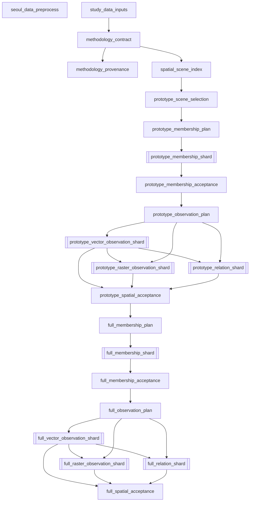
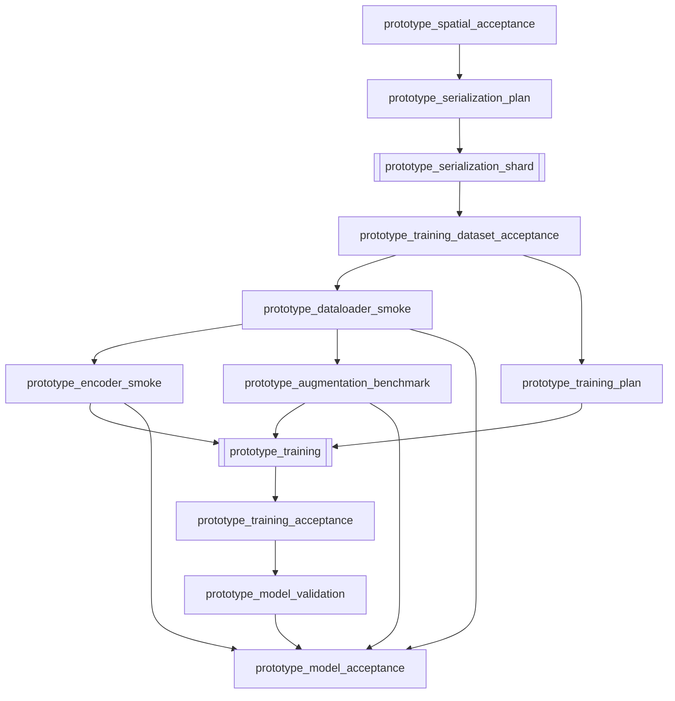
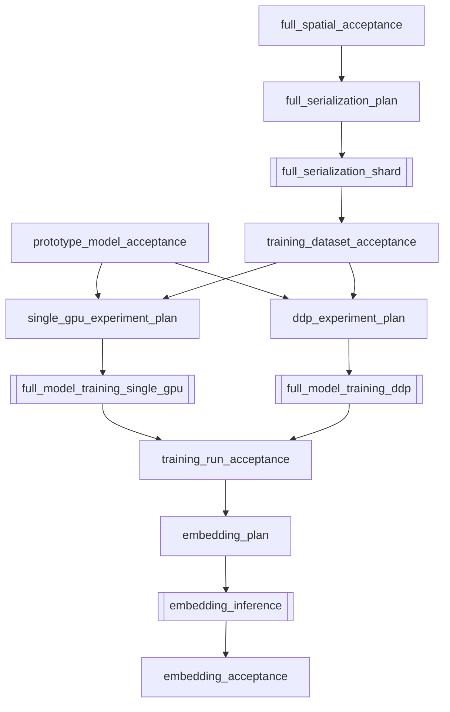
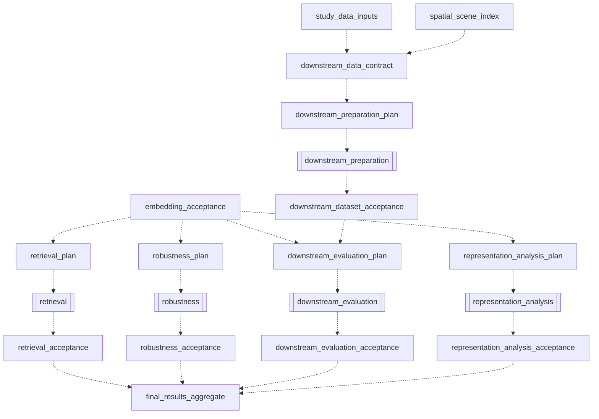

# 최종 targets 구현 Blueprint

## 0. 문서 정보

- **목적:** 승인된 서울 study data부터 공간장면 source-of-truth, PyTorch training-ready cache, prototype, production training 및 후속 평가까지 구현하기 위한 최종 `targets` 설계 계약을 정의한다.
- **작성 시각:** 2026-08-21 00:34 KST
- **구현 저장소 기준:** `/members/dhnyu/fuse`, `main`, HEAD `8d2df70bf4772ab24d3e60b16df2c4b926ff0b13`.
- **논문 저장소 기준:** `/members/dhnyu/dhnyu-masters-dissertation`, `main`, HEAD `73c7f5a65ae18960ac1990af035bca9076210f69`.
- **기존 설계:** `/members/dhnyu/fuse/reports/20260821_0016_targets_implementation_blueprint.md`.
- **선행 감사:** `/members/dhnyu/fuse/reports/20260820_2326_thesis_implementation_strategy_audit.md`.
- **작업 범위:** 이 문서와 `blueprint/` 디렉터리만 생성했다. `_targets.R`, R/Python source, config, schema, data, thesis는 수정하지 않았고 `tar_make()`도 실행하지 않았다.

## 1. 설계 목적과 범위

### 구현 상태 (2026-08-21)

첫 승인 단위가 `feature/research-scene-index`에서 구현되었다.

| Blueprint target | 상태 | 구현 artifact |
|---|---|---|
| `study_data_inputs` | `IMPLEMENTED/PASS` | 12 source files `format="file"`; `study_data_inventory.json` hard QC |
| `methodology_contract` | `IMPLEMENTED/PASS` | scientific JSON Schema contract + dependency-free record-only provenance |
| `spatial_scene_index` | `IMPLEMENTED/PASS` | 12,690-row EPSG:5186 GeoParquet, manifest, QC |
| `prototype_scene_selection` | `IMPLEMENTED/PASS` | 320-row GeoParquet with pre-membership density proxies, manifest, QC |
| `prototype_membership_plan` | `IMPLEMENTED/PASS` | 9 cost-balanced specs; 4 dense singleton + 5 regular shards |
| `prototype_membership_shard` | `IMPLEMENTED/PASS` | 9 dynamic branches, B/R/P geometry-free Parquet + sidecars |
| `prototype_membership_acceptance` | `IMPLEMENTED/PASS` | 237,121 memberships, source/checksum/brute-force aggregate gate |
| `prototype_observation_plan` | `IMPLEMENTED/PASS` | 15 aligned specs; 3 dense singleton + 12 capped/cost-balanced shards |
| `prototype_vector_observation_shard` | `IMPLEMENTED/PASS` | 15 dynamic branches; B/R/P GeoParquet 1.1.0, clipped attrs/local IDs/QC |
| `prototype_raster_observation_shard` | `IMPLEMENTED/PASS` | 15 aligned dynamic branches; LC/DEM Zarr v2, 237,121 object contexts, branch QC/checksums |

`research_config_files`, `research_implementation_files`, `study_data_inventory`는 파일
추적과 validation 결과를 targets store의 대형 R object 없이 연결하기 위한 기술 보조
target이며 scientific phase target 수에는 포함하지 않는다. Root research graph에는
`seoul_data_preprocess`가 없고 maintenance는 `_targets_maintenance.R`과 별도 store를 쓴다.

이 blueprint는 target을 논문의 절 순서가 아니라 재계산 비용, 독립 실행 가능성, QC gate와 partial recovery 경계에 따라 배치한다. 목표는 다음 네 가지다.

1. 완료된 study-data maintenance와 연구 계산 graph를 target 수준에서 완전히 분리한다.
2. spatial source-of-truth와 model/training cache를 분리해 model 변경이 공간 production을 무효화하지 않게 한다.
3. 320-scene prototype에서 spatial correctness와 model correctness를 서로 다른 gate로 승인한다.
4. expensive operation만 cost-balanced shard로 branch하고, 모든 branch에 명시적 plan과 aggregator를 둔다.

이 문서는 세 수준의 target을 다룬다.

- **즉시 구현:** schema와 역할을 확정해 한 target씩 구현한다.
- **조건부 확정:** prototype 결과로 shard/runtime만 조정하며 이름·역할·schema는 유지한다.
- **잠정:** 상위 artifact를 확인한 뒤 구현 직전에 plan granularity와 세부 schema를 재승인한다. 지금 `_targets.R`에 선언하지 않는다.

## 2. 확정된 연구방법

| 항목 | 확정값과 구현 의미 |
|---|---|
| CRS | 모든 scene 계산 EPSG:5186 |
| Scene | center 기준 axis-aligned 500 m x 500 m observation window |
| Training lattice | 공식 500 m grid native alignment를 유지한 250 m stride derived lattice |
| Training center | 서울시 boundary 내부 |
| Validation/evaluation | off-lattice 1,000 / 2,000 scenes |
| Source coverage | 서울시 400 m buffer의 B/R/P/land cover/DEM 사용 |
| Retrieval query | evaluation scenes 중 fixed 10개 |
| Unrestricted candidates | query별 `evaluation AND scene_id != query_scene_id`, 정확히 1,999개 |
| 다른 query의 처리 | 다른 query 9개도 candidate에 포함; query flag로 전역 제외하지 않음 |
| Non-local retrieval | 같은 query/base pool에서 center distance `<2 km` candidate만 제외 |
| Batch | variable node/edge-budget microbatch, optimizer effective batch 32 scenes |
| Prototype | training 256, validation 32, evaluation 32의 총 320 scenes |
| Geometry augmentation | 논문 reference implementation을 먼저 benchmark하고 최적화는 결과 후 결정 |

## 3. 설계 원칙

1. scene별 target을 만들지 않는다. 모든 대규모 spatial 작업은 shard plan에 따른 dynamic branch다.
2. branch 하나는 자기 파일만 쓰고 동일 GeoPackage, Parquet, Zarr group, tar에 여러 writer가 접근하지 않는다.
3. 모든 대규모 artifact는 branch-local staging -> branch QC -> checksum -> same-filesystem atomic rename -> aggregate acceptance 순서다.
4. 최종 artifact target은 `format = "file"`이다. Directory dataset은 file list와 SHA-256을 가진 manifest가 대표 artifact다.
5. Dynamic plan target은 branch-spec JSON을 외부에 atomic publish하고 작은 spec list를
   `format = "rds", iteration = "list"`로 반환한다. 사용 중인 `targets 1.12.0`은
   정적 `format="file"` stem을 직접 `map()`하는 것을 금지한다. Branch는
   `pattern = map(plan_target)`, `format="file"`로 생성하며 spec 내용 hash와 branch
   file hash가 각각 계산 identity와 partial recovery를 보장한다.
6. 매우 저비용이며 항상 같이 수행되는 manifest와 cross-QC는 하나의 `*_acceptance` target으로 합친다.
7. 비싼 branch와 aggregate gate는 합치지 않는다. 성공 branch 재사용이 가능해야 한다.
8. Prototype과 production은 동일 target factory, R/Python 함수, schema를 사용하고 input scene index와 output root만 다르게 한다.
9. R은 orchestration·공간처리·공간 QC, Python CLI는 DataLoader·augmentation·PyTorch model·training·GPU inference를 담당한다.
10. 장시간 Python 작업에 `reticulate`를 사용하지 않는다.

## 4. `seoul_data_preprocess` 완전 분리

`seoul_data_preprocess`는 원본/Canonical 자료에서 서울 boundary, 400 m buffer와 B/R/P/LC/DEM subset을 준비하는 **독립 maintenance target**이다.

- 연구 graph의 어떤 target도 `seoul_data_preprocess` 객체를 dependency로 참조하지 않는다.
- `_targets.R`에서는 maintenance target list와 research target list를 별도 객체로 source한다.
- `seoul_data_preprocess` code/command 변경 또는 강제 재실행 자체는 연구 target을 outdated시키지 않는다.
- 연구 graph는 기존 study-data 파일을 직접 추적하는 `study_data_inputs`에서 시작한다.
- study 파일 내용이 바뀌면 `format="file"` hash가 변해 `study_data_inputs`부터 연구 graph가 outdated된다.
- maintenance target과 research target이 같은 파일을 동시에 쓰고 읽는 실행은 허용하지 않는다. Study-data 재생성은 별도 maintenance 운영 절차에서 승인한다.

원칙적 구조는 다음과 같다.

```text
seoul_data_preprocess                 # edge 없는 maintenance node

study_data_inputs
  -> methodology_contract
  -> spatial_scene_index
  -> research pipeline
```

### 4.1 `study_data_inputs`

`study_data_inputs`는 다음 8개 필수 study artifact를 직접 추적하는 `format="file"` target이다.

1. `/mnt/hdd002/dhnyu/fusedata/study_data/seoul_boundary.gpkg`
2. `/mnt/hdd002/dhnyu/fusedata/study_data/seoul_buffer400.gpkg`
3. `/mnt/hdd002/dhnyu/fusedata/study_data/seoul_B.gpkg`
4. `/mnt/hdd002/dhnyu/fusedata/study_data/seoul_R.gpkg`
5. `/mnt/hdd002/dhnyu/fusedata/study_data/seoul_P.gpkg`
6. `/mnt/hdd002/dhnyu/fusedata/study_data/seoul_lc.tif`
7. `/mnt/hdd002/dhnyu/fusedata/study_data/seoul_dem.tif`
8. `/mnt/hdd002/dhnyu/fusedata/study_data/seoul_data_manifest.json`

I04가 공식 500 m grid의 native alignment를 실제 계산에 사용하므로, 같은 source target은 다음 read-only alignment-reference Shapefile 구성 파일도 함께 추적한다.

- `/mnt/hdd002/dhnyu/fusedata/koreaadmin/빈격자(500m).shp`
- `/mnt/hdd002/dhnyu/fusedata/koreaadmin/빈격자(500m).shx`
- `/mnt/hdd002/dhnyu/fusedata/koreaadmin/빈격자(500m).dbf`
- `/mnt/hdd002/dhnyu/fusedata/koreaadmin/빈격자(500m).prj`

따라서 반환값은 `study_*` 8개와 `official_grid_*` 4개를 이름 붙인 deterministic 12-path vector다. 이 추가 추적은 maintenance target dependency가 아니라 scene-index 계산에 필요한 외부 reference file dependency다. Command는 literal path vector만 반환하며 `seoul_data_preprocess`를 읽거나 참조하지 않는다. `targets`가 각 파일 내용을 hash하므로 manifest, study artifact 또는 official-grid component 내용이 달라지면 downstream이 다시 계산된다.

## 5. Scientific identity와 record-only provenance

### 5.1 계산 identity

Artifact ID와 계산 dependency에는 다음만 포함한다.

- 직접 사용하는 input data manifest와 file checksum
- 해당 target이 실제 계산에 사용하는 scoped methodology config
- input/output schema version과 schema hash
- 관련 R/Python implementation source hash
- 계산 결과에 영향을 주는 RNG algorithm, seed, parameter
- upstream scientific artifact ID

`methodology_contract`는 모든 config를 묶는 global invalidation key가 아니다. Scene size/stride/CRS/split/ID schema처럼 scene index에 공통으로 필요한 최소 shared contract만 가진다. Vector, raster, relation, serialization, model, augmentation, training, evaluation config는 해당 plan/target에서 별도로 hash한다. 따라서 model config가 바뀌어도 `spatial_scene_index`, membership, clipping, raster, relation은 outdated되지 않는다.

### 5.2 기록 전용 provenance

다음은 계산 identity와 dependency에서 제외한다.

- thesis Git commit
- thesis dirty status
- PDF SHA-256
- PDF 생성 시각

이를 구조적으로 보장하기 위해 두 파일을 분리한다.

- `methodology_contract.json`: scientific fields만 포함하며 calculation targets가 소비한다.
- `provenance/{contract_id}/{timestamp}.json`: thesis/PDF record-only fields와 contract/artifact ID를 append-only provenance manifest로 기록한다. `methodology_provenance` target만 쓰며 계산 target은 소비하지 않는다.

`methodology_provenance`는 contract 생성 시 한 번 실행하거나 문서 provenance 갱신 작업에서 명시적으로 invalidation해 새 timestamp snapshot을 만든다. 기존 snapshot을 덮어쓰지 않으며 outgoing calculation edge가 없다. Thesis 문장·오탈자·결과 서술이나 PDF rebuild만으로 공간처리와 model training이 outdated되지 않는다. Calculation artifact의 scientific manifest에는 `contract_id`와 scientific hashes만 기록한다. Thesis commit/PDF hash는 별도의 record-only provenance manifest가 해당 `contract_id`와 선택적인 artifact ID 목록에 연결해 기록한다. Calculation target은 이 provenance manifest를 직접 읽지 않는다.

## 6. 최종 dependency graph

### 6.1 Source 및 spatial pipeline



`SDP`는 의도적으로 edge가 없다. `FMP`는 `PSA`에만 의존하며 model/augmentation target과 연결되지 않는다.

### 6.2 Prototype model pipeline



`prototype_model_validation`은 checkpoint/resume, fixed prototype embedding과 cosine retrieval smoke를 한 번에 수행한다. 이들은 작은 prototype run 뒤 항상 함께 수행되는 저비용 validation이므로 별도 target 3개로 분해하지 않는다.

I23의 retrieval 출력은 두 계약을 구분한다. 320개 original prototype scene의 projection-head 이전 L2-normalized embedding은 query 자신만 제외한 cosine 전 순위를 생성하지만, 서로 다른 original scene 사이의 relevance ground truth가 없으므로 MRR/HIT를 계산하지 않는다. 별도의 fixed-seed I19 augmented query는 대응하는 unaugmented source scene을 유일한 relevant candidate로 사용하며, 이 source-scene retrieval에만 MRR와 HIT@1/5/10을 계산한다. 두 경로 모두 accepted best checkpoint의 online encoder를 read-only로 사용하고 optimizer, EMA, queue, masking 및 checkpoint state를 변경하지 않는다.

### 6.3 Production serialization 및 training pipeline



`full_model_training_*`은 `training_dataset_acceptance`와 `prototype_model_acceptance` 없이는 시작하지 않는다. `ddp_experiment_plan`은 DDP benchmark가 승인될 때만 non-empty이며, 그렇지 않으면 DDP target 선언/branch 생성을 유예한다.

### 6.4 잠정 evaluation pipeline

잠정 target은 upstream accepted artifact의 실제 형태를 확인한 뒤 `_targets.R`에 단계적으로 선언한다. 점선은 잠정 경계를 뜻한다.



## 7. Target phase 분류와 수 재검토

| 구분 | target 수 | dynamic branch 수 | 선언 시점 |
|---|---:|---:|---|
| 기존 maintenance | 1 | 0 | 현재 존재, research graph와 독립 |
| 즉시 구현 | **24** | **6** | 순차 구현·승인 |
| 조건부 확정 | **19** | **8** | prototype gate 뒤 구현 |
| 잠정 | **17** | **5** | upstream artifact 검토 뒤 선언 |
| Research pipeline 합계 | **60** | **19** | maintenance 제외 |
| 문서상 전체 node | **61** | **19** | maintenance 포함 |

기존 61개를 그대로 유지한 결과가 아니다. 다음을 재설계했다.

- 별도 manifest와 저비용 QC를 `*_acceptance`로 통합했다.
- prototype checkpoint/resume+embedding+retrieval smoke를 한 `prototype_model_validation`으로 통합했다.
- `study_data_inputs`, record-only provenance와 spatial/model gate를 추가했다.
- 모든 dynamic branch plan을 실제 target으로 명시했다.
- single-GPU와 DDP plan/target을 controller 제약 때문에 분리했다.

그 결과 research target은 60개이며, 기존 독립 maintenance node까지 graph에 보이면 전체 node 수가 우연히 61개다. 잠정 17개는 지금 `_targets.R`에 일괄 선언하지 않는다.

## 8. 최종 target registry

공통 규칙은 다음과 같다.

- Artifact/plan output은 `format="file"`.
- Plan은 `spec-*.json` path vector, `iteration="vector"`.
- Dynamic target은 표에서 **D**로 표시한다.
- Branch는 자기 staging/output만 쓰며 acceptance가 전체 manifest, plan Parquet, QC를 publish한다.

### 8.1 독립 maintenance target

| ID | target | 목적 | 직접 입력/dependency | 출력 | controller | 완료/QC 및 복구 |
|---|---|---|---|---|---|---|
| M00 | `seoul_data_preprocess` | study source maintenance | canonical/admin/config; **research target dependency 없음** | 기존 `study_data` GPKG/COG/manifest/report | `controller_20`, internal 5x4 | 기존 acceptance transaction. Research graph outgoing edge 없음 |

### 8.2 즉시 구현 target 24개

| ID | target | 목적 | 직접 입력/dependency | 출력·핵심 schema | branch/controller | 완료/QC 및 복구 |
|---|---|---|---|---|---|---|
| I01 | `study_data_inputs` | 승인된 study files와 alignment reference 추적 | literal 12 paths; M00 참조 없음 | named 12-file path vector | static `controller_05` | files exist, study manifest PASS; content hash 변경 시 downstream outdated |
| I02 | `methodology_contract` | shared scientific scene/data contract | I01, scene/split/schema config, relevant source hash | `methodology_contract.json` | static `controller_05` | scientific hash와 required decision complete |
| I03 | `methodology_provenance` | thesis/PDF record-only provenance | I02; runtime git/PDF read, calculation consumer 없음 | `provenance/{contract_id}/{timestamp}.json` | static/explicit refresh `controller_05` | append-only record complete; failure는 계산 차단 안 함 |
| I04 | `spatial_scene_index` | full train/val/eval scene index | I01의 boundary/official-grid components,I02 | `scene_index.parquet`, manifest, QC | static `controller_05` | lattice/alignment/count/50m/query gate; 전체 index 재실행 |
| I05 | `prototype_scene_selection` | 320-scene stratified selection | I04, prototype runtime config | `prototype_scene_index.parquet`, manifest/QC | static `controller_05` | 256/32/32 및 tail/boundary cases |
| I06 | `prototype_membership_plan` | membership branch specs | I05, study inventory, shard runtime | `plans/membership/spec-*.json` | static plan `controller_05` | all scenes once, cost estimate/cap |
| I07 | **`prototype_membership_shard` D** | B/R/P membership | I06 spec, I01 | membership Parquet+branch manifest | `map(I06)`, `controller_20`, 1x1 | exact predicate/unique IDs; failed branch only |
| I08 | `prototype_membership_acceptance` | membership aggregate+QC | all I07, I06 | manifest, `membership_plan.parquet`, stats/QC | static `controller_05` | complete scene/source/count; aggregate only rerun |
| I09 | `prototype_observation_plan` | vector/raster/relation aligned specs | I05,I08, observation runtime | `plans/observation/spec-*.json` | static plan `controller_05` | balanced cost, dense singleton, all scenes once |
| I10 | **`prototype_vector_observation_shard` D** | clipping/observed attrs/local IDs | I09 spec,I08,I01 | B/R/P GeoParquet+branch QC | `map(I09)`, `controller_10`,1x1 | within-window/valid/area-length-A14; failed branch only |
| I11 | **`prototype_raster_observation_shard` D** | LC/DEM scene/object observations | I09 spec, aligned I10, I01 | shard Zarr+object context Parquet+QC | `map(I09,I10)`, `controller_10`,1x1 | fixed shapes/support/nodata; failed branch only |
| I12 | **`prototype_relation_shard` D** | SN/CNT/WIT/INT/CON graph | I09 spec, aligned I10, road topology | edge Parquet+branch QC | `map(I09,I10)`, `controller_10`,1x1 | inverse/symmetry/top-k/host/CON; failed branch only |
| I13 | `prototype_spatial_acceptance` | dictionary+cross-artifact spatial gate | all I10/I11/I12,I09,I02 | vector/raster/relation manifests, entity dictionary, cross-QC | static `controller_05` | scene/local-ID/schema equality and spatial PASS |
| I14 | `prototype_serialization_plan` | training shard specs | I13, actual node/edge/byte stats | `plans/serialization/spec-*.json` | static plan `controller_05` | all scenes once, byte/node/edge caps |
| I15 | **`prototype_serialization_shard` D** | ragged training cache | I14 spec,I13 artifacts | WebDataset tar+safetensors+index+branch QC | `map(I14)`, `controller_10`,1x1 | source round-trip/schema/checksum; failed branch only |
| I16 | `prototype_training_dataset_acceptance` | prototype cache aggregate gate | all I15,I14,I13 | training manifest, shard plan/index/QC | static `controller_05` | 320 scenes/splits/checksums complete |
| I17 | `prototype_dataloader_smoke` | loader correctness/performance | I16, Python env | smoke JSON/log | static `controller_05`, DL0/4 | deterministic random/sequential, empty/dense, no leak |
| I18 | `prototype_encoder_smoke` | model forward/loss/backward shapes | I16,I17, model config | smoke JSON/log | static `controller_gpu_02`, GPU lock 1 | float32 finite, norm/grad/VRAM; target만 재실행 |
| I19 | `prototype_augmentation_benchmark` | exact reference correctness/latency | I16,I17, augmentation config | benchmark Parquet/JSON/report | static `controller_05`,1x1 | relation/window correctness, p50/p95/rejection |
| I20 | `prototype_training_plan` | prototype GPU run spec | I16,I18,I19, model/train/seed config | `plans/prototype_train/spec-*.json` | static plan `controller_05` | run/dataset/config/GPU mode unique |
| I21 | **`prototype_training` D** | end-to-end q/k/EMA/queue training | I20 spec,I16,I18,I19 | checkpoint bundle, metrics, run manifest/log | `map(I20)`, `controller_gpu_02`, GPU lock 1 | checkpoint and finite train; last checkpoint resume |
| I22 | `prototype_training_acceptance` | prototype run aggregate/QC | all I21,I20 | training acceptance JSON+run registry | static `controller_05` | required run/checkpoint/EMA/queue complete |
| I23 | `prototype_model_validation` | resume+embedding+retrieval smoke | I22,I16,I05 | resume QC, prototype embeddings/ranks/metrics | static `controller_gpu_02`, GPU lock 1 | RNG/sampler/queue exact, numeric tolerance, self-only exclusion |
| I24 | `prototype_model_acceptance` | full model gate | I17,I18,I19,I22,I23 | model acceptance JSON/MD | static `controller_05` | all model-path checks PASS; spatial consumer 없음 |

### 8.3 조건부 확정 target 19개

| ID | target | 목적 | 직접 입력/dependency | 출력·핵심 schema | branch/controller | 완료/QC 및 복구 |
|---|---|---|---|---|---|---|
| C01 | `full_membership_plan` | full membership specs | I04,I13,pilot cost coefficients | `plans/full_membership/spec-*.json` | static plan `controller_05` | cost-balanced, all scenes once |
| C02 | **`full_membership_shard` D** | full B/R/P membership | C01 spec,I01 | membership Parquet+branch QC | `map(C01)`, `controller_20`,1x1 | failed branch only |
| C03 | `full_membership_acceptance` | membership aggregate/QC | all C02,C01 | manifest, plan Parquet, stats/QC | static `controller_05` | completeness/source IDs/skew |
| C04 | `full_observation_plan` | aligned full observation specs | C03,I04,pilot cost | `plans/full_observation/spec-*.json` | static plan `controller_05` | cost/byte caps, dense singleton |
| C05 | **`full_vector_observation_shard` D** | full clipped vector truth | C04 spec,C03,I01 | GeoParquet+branch QC | `map(C04)`, `controller_10`,1x1 | failed branch only |
| C06 | **`full_raster_observation_shard` D** | full raster observations | C04 spec,aligned C05,I01 | Zarr/context Parquet+branch QC | `map(C04,C05)`, `controller_10`,1x1 | failed branch only |
| C07 | **`full_relation_shard` D** | full five-relation graph | C04 spec,aligned C05,I01 topology | edge Parquet+branch QC | `map(C04,C05)`, `controller_10`,1x1 | failed branch only |
| C08 | `full_spatial_acceptance` | dictionary+full cross-QC gate | all C05/C06/C07,C04,I02 | manifests, entity dictionary, cross-QC | static `controller_05` | all scenes/local IDs/schema PASS |
| C09 | `full_serialization_plan` | full training shard specs | C08 actual stats | `plans/full_serialization/spec-*.json` | static plan `controller_05` | scene/byte/node/edge caps |
| C10 | **`full_serialization_shard` D** | full ragged training cache | C09 spec,C08 | tar+safetensors+index+branch QC | `map(C09)`, `controller_10`,1x1 | failed branch only |
| C11 | `training_dataset_acceptance` | accepted full model input | all C10,C09,C08 | training dataset manifest/plan/index/QC | static `controller_05` | split/count/checksum/schema complete |
| C12 | `single_gpu_experiment_plan` | FM/A1-A5/SSV/DS/HP single-GPU run specs | C11,I24,model/aug/train/seed configs | `plans/single_gpu/run-*.json` | static plan `controller_05` | unique run ID, budget/seed/GPU mode |
| C13 | `ddp_experiment_plan` | approved 2-GPU run specs | C11,I24,DDP benchmark decision | `plans/ddp/run-*.json` | conditional plan `controller_05` | only approved runs; otherwise undeclared/empty |
| C14 | **`full_model_training_single_gpu` D** | independent GPU run | C12 spec,C11,I24 | checkpoint/metrics/run manifest/log | `map(C12)`, `controller_gpu_02` | one GPU flock; failed run resumes only |
| C15 | **`full_model_training_ddp` D** | optional 2-GPU DDP run | C13 spec,C11,I24 | checkpoint/metrics/DDP manifest/log | `map(C13)`, `controller_gpu_pair_01` | pair+GPU locks; failed run resumes only |
| C16 | `training_run_acceptance` | all required run aggregate | all C14/C15,C12/C13 | accepted run registry/checkpoint catalog/QC | static `controller_05` | configs/seeds/best checkpoint complete |
| C17 | `embedding_plan` | run x split x inference-shard specs | C16,C11,I04 | `plans/embedding/spec-*.json` | static plan `controller_05` | accepted checkpoint, all scene IDs exactly once per run/split |
| C18 | **`embedding_inference` D** | scene embeddings | C17 spec,C11 | embedding Parquet+branch manifest | `map(C17)`, `controller_gpu_02`, one GPU lock | finite/dim/count/checkpoint hash; failed branch only |
| C19 | `embedding_acceptance` | embedding aggregate gate | all C18,C17,C16 | embedding manifest/catalog/QC | static `controller_05` | model/split/scene completeness |

### 8.4 잠정 target 17개

| ID | target | 잠정 역할 | 직접 input/plan | 예상 output | 선언 전 재검토 |
|---|---|---|---|---|---|
| T01 | `retrieval_plan` | run별 fixed 10 query spec | C19,I04 | `plans/retrieval/run-*.json` | accepted embedding layout와 query IDs |
| T02 | **`retrieval` D** | unrestricted/non-local exact cosine ranks | `map(T01)` | full ranking Parquet | branch당 run 1개, candidate 1,999 QC |
| T03 | `retrieval_acceptance` | cross-model retrieval QC | all T02 | manifest/selected ranks/QC | figure selection schema |
| T04 | `robustness_plan` | run x augmented-query shard spec | C19,C16,C11 | `plans/robustness/spec-*.json` | augmentation throughput와 shard size |
| T05 | **`robustness` D** | fixed two-view source retrieval | `map(T04)` | ranks/partial metrics | GPU `controller_gpu_02`; query shard recovery |
| T06 | `robustness_acceptance` | MRR/HIT aggregate/QC | all T05 | manifest/metrics | seed equality across runs |
| T07 | `downstream_data_contract` | external target inventory/contract | I01,I04,downstream sources | contract/QC | Flickr 및 coverage/transform 결정 |
| T08 | `downstream_preparation_plan` | target family x spatial shard specs | T07,I04 | `plans/downstream_data/spec-*.json` | source-specific costs |
| T09 | **`downstream_preparation` D** | scene target aggregation | `map(T08)` | target Parquet+branch QC | temporal/spatial aggregation schema |
| T10 | `downstream_dataset_acceptance` | downstream target gate | all T09 | manifest/coverage/stats | valid N/district distribution |
| T11 | `downstream_evaluation_plan` | run x target specs | T10,C19,C16 | `plans/downstream_eval/spec-*.json` | final target set/valid sets |
| T12 | **`downstream_evaluation` D** | district-CV ridge probes | `map(T11)` | OOF prediction+metrics | `controller_40`, run-target branch |
| T13 | `downstream_evaluation_acceptance` | probe aggregate/QC | all T12 | manifest/metric tables | fold leakage/coverage |
| T14 | `representation_analysis_plan` | accepted run analysis specs | C19 | `plans/representation/run-*.json` | UMAP/HDBSCAN settings |
| T15 | **`representation_analysis` D** | UMAP/HDBSCAN/original-space stats | `map(T14)` | coordinates/clusters/stats/figures | model branch, `controller_10` |
| T16 | `representation_analysis_acceptance` | analysis aggregate/QC | all T15 | manifest/summary | fixed seed and original-space metrics |
| T17 | `final_results_aggregate` | final table/figure bundle | T03,T06,T13,T16 | immutable result manifest/tables/figure index | thesis result layout 직전 |

잠정 plan/acceptance/aggregate는 기본 `controller_05`, T02는 `controller_20`, T05는 `controller_gpu_02`, T09/T15는 `controller_10`, T12는 `controller_40`을 사용한다. CPU dynamic branch 내부는 모두 `workers=1`, `threads=1`; T05는 한 GPU lock과 별도 DataLoader worker budget을 사용한다. 이 배정은 target 선언 직전 upstream benchmark로 재승인한다.

## 9. 입출력 및 schema 계약

### 9.1 Source와 contract

`study_data_inputs`는 이름이 붙은 12-path character vector를 반환한다. Logical roles는 `boundary`, `buffer400`, `building`, `road`, `poi`, `landcover`, `dem`, `study_manifest`, `official_grid_shp/shx/dbf/prj`다. `targets` metadata가 각 physical file hash를 추적하고 I02는 다음 scientific contract를 publish한다.

`methodology_contract.json` 필수 fields는 `contract_schema_version`, `contract_id`, `created_at`, input logical role/path/SHA-256/bytes, `EPSG=5186`, official-grid native CRS/checksum/derived phase, scene width/stride, center predicate, split counts, RNG algorithm/seed, off-lattice separation rule, scene/ID/schema versions, scoped config hashes와 relevant source hashes다. `contract_id`는 `created_at`을 제외한 canonical scientific JSON의 SHA-256이다.

Record-only provenance JSON은 `provenance_schema_version`, `record_id`, `recorded_at`, `contract_id`, thesis repository path/commit/dirty status, PDF path/SHA-256/build time, optional artifact ID references를 가진다. `record_id` 외 어떤 scientific ID에도 thesis/PDF fields를 넣지 않는다.

### 9.2 공통 identifier

| identifier | type | 규칙 |
|---|---|---|
| `scene_id` | string | `scn_` + canonical `(scene schema, split, exact center)` SHA-256 |
| `source_entity_id` | string | B=`building_feature_id`, R=`LINK_ID`, P=`NF_ID`; numeric coercion 금지 |
| `entity_type` | int8 | `0=B`, `1=R`, `2=P`, schema에 고정 |
| `entity_local_id` | int32 | clipping 후 retained observation을 `(entity_type, source_entity_id)`로 정렬한 scene-local dense ID |
| `branch_id` | string | plan schema/scope/stage/config/sorted scene IDs의 SHA-256 |
| `run_id` | string | dataset/model/augmentation/training/seed/execution-mode scientific hash |

Augmentation에서 entity가 제거돼도 retained entity의 original `entity_local_id`를 재번호화하지 않는다. Relation edge의 source/destination은 동일 scene의 local ID를 사용한다.

### 9.3 Scene index

`scene_index.parquet` 필수 columns:

`scene_id`, `split`, `center_x_5186`, `center_y_5186`, `xmin_5186`, `ymin_5186`, `xmax_5186`, `ymax_5186`, `center_x_native`, `center_y_native`, `official_grid_id`, `lattice_row`, `lattice_col`, `phase_x_m`, `phase_y_m`, `sampling_order`, `split_assignment_order`, `nearest_training_center_m`, `district_code`, `is_retrieval_query`, `retrieval_query_order`, `scene_schema_version`, `scene_config_hash`, `study_manifest_hash`.

`scene_index_manifest.json`은 counts, ordered query IDs 10개, grid/boundary checksum/CRS, derivation/sampling algorithm과 seed, config/schema/source hashes를 기록한다. `scene_index_qc.json`은 validation=1,000, evaluation=2,000, query=10, unique IDs, 500 m bounds, 50 m rule와 training alignment를 hard gate로 검사한다.

### 9.4 Membership, vector, raster, relation

**Membership Parquet:** `(branch_id,scene_id,split,entity_type,source_entity_id,source_layer,membership_predicate,touches_window_boundary,source_bbox,source_geometry_bytes,source_vertex_count)`. Unique key는 `(scene_id,entity_type,source_entity_id)`다.

**Vector GeoParquet common:** `scene_id`, `split`, `entity_local_id`, `entity_type`, `source_entity_id`, `observed_geometry`, source/observed geometry hashes, center, boundary-clipped flag, geometry family, component/ring/vertex counts, validity/drop reason, config/schema hash.

- Building: raw `A9`,`A11`,`A14`, source/observed footprint, observed fraction, proportional observed gross floor, missing states.
- Road: raw `LANES`,`ROAD_RANK`,`ROAD_TYPE`,`F_NODE`,`T_NODE`, source/observed length, retained source-node list, source/clip endpoint flags.
- POI: point, six hierarchy code/label/state columns와 model availability mask.

**Raster Zarr:** LC `class_fraction float32[S,22,100,100]`, `valid_support_ratio[S,1,100,100]`, source nodata; DEM `value_mean_m[S,1,17,17]`, valid support. Object context Parquet key `(scene_id,entity_local_id)`에 LC 22 composition+support, DEM mean/SD/support를 둔다.

**Relation Parquet:** one row per ordered pair with any relation: `scene_id`, `src_local_id`, `dst_local_id`, types, `relation_mask uint8` bits `SN/CNT/WIT/INT/CON`, individual bools, SN distance/rank, host tie-break evidence, shared source-node IDs. Unique key는 `(scene_id,src_local_id,dst_local_id)`다.

**Entity dictionary:** `prototype_spatial_acceptance`/`full_spatial_acceptance`가 entity key dictionary와 semantic vocabulary/statistics Parquet을 별도로 출력한다. Vocabulary universe와 index는 frequency나 observed subset이 아니라 versioned official source codebook 전체로 고정하며 source category 뒤에 `MISSING`, `MASK`를 둔다(`OOV` token 없음). Validation/evaluation 관측은 vocabulary를 확장하거나 재정렬하지 않는다. Data-derived numerical mean/SD와 training count는 training scenes만 사용한다. Semantic long schema는 entity type, attribute, kind, raw code/state/parent, model token/index, training count, transform, mean/SD, missing rule, dictionary/schema/source hash를 기록한다.

### 9.5 Training-ready cache

Spatial truth는 GeoParquet/Zarr/Parquet이며 training cache는 versioned WebDataset tar다. Scene member는 다음을 포함한다.

- `meta.json`: scene/split/center/window/source/config hashes.
- `entities.safetensors`: type/local IDs, semantic indices/raw numeric+missing masks, object raster context.
- `geometry.safetensors`: flattened coordinates와 entity/component/ring/part offsets, endpoint flags.
- `edges.safetensors`: `edge_index[2,E]`, relation masks/auxiliary values.
- `rasters.safetensors`: LC/DEM tensors와 valid/nodata masks.

Tar `.idx`는 `scene_id -> offset,length`를 제공한다. Original observed geometry가 authoritative하며 two augmented views는 저장하지 않는다. Dataset manifest는 shard checksum/bytes, scene-to-shard index, split counts, node/edge/vertex statistics, spatial acceptance ID, dictionary hash, serialization schema와 Python reader version을 기록한다.

### 9.6 Checkpoint와 embedding

Checkpoint에는 online encoder/projection/decoders, momentum target, optimizer/scheduler/scaler, EMA state, queue embedding+scene ID+center+pointer, epoch/step/sampler cursor, Python/NumPy/PyTorch CPU/CUDA RNG, early-stop/best metric, dataset/config/schema/source hashes를 모두 저장한다.

Embedding Parquet은 `run_id`, checkpoint hash, model config, `scene_id`, split, center, district, query flag/order, `embedding fixed_size_list<float32,128>`, norm, inference hash를 가진다. Inference output은 online encoder의 projection-head 이전 scene embedding이다.

### 9.7 Retrieval candidate schema

Retrieval ranking columns는 `run_id`, `query_scene_id`, `query_order`, `mode`, `candidate_scene_id`, `candidate_is_retrieval_query`, center distance, cosine, rank, candidate count, embedding manifest hash다.

```text
base(q) = evaluation scenes WHERE scene_id != q.scene_id  # 1,999
unrestricted(q) = base(q)
non_local_2km(q) = base(q) WHERE center_distance_m >= 2000
```

QC는 unrestricted row count 1,999와 `candidate_is_retrieval_query == TRUE` 9개를 query마다 검사한다. `is_retrieval_query`는 candidate exclusion predicate가 아니다.

### 9.8 Robustness, downstream, representation analysis

**Robustness branch output:** `run_id`, `query_scene_id`, `view_id`, fixed augmentation seed, `candidate_scene_id`, rank, cosine, source-scene match flag, query-shard ID. Acceptance는 evaluation 2,000 scenes x two fixed views에 대해 MRR, HIT@1/5/10과 seed/query/candidate equality를 집계한다.

**Downstream target Parquet:** `scene_id`, `target_name`, `target_family`, `value`, `unit`, `support_type`, spatial/temporal coverage, validity/reason, aggregation method, source date/hash. OOF prediction은 `run_id`, target, scene, district/fold, raw/transformed truth and prediction, train/test N, transform ID, ridge lambda와 valid-set hash를 가진다. Metric은 overall/fold `n`, `R2`, RMSE, MAE와 prediction checksum을 가진다.

**Representation analysis:** run별 evaluation `scene_id`, UMAP x/y, optional HDBSCAN label/probability/outlier score, fixed analysis seed와 input embedding hash를 저장한다. Similarity와 quantitative analysis는 original 128-dimensional embedding에서 수행하고 UMAP/HDBSCAN은 exploratory output으로 표시한다.

## 10. 모든 dynamic branch plan

모든 plan target은 `plans/{plan_id}/spec-*.json` path vector를 반환하고 각 spec은 `plan_id`, `branch_id`, `scope`, direct artifact/config hashes, input paths/IDs, output staging/final paths, expected cost, resource mode를 가진다. Acceptance target은 specs를 `plan.parquet`으로 병합한다.

아래 표의 root symbol은 `P=${SCENE_ROOT}/prototype/{prototype_id}`, `F=${SCENE_ROOT}/production/{spatial_dataset_id}`, `TP=${TRAIN_ROOT}/prototype/{prototype_dataset_id}`, `TF=${TRAIN_ROOT}/production/{training_dataset_id}`, `M=${MODEL_ROOT}`, `E=${EMBED_ROOT}`, `V=${EVAL_ROOT}`다. 모든 path의 `{branch}`와 `{run}`은 full hash의 12-character display prefix이며 full hash는 sidecar에 기록한다. Branch ID는 target stage, plan schema, scope, sorted scene/input IDs, scoped scientific config와 upstream scientific IDs의 canonical SHA-256으로 생성한다.

| Dynamic target | Direct plan target | `pattern` | branch spec와 ID | branch output | aggregator | 실패 복구 |
|---|---|---|---|---|---|---|
| I07 `prototype_membership_shard` | I06 | `map(prototype_membership_plan)` | prototype scene IDs + source refs; membership stage hash | `${P}/membership/part-{branch}.parquet` + `.manifest.json` | I08 | failed branch metadata만 invalid |
| I10 `prototype_vector_observation_shard` | I09 | `map(prototype_observation_plan)` | scene IDs+membership shards+vector config | `${P}/vectors/{B,R,P}/part-{branch}.parquet` + sidecar | I13 | branch-local temp/checksum 재사용 |
| I11 `prototype_raster_observation_shard` | I09 | `map(prototype_observation_plan, prototype_vector_observation_shard)` | 같은 spatial branch ID+aligned vector path+raster config | `${P}/rasters/raster-{branch}.zarr/`, `object_context/part-{branch}.parquet`, manifest | I13 | 해당 raster branch만 |
| I12 `prototype_relation_shard` | I09 | `map(prototype_observation_plan, prototype_vector_observation_shard)` | 같은 branch+vector/topology+relation config | `${P}/relations/part-{branch}.parquet` + sidecar | I13 | 해당 relation branch만 |
| I15 `prototype_serialization_shard` | I14 | `map(prototype_serialization_plan)` | scene IDs+spatial paths+dictionary+serialization hash | `${TP}/shards/scenes-{branch}.tar`, `.idx`, sidecar | I16 | 해당 tar만 repack |
| I21 `prototype_training` | I20 | `map(prototype_training_plan)` | one or more run specs; `run_id`, single-GPU mode | `${M}/prototype/runs/{run}/checkpoints/`, metrics, manifest, log | I22 | last checkpoint resume |
| C02 `full_membership_shard` | C01 | `map(full_membership_plan)` | full scene membership spec | `${F}/membership/part-{branch}.parquet` + sidecar | C03 | failed branch only |
| C05 `full_vector_observation_shard` | C04 | `map(full_observation_plan)` | full spatial shard+vector config | `${F}/vectors/{B,R,P}/part-{branch}.parquet` + sidecar | C08 | failed branch only |
| C06 `full_raster_observation_shard` | C04 | `map(full_observation_plan, full_vector_observation_shard)` | aligned vector+raster config | `${F}/rasters/raster-{branch}.zarr/`, `object_context/part-{branch}.parquet`, manifest | C08 | failed branch only |
| C07 `full_relation_shard` | C04 | `map(full_observation_plan, full_vector_observation_shard)` | aligned vector/topology/relation config | `${F}/relations/part-{branch}.parquet` + sidecar | C08 | failed branch only |
| C10 `full_serialization_shard` | C09 | `map(full_serialization_plan)` | scene/spatial paths+serialization config | `${TF}/shards/scenes-{branch}.tar`, `.idx`, sidecar | C11 | failed tar only |
| C14 `full_model_training_single_gpu` | C12 | `map(single_gpu_experiment_plan)` | run/model/seed/dataset, `gpu_count=1`; run ID hash | `${M}/runs/{run}/checkpoints/`, metrics, manifest, log | C16 | run checkpoint resume |
| C15 `full_model_training_ddp` | C13 | `map(ddp_experiment_plan)` | approved run, `gpu_ids=[0,1]`, DDP config | `${M}/runs/{run}/checkpoints/`, DDP metrics/manifest/log | C16 | DDP checkpoint resume |
| C18 `embedding_inference` | C17 | `map(embedding_plan)` | accepted run x split x cost-balanced scene shard | `${E}/{run}/{split}/part-{branch}.parquet` + sidecar | C19 | run-split-inference shard only |
| T02 `retrieval` | T01 | `map(retrieval_plan)` | run ID+fixed query 10 IDs+both modes | `${V}/retrieval/{run}/ranking-{branch}.parquet` + sidecar | T03 | model run branch only |
| T05 `robustness` | T04 | `map(robustness_plan)` | run ID+evaluation query shard+fixed view seeds | `${V}/robustness/{run}/rank-{branch}.parquet` + partial metrics/sidecar | T06 | run-query shard only |
| T09 `downstream_preparation` | T08 | `map(downstream_preparation_plan)` | target family+spatial shard+aggregation rules | `${V}/downstream/data/{target}/part-{branch}.parquet` + sidecar | T10 | target-spatial shard only |
| T12 `downstream_evaluation` | T11 | `map(downstream_evaluation_plan)` | run ID+target+fixed valid set/folds | `${V}/downstream/eval/{run}/{target}/pred-{branch}.parquet` + metrics/sidecar | T13 | run-target only |
| T15 `representation_analysis` | T14 | `map(representation_analysis_plan)` | accepted run+eval embedding+fixed analysis seed | `${V}/representation/{run}/{coordinates,clusters,stats}` + sidecar | T16 | model run only |

Plan spec file 수가 branch 수다. Scheduler completion order는 branch ID나 output filename에 영향을 주지 않는다. Aligned raster/relation branch는 동일 observation plan과 vector branch를 함께 `map()`하여 local scene IDs가 일치하도록 한다.

## 11. Shard 전략

### 11.1 혼합 cost 기준

고정 scene 수만으로 shard하지 않는다. EPSG:5186 center의 Hilbert order로 source read locality를 유지하면서 다음 cost를 혼합한다.

```text
cost(scene) = a_B*N_B + a_R*N_R + a_P*N_P
            + a_V*source_vertex_count + a_G*source_geometry_bytes
```

Membership 전에는 small spatial microshard와 bbox estimate를 사용한다. Membership 완료 후 actual B/R/P count, source bytes/vertices로 observation plan을 다시 만든다. Serialization plan은 actual node/edge/coordinate/raster bytes를 사용하므로 spatial shard와 동일할 필요가 없다.

한 dense scene이 cap을 넘으면 scene를 분할하지 않고 `oversize_singleton=TRUE` branch로 만든다. Scene은 graph/augmentation의 원자 단위다.

### 11.2 초기 pilot seed와 조정

확정 production 값이 아닌 시작값으로 membership 64 scenes/shard, observation 8--64 scenes이면서 약 20,000 entities 또는 256 MiB estimated geometry 중 먼저 도달하는 cap, serialization 64--128 scenes 또는 256--512 MiB tar를 제안한다.

320-scene prototype에서 wall-time p50/p95/max, p95/p50 skew, max RSS, source/output bytes, entities/vertices/edges per second, GEOS rejection/invalid, disk queue depth, Arrow/Zarr/tar throughput을 측정한다. `a_*`, cap과 controller pool 크기는 이 결과로 조정하되 logical schema와 target 역할은 바꾸지 않는다.

## 12. CPU controller, workers, threads

### 12.1 CPU controller 역할

| controller | 용도 | branch 내부 | pool 최대 | 제한 |
|---|---|---:|---:|---|
| `controller_05` | source contract, plan, aggregate, QC, small static tasks | 1 worker x 1 thread | 5 CPU | GPU target 배정 금지 |
| `controller_10` | GEOS clipping, raster, relation, serialization, representation analysis | 1x1 | 10 CPU | RSS/I/O pilot에 따라 5--10으로 override |
| `controller_20` | membership과 작은 exact retrieval | 1x1 | 20 CPU | GPKG read contention 관측 |
| `controller_40` | 저메모리 run x downstream target ridge | 1x1 | 40 CPU | spatial writer와 high-memory job 금지 |

기존 `seoul_data_preprocess`만 coarse target 내부 5 workers x 4 threads, 최대 20 CPU를 유지한다. 새 dynamic spatial branch에는 nested worker를 쓰지 않는다.

### 12.2 Thread 충돌 방지

R branch는 `OMP_NUM_THREADS`, `OPENBLAS_NUM_THREADS`, `MKL_NUM_THREADS`, `VECLIB_MAXIMUM_THREADS`, `NUMEXPR_NUM_THREADS`, `GDAL_NUM_THREADS`, `ARROW_NUM_THREADS`를 1로 제한하고 `data.table`, BLAS, terra/GDAL native thread도 1로 설정한다. 함수 종료 시 환경을 복원한다.

Dependency barrier와 단계별 승인 실행으로 controller pools가 동시에 48 logical CPU를 넘지 않게 한다. Raster I/O가 포화되면 `controller_10` worker count를 낮춘다. 각 branch는 bbox/ID predicate로 source를 읽고 전체 GPKG layer를 반복 materialize하지 않는다.

## 13. GPU 전용 controller와 lock

향후 `_targets.R`에 CPU controller와 별도로 다음 두 controller를 등록한다.

```r
controller_gpu_02 <- crew::crew_controller_local(
  name = "controller_gpu_02",
  workers = 2L
)

controller_gpu_pair_01 <- crew::crew_controller_local(
  name = "controller_gpu_pair_01",
  workers = 1L
)
```

- `controller_gpu_02`: single-GPU target 최대 2개. I18, I21, I23, C14, C18, T05가 사용한다.
- `controller_gpu_pair_01`: GPU 두 장을 함께 쓰는 DDP target 최대 1개. C15만 사용한다.
- GPU lock을 기다리는 target은 CPU controller worker를 점유하지 않는다.

### 13.1 GPU exclusivity

GPU controller는 job 수만 제한하고 실제 device exclusivity는 POSIX `flock`으로 보장한다. Pair job starvation과 multi-lock 교착을 막기 위해 모든 job이 같은 reservation order를 따른다.

- single-GPU job은 `gpu_pair.lock`의 **shared lock**을 먼저 잡고, `/mnt/hdd002/dhnyu/fusedata/runtime/gpu_locks/gpu0.lock` 또는 `gpu1.lock` 중 사용 가능한 하나의 exclusive lock을 획득한다. 실행 동안 두 lock을 유지한다.
- DDP job은 `gpu_pair.lock`의 **exclusive lock**을 먼저 잡는다. 기존 single-GPU shared holder가 모두 끝난 뒤 `gpu0.lock`, `gpu1.lock`을 이 순서로 획득한다.
- GPU device를 먼저 잡은 뒤 pair lock을 기다리는 역순은 금지한다. Device acquisition 실패 시 잡은 lock을 모두 해제하고 bounded backoff한다.
- `CUDA_VISIBLE_DEVICES`는 acquired physical GPU ID를 해당 Python subprocess에만 설정한다.
- lock은 file descriptor lifetime에 결합되어 비정상 종료 시 OS가 해제한다.
- run manifest에는 physical GPU UUID, driver, CUDA, lock acquire/release와 peak VRAM을 기록한다.

### 13.2 GPU plan/run spec

Single/DDP experiment spec 필수 fields:

`run_id`, `execution_mode`, `requested_gpu_count`, `preferred_gpu` nullable, `dataset_manifest`, `model_config`, `augmentation_config`, `training_config`, `seed`, `effective_batch_scenes=32`, `node_budget`, `edge_budget`, `coordinate_budget`, `dataloader_workers`, `precision`, `resume_policy`, `output_root`, scientific hashes.

초기 correctness는 GPU 1장 float32다. 이후 BF16 또는 FP16+GradScaler를 benchmark한다. Variable microbatch의 scene-weighted loss를 accumulation해 effective 32 scenes에서 optimizer step한다. Model이 작고 run 수가 많으므로 GPU별 independent experiment 두 개를 우선한다. DDP는 FM throughput과 queue synchronization benchmark가 승인될 때만 C13/C15를 활성화한다.

DDP는 target keys, scene IDs와 centers를 deterministic rank/sample order로 `all_gather`하고 모든 rank가 동일 queue/pointer를 유지한다. Checkpoint에는 online/target/optimizer/scheduler/scaler/EMA/queue/RNG/sampler/accumulation state가 모두 포함돼야 한다.

## 14. 저장 디렉터리 구조

```text
/mnt/hdd002/dhnyu/fusedata/
├── koreaadmin/                              # external official-grid reference, read-only
├── study_data/                              # external accepted input
│   └── seoul_data_manifest.json
├── scene_data/v1/
│   ├── contracts/{contract_id}/
│   │   └── methodology_contract.json
│   ├── provenance/{contract_id}/
│   │   └── {timestamp}.json                 # append-only, record-only
│   ├── index/{scene_index_id}/
│   │   ├── scene_index.parquet
│   │   ├── scene_index_manifest.json
│   │   ├── scene_index_qc.json
│   │   └── prototype_scene_index.parquet
│   ├── prototype/{prototype_id}/
│   │   ├── plans/
│   │   ├── membership/
│   │   ├── vectors/
│   │   ├── rasters/
│   │   ├── relations/
│   │   ├── features/
│   │   └── qc/
│   └── production/{spatial_dataset_id}/
│       ├── plans/
│       ├── membership/
│       ├── vectors/
│       ├── rasters/
│       ├── relations/
│       ├── features/
│       └── qc/
├── training_data/v1/
│   ├── prototype/{prototype_dataset_id}/{plans/,shards/,manifest.json}
│   └── production/{training_dataset_id}/{plans/,shards/,manifest.json}
├── models/v1/
│   ├── plans/{experiment_plan_id}/
│   ├── prototype/runs/{run_id}/
│   └── runs/{run_id}/{checkpoints/,metrics.parquet,manifest.json,run.log}
├── embeddings/v1/{run_id}/{split}/{part-*.parquet,manifest.json}
├── evaluation/v1/
│   ├── retrieval/
│   ├── robustness/
│   ├── downstream/
│   ├── representation/
│   └── final/
├── runtime/gpu_locks/
├── tmp/fuse/{target}/{run_uuid}/
└── archive/fuse_incompatible/{schema_version}/archive_manifest.json
```

Naming은 `part-{branch_id12}.parquet`, `raster-{branch_id12}.zarr/`, `scenes-{branch_id12}.tar`, `run-{run_id12}`를 사용한다. Full SHA-256은 manifest에 보존한다. Archive는 자동 move/delete 공간이 아니며 사용자 승인된 비호환 artifact만 새 manifest로 기록한다.

## 15. R--Python 경계

### 15.1 R 책임

- `targets`, `crew`, target factory, plan spec와 atomic publish
- `sf`, `terra`, `data.table`, Arrow를 사용한 index/membership/clipping/raster/relation
- GeoParquet/Parquet/Zarr source-of-truth와 spatial QC
- downstream spatial/temporal aggregation

### 15.2 Python 책임

- WebDataset/safetensors DataLoader와 ragged graph batching
- exact reference augmentation와 optimized variant benchmark
- relative position, Fourier intrinsic geometry, semantic/raster modality, gating
- relation-aware Transformer, type pooling, raster CNN, scene fusion
- masking/reconstruction, online/momentum encoders, queue/geographic exclusion, InfoNCE
- training/checkpoint/resume, embedding inference, robustness

장시간 Python target은 R wrapper가 고정 executable로 `processx::run()` 등 별도 process를 실행한다.

```text
<venv>/bin/python -m fuse_training.train \
  --run-spec <spec.json> --output-staging <path>
```

Nonzero exit는 target error다. Python은 structured error JSON과 log를 남기고 성공 시 output manifest를 마지막에 쓴다. R은 schema/checksum/QC를 검증한 뒤 publish한다. `reticulate`는 장시간/GPU target에 사용하지 않는다.

Python/PyTorch/CUDA/cuDNN/graph library/Arrow/safetensors/WebDataset lock hash와 GPU driver/UUID를 run manifest에 기록한다. R object serialization을 언어 경계로 사용하지 않는다.

## 16. QC gate와 partial recovery

| Gate | 검증 범위 | 차단 대상 | recovery |
|---|---|---|---|
| I08 `prototype_membership_acceptance` | membership completeness/IDs/count/skew | observation plan | failed membership branch |
| I13 `prototype_spatial_acceptance` | vector/raster/relation/dictionary/cross refs | full spatial production와 prototype serialization | cause-specific branch |
| I16 `prototype_training_dataset_acceptance` | 320 cache round-trip/checksum/schema | DataLoader/model prototype | failed serialization branch |
| I24 `prototype_model_acceptance` | loader/encoder/augmentation/train/resume/embedding/retrieval | experiment plans/full training | failed model target/run |
| C03 `full_membership_acceptance` | full membership | full observation plan | failed membership branch |
| C08 `full_spatial_acceptance` | full vector/raster/relation/dictionary | full serialization | failed observation branch |
| C11 `training_dataset_acceptance` | full training cache | all full training | failed serialization branch |
| C16 `training_run_acceptance` | required run/checkpoints | embedding | failed run resume |
| C19 `embedding_acceptance` | model/split/scene completeness | tentative evaluation | failed run-split inference |
| T03/T06/T10/T13/T16 | evaluation-specific contracts | final aggregation | failed evaluation branch |

Branch sidecar는 config/source hashes, input IDs, output paths/bytes/SHA-256, row/scene count, wall time, max RSS와 local QC를 기록한다. Acceptance는 sidecars를 읽어 global manifest/plan/QC를 atomic publish한다. Aggregator 실패는 branch를 다시 계산하지 않는다.

Model/augmentation/training config 변경은 I17 이후 prototype model targets와 I24를 outdated시킬 수 있지만 I13 또는 C01--C08에는 outgoing dependency가 없으므로 full spatial data를 재계산하지 않는다.

## 17. Config scope와 invalidation

제안 config group은 `scene_construction`, `splits`, `membership`, `vector_observation`, `raster_observation`, `relation_graph`, `serialization`, `model_architecture`, `augmentation`, `training`, `experiments`, `evaluation`, `downstream`, `runtime_cpu/gpu/io`다. 아직 파일을 만들지는 않는다.

| 변경 | 최초 outdated target | 보존되는 상위 artifact |
|---|---|---|
| 실제 study file/manifest checksum | I01 | 없음; research graph 전체 재검토 |
| thesis commit/dirty/PDF hash/time | I03만 | 모든 calculation artifact |
| scene width/stride/CRS/split seed/count | I02/I04 | study source |
| membership predicate | I06/C01 | scene index |
| vector clip/observed attribute policy | I09/C04 -> vector 및 dependent raster/relation | index/membership |
| raster extraction | I11/C06 | vector와 membership |
| relation config | I12/C07 | vector/raster/membership |
| dictionary/missing/normalization | I13/C08 | raw spatial observations |
| serialization schema | I14/C09 | spatial source-of-truth |
| model architecture | I18 이후, I24, C12/C13 이후 | all spatial/cache data |
| augmentation | I19 이후, I24, training plans 이후 | spatial/cache data |
| training optimizer/seed | I20/C12/C13 이후 | model inputs와 spatial data |
| retrieval/robustness | T01/T04 이후 | embeddings/checkpoints |
| downstream | T07 이후 | embeddings와 core training |
| shard/controller/workers/threads | corresponding plan/layout only | logical scientific artifact; run manifest에 runtime 기록 |

각 plan은 필요한 config subset만 direct input으로 받는다. 하나의 global config object를 모든 target에 전달하지 않는다. AMP/DDP는 numeric result에 영향을 주므로 runtime 이름이더라도 run ID와 training dependency에 포함한다.

## 18. 단계별 구현·검증·승인 순서

각 단계는 `구현 -> 정적 검사 -> fixture test -> 제한 smoke -> 실제 target 실행 -> acceptance 검토 -> 다음 승인` 순서를 따른다.

1. **Source/contract/index:** I01, I02, I04, I05를 구현한다. I03은 record-only로 같이 추가하되 계산 gate가 아니다. Official-grid phase, deterministic ID, split/query QC 후 승인한다.
2. **Prototype membership:** I06--I08. Boundary-touch fixture와 brute-force sample이 일치해야 한다.
3. **Prototype vector:** I09--I10. Multipart/hole/line endpoint/sliver, A14/area/length invariant를 검증한다.
4. **Prototype raster:** I11. Synthetic aligned/off-grid/nodata와 independent terra spot check를 통과한다.
5. **Prototype relations:** I12. Five relation, multi-mask, host tie, crossing-without-CON, SN top-k fixture를 통과한다.
6. **Prototype spatial gate:** I13이 dictionary와 cross-artifact QC를 publish한다. 이 gate 승인 후에만 C01 full spatial production을 구현/실행한다.
7. **Prototype serialization/loader:** I14--I17. Source round-trip, empty/sparse/dense, multiworker order와 corrupted shard failure를 검증한다.
8. **Encoder/augmentation:** I18--I19. Float32 forward/loss/grad와 논문 reference augmentation correctness/latency를 승인한다.
9. **Prototype training/model gate:** I20--I24. EMA/queue/geographic exclusion, checkpoint resume, embedding/retrieval wiring을 통과한다.
10. **Full spatial:** C01--C08을 prototype과 같은 factory/schema로 실행한다. Shard/runtime만 pilot 결과로 바꾼다.
11. **Full cache:** C09--C11. P99 dense DataLoader smoke를 acceptance 내부에서 추가한다.
12. **Training:** C12/C14로 single-GPU FM부터 실행한다. DDP benchmark 승인 후에만 C13/C15를 선언한다. C16을 통과한 run만 inference한다.
13. **Embedding:** C17--C19. Accepted checkpoint x split plan과 count/hash QC를 수행한다.
14. **Evaluation:** T01--T16은 각 upstream accepted artifact를 확인하고 target별 별도 승인 후 `_targets.R`에 추가한다.
15. **Final aggregate:** 모든 잠정 acceptance가 완료된 뒤 T17을 구현한다.

초기 `tar_make()` 범위는 첫 승인 단위의 target 이름만 지정한다. 전체 graph를 한 번에 구현하거나 실행하지 않는다.

## 19. Prototype spatial/model acceptance 분리

### 19.1 `prototype_spatial_acceptance`

다음을 검사하고 artifact manifests, entity dictionary와 cross-QC를 출력한다.

- scene set과 membership 완전성
- observed B/R/P geometry가 window 안에 있고 valid/dimension-correct인지
- observed area/length/proportional gross-floor invariant
- raster shapes/class composition/support/nodata
- SN/CNT/WIT/INT/CON inverse/symmetry/host/top-k/source-node rule
- scene/local entity ID가 vector/raster/relation에서 동일한지
- official source-codebook vocabulary(관측 subset/frequency 학습 없음), training-only numerical statistics와 missing mapping

Outgoing production edge는 C01 `full_membership_plan`이다. Model, augmentation, training config는 이 gate의 input이 아니다.

### 19.2 `prototype_model_acceptance`

다음을 검사한다.

- serialization round-trip과 DataLoader
- encoder forward/loss/backward
- exact reference augmentation correctness/latency
- online/momentum encoder, EMA, queue/geographic exclusion
- checkpoint/resume state
- prototype embedding과 cosine retrieval wiring

Outgoing training edge는 C12/C13 experiment plans다. Full model training은 C11 accepted dataset과 I24 model gate를 모두 요구한다. I24가 model config 변경으로 outdated돼도 C01--C08 spatial artifact에는 영향을 주지 않는다.

## 20. 구현 전 남은 결정

### 20.1 논문 수준

- Geometry jitter 후 scene window closure: boundary-origin vertex 고정 대 perturb 후 reclip.
- Geometry-derived continuous attribute noise와 post-augmentation recomputation 순서.
- Same-dimension multipart는 모두 보존하는 기본값에서 sliver를 제거할지 여부.
- Downstream Flickr를 제거할지 data contract를 추가할지.

### 20.2 Config 수준

- Off-lattice RNG algorithm/seed와 center predicate.
- 생성 후 고정할 query 10개의 explicit `scene_id`.
- POI `TERMINAL_DASH`/`NULL`의 model `MISSING` mapping, reserved token indices.
- relation tie tolerance/bit positions, raster dtype/chunk/compression.
- downstream coverage threshold와 target transform.

Query 수, query별 1,999 candidate, 다른 query 9개 포함, 2 km rule은 결정 항목이 아니라 확정사항이다.

### 20.3 Prototype benchmark 후

- Geometry augmentation reference 유지 대 local-neighborhood/cached 최적화.
- Cost coefficients, shard cap, `controller_10/20` workers.
- DataLoader workers/prefetch/pinned memory.
- node/edge/coordinate budgets, AMP precision, DDP 사용 여부.

### 20.4 구현 convention

- Canonical JSON/SHA-256, UTF-8 byte-order local ID, file compression/member ordering.
- POSIX lock wrapper API, structured error/log fields.
- Manifest relative path와 atomic publish helper.

Convention도 schema/config/test로 명시하며 암묵적으로 결정하지 않는다.

## 21. 첫 구현 단계와 accepted outputs

첫 구현 단계는 다음 네 target이다.

1. `study_data_inputs`
2. `methodology_contract`
3. `spatial_scene_index`
4. `prototype_scene_selection`

`methodology_provenance`는 같은 단계에서 record-only support로 구현할 수 있지만 calculation gate가 아니다.

정확한 accepted outputs:

- `${SCENE_ROOT}/contracts/{contract_id}/methodology_contract.json`
- `${SCENE_ROOT}/provenance/{contract_id}/{timestamp}.json` (append-only, record-only)
- `${SCENE_ROOT}/index/{scene_index_id}/scene_index.parquet`
- `${SCENE_ROOT}/index/{scene_index_id}/scene_index_manifest.json`
- `${SCENE_ROOT}/index/{scene_index_id}/scene_index_qc.json`
- `${SCENE_ROOT}/index/{scene_index_id}/prototype_scene_index.parquet`
- `${SCENE_ROOT}/index/{scene_index_id}/prototype_scene_index_manifest.json`

`scene_index_qc.json`이 `PASS`이고 prototype selection이 256/32/32와 required density/spatial cases를 충족하기 전 I06 membership plan으로 진행하지 않는다.

## 22. 자체 검증 결과

| 검증 질문 | 결과 | 설계 근거 |
|---|---|---|
| `seoul_data_preprocess` outgoing edge가 없는가? | `PASS` | Mermaid에서 M00/SDP 고립, I01은 literal files만 추적 |
| Thesis/PDF 변경이 계산 target을 invalidate하지 않는가? | `PASS` | I03 record-only, calculation consumer 없음 |
| Spatial production이 model/augmentation gate에 의존하지 않는가? | `PASS` | C01의 gate는 I13뿐 |
| Full training이 spatial/model gate 없이 시작되지 않는가? | `PASS` | C12/C13/C14/C15는 C11과 I24 요구 |
| 모든 dynamic branch에 direct plan이 있는가? | `PASS` | Section 10의 19개 branch-plan mapping |
| GPU target이 CPU controller를 점유하지 않는가? | `PASS` | GPU target은 `controller_gpu_02`/`controller_gpu_pair_01` |
| Query별 unrestricted candidate가 1,999개인가? | `PASS` | `evaluation AND scene_id != q`; other queries 9개 포함 QC |
| Prototype/production이 같은 함수·schema인가? | `PASS` | 동일 factory, prefix/index/root만 변경 |
| 즉시/조건부/잠정 target이 구분되는가? | `PASS` | 24/19/17 registry와 잠정 미선언 원칙 |

## 23. 최종 판정

이 blueprint는 구현 착수에 사용할 수 있다. 첫 작업은 study files를 직접 추적하는 I01에서 시작하며 maintenance target을 실행하거나 연결하지 않는다. Spatial production은 I13만, full training은 I24와 C11을 gate로 사용한다. Evaluation target은 upstream artifact를 확인하기 전 `_targets.R`에 선언하지 않는다.

**즉시 구현 target: 24개**  
**조건부 target: 19개**  
**잠정 target: 17개**  
**Dynamic branch target: 19개**  
**첫 구현 대상: `study_data_inputs`, `methodology_contract`, `spatial_scene_index`, `prototype_scene_selection`**  
**`seoul_data_preprocess`: 완전히 독립된 maintenance node**
