# P9-P10 Comprehensive Model Results

`P9_P10_COMPREHENSIVE_MODEL_RESULTS_REPORT_PASS`

Created: 2026-09-06T02:44:21.640177+09:00 Asia/Seoul. Input Fuse: `reduced@10c02e4860d6043af598af2c9a2fcfed4ab274a1`. Report artifact: `p9p10report_cd410155ce55a1658adf01fd`.

## 1. Purpose And Scope

Read-only consolidation of exactly **20 primary configurations**: 13 P9-A observations and seven P9-B variants. `cfg_d128` is the selected full model (FM), not a 21st configuration. Two joint-interaction runs are secondary only. No training, inference, selection publication, or retrieval computation was executed. P11 is excluded.

Input prompt: consolidate the full accepted P9 training/validation histories and canonical P10 held-out metrics; audit lineage, loss semantics, selection agreement and metric availability; publish only a report and small derived evidence.

## 2. Experiment Lineage And Inventory

Primary eligibility: `p9elig_250e0140d593f360f1368ef1`; original completed P9-A snapshot: `p9elig_8d017288b37c7c7a08734fa7`. Each primary model resolves uniquely through `AcceptedCheckpointResolver`: eligibility -> acceptance -> finalization -> immutable run bundle -> checkpoint locator and bytes. Terminal histories are read from the checkpoint matching the accepted bundle stopping boundary, never a filesystem latest file.

The cfg_d64 observation is the explicitly accepted v2 historical import `p9accv2_d93b01ef13c3f26a22287ce7`. Its source configuration is `cfg_main`, v2 config identity `p9cfglegacy_fe87488eced8c54d852473d5`. `config/dissertation_authority_refresh.json` explicitly authorizes the reporting alias cfg_d64. Reading its v2-bound historical payload is not fallback to a v1 acceptance. Requested compact labels cfg_ema990/cfg_ip0/cfg_lr2/cfg_lr3/cfg_lr10 map explicitly to cfg_ema_990/cfg_ip_0/cfg_lr_2/cfg_lr_3/cfg_lr_10.

| Model | Source configuration | Authority | v2 run | Bundle |
| --- | --- | --- | --- | --- |
| cfg_d48 | cfg_d48 | p9authv2_d3ba1eb1b8204953e4f9292c | p9runv2_79ab1abc43fb8e2ea13b8ce6 | p9rb_f71a1da232e6ee98e40f08a3 |
| cfg_d64 | cfg_main | p9authv2_47f350372bf94162db8f9142 | p9runv2_d6ffbd951bc813f78defeacc | p9rb_78322173dfd691baf67a44a0 |
| cfg_d128 | cfg_d128 | p9authv2_8a0d04b815f566e65d65a2c9 | p9runv2_ae13c2259e3a73e1dfb209b6 | p9rb_6c37cab1bb861c283f90bd56 |
| cfg_k2 | cfg_k2 | p9authv2_68b0eac864204e9c2499715f | p9runv2_b684d7237a1e42f0c9553319 | p9rb_4b67708e7689762261ac6c54 |
| cfg_k4 | cfg_k4 | p9authv2_aec9098a66038d741dcea054 | p9runv2_7d2f4e3c093f9a757e0c613b | p9rb_810a3d8f19d9056de6ce177d |
| cfg_k16 | cfg_k16 | p9authv2_1211e34ea422dbbf706770d2 | p9runv2_7f99d72f96bf3a5bdbb19930 | p9rb_48fc8bf84a72deda9c916f11 |
| cfg_intensity_05 | cfg_intensity_05 | p9authv2_c86c42d341c6d3f7d651bc15 | p9runv2_32e0c8be36a881b20384abd0 | p9rb_74b1ade8f71044b83ff4ca3b |
| cfg_intensity_20 | cfg_intensity_20 | p9authv2_95fc5f17918b033297e31fe8 | p9runv2_9691a86bfe660903d18de9d5 | p9rb_98d7dfd4363d9d2cb2c63090 |
| cfg_ema990 | cfg_ema_990 | p9authv2_42e5141333b604aa62eb8603 | p9runv2_925cb75693059c854c74fdc1 | p9rb_4164611ae6b89c5dde09f9aa |
| cfg_ip0 | cfg_ip_0 | p9authv2_68ccb09ed4507f14d596e194 | p9runv2_aca11ec5e122b31e220f7414 | p9rb_9cbbcb12089117364ad80b08 |
| cfg_lr2 | cfg_lr_2 | p9authv2_865f08312151d3117f7977bd | p9runv2_33e4444c800cb8e1cd95fab2 | p9rb_7e52cf8561b1f7e6ce7b24e0 |
| cfg_lr3 | cfg_lr_3 | p9authv2_d98b0cdeabf70eb1b533efb9 | p9runv2_561f8a00aef0b3d480e7f752 | p9rb_b4575e483cb8a81be83ec67d |
| cfg_lr10 | cfg_lr_10 | p9authv2_df020f2fdacb3b4ffa0bab4e | p9runv2_aae99423db37bba163ba1ea2 | p9rb_87e7040ddf34b919cd9d944a |
| A1 | cmp_a1_geometric_core | p9authv2_5511c301297029b0bfaa870d | p9runv2_7fd1aaf555adcdebdad47275 | p9rb_79b08995140e7701500370a0 |
| A2 | cmp_a2_semantic_enriched | p9authv2_52799c5ebaa2b48f762d6af1 | p9runv2_60c97cb2441ed3d6417ec805 | p9rb_673c28a4bbb6326763f1e09f |
| A3 | cmp_a3_object_context_enriched | p9authv2_f20843c1768945614086bd8c | p9runv2_169ecad406483c30f9e41b9d | p9rb_49755ef6a54349c6bf729558 |
| A4 | cmp_a4_raster_complete_non_relational | p9authv2_a004703a7db067646f6071f8 | p9runv2_4ed40f394e10e82eaa606742 | p9rb_b05b06ff95eaae22212b73be |
| A5 | cmp_a5_relation_type_agnostic | p9authv2_3ba6b1745d8b24fae5961459 | p9runv2_aff976956d1e06ae001350a1 | p9rb_8f49532de34504fdc33ee814 |
| SSV | cmp_ssv_like | p9authv2_17728774130a67c2ae1e5f5e | p9runv2_55119e5c1965d000c52bf9e6 | p9rb_24c5b99d0c88e586a9edfb64 |
| DS | cmp_ds_like | p9authv2_8610966f649fa6ae8b806afc | p9runv2_c63dfaa65295f1a2727b15a6 | p9rb_b98d354c193bf5009befe00f |

## 3. P9 Training And Validation Methodology

Population: 2,421 training scenes, 400 validation scenes, 1,600 held-out evaluation scenes. Validation uses 800 fixed augmented queries against 400 original scenes; canonical held-out uses 3,200 augmented queries against 1,600 originals. The validation and held-out main-intensity query sets are fixed independently of training-bank intensity.

Accepted P9 selection contract `p9-selection-v2.1.0` / `p9selc_c9865aadb72174e79b57a030`: chronological committed checkpoints; minimize validation retrieval loss; treat an absolute binary64 loss difference **strictly < 1e-4** as equivalent; prefer larger mean source-separation margin, then earlier epoch. Validate every five epochs. Patience is four validation events; reset only for loss decrease >= 1e-4 relative to the previous selected best. A margin-only selection change does not reset patience. This report independently replays this rule without publishing a checkpoint or model decision.

All 20 selected epochs, checkpoint IDs, losses and margins agree exactly with accepted resolver results. Early-stopping counter histories also agree with ledger events. Maximum training horizon is 200 epochs; 76 updates/epoch, global batch 32 over two ranks of 16, AdamW, ten-epoch linear warmup then cosine decay to zero. Float32, AMP/TF32 off, gradient-norm clipping at 1, EMA and FIFO negative queue capacity 8,192. Effective bank/configuration values are resolved per model below. P9 contracts override prototype-only settings in `config/p7_deterministic_training.yml`, notably its older patience-reset wording and prototype population/schedule.

| Model | Accepted epoch | Accepted loss | Accepted margin | Independent epoch | Agreement |
| --- | --- | --- | --- | --- | --- |
| cfg_d48 | 130 | 0.548458278 | 0.238220543 | 130 | PASS |
| cfg_d64 | 105 | 0.380689353 | 0.287602603 | 105 | PASS |
| cfg_d128 | 85 | 0.176506951 | 0.375468940 | 85 | PASS |
| cfg_k2 | 110 | 0.364493638 | 0.291342914 | 110 | PASS |
| cfg_k4 | 100 | 0.352069885 | 0.290824920 | 100 | PASS |
| cfg_k16 | 95 | 0.377282679 | 0.288145244 | 95 | PASS |
| cfg_intensity_05 | 160 | 0.323341548 | 0.299975187 | 160 | PASS |
| cfg_intensity_20 | 140 | 0.383309454 | 0.284097970 | 140 | PASS |
| cfg_ema990 | 50 | 0.448924094 | 0.250989079 | 50 | PASS |
| cfg_ip0 | 115 | 0.367229640 | 0.295699596 | 115 | PASS |
| cfg_lr2 | 105 | 0.343239278 | 0.288937896 | 105 | PASS |
| cfg_lr3 | 110 | 0.331801981 | 0.289395839 | 110 | PASS |
| cfg_lr10 | 35 | 0.505942345 | 0.229145736 | 35 | PASS |
| A1 | 70 | 0.220193729 | 0.414166689 | 70 | PASS |
| A2 | 75 | 0.230553895 | 0.389702290 | 75 | PASS |
| A3 | 95 | 0.244639874 | 0.378450155 | 95 | PASS |
| A4 | 90 | 0.186118782 | 0.372294426 | 90 | PASS |
| A5 | 110 | 0.205889493 | 0.355755925 | 110 | PASS |
| SSV | 100 | 0.223643109 | 0.398282230 | 100 | PASS |
| DS | 200 | 0.414500237 | 0.247260794 | 200 | PASS |

## 4. Metric And Recording Semantics

**Training total** is the optimized objective `scene_loss + lambda_IP * raw_IP_loss`. **Scene loss** is symmetric contrastive InfoNCE over augmented views and the accepted negative dictionary, temperature 0.1, training-negative geographic exclusion 750 m. **Raw IP** averages applicable modality-specific reconstruction terms (relative position, intrinsic geometry, semantics, environmental context) with globally normalized valid-target denominators. **Weighted IP** is the separately recorded lambda_IP contribution, not the raw loss.

Per-update values in these checkpoint traces are the recorded rank-0, world-size-scaled local objectives whose DDP gradients optimize the global objective. They are not a newly reconstructed global two-rank mean. Master-table training values are arithmetic means of the 76 recorded updates in the selected epoch; raw per-update values remain in training_history. Epoch means are labeled derived summaries, never substituted for checkpoint validation values.

Early native checkpoints do not explicitly record raw or weighted IP, while the historical d64 trace records weighted IP only. Missing fields remain NA_NOT_RECORDED; no total-minus-scene reconstruction or division by lambda is used to fill them. For lambda_IP=0 configurations that do record raw IP, that measured raw value is retained and weighted IP is separately zero. DS explicitly removes all IP modules and sets lambda_IP=0; its recorded raw/weighted zeros are empty-objective sentinels, not evidence of perfect reconstruction.

**P9 validation / P10 held-out retrieval loss** is mean cross-entropy of correct-source cosine similarity against the complete split gallery, temperature 0.1, on final scene embeddings rather than the contrastive projection. **Margin** is mean correct-source cosine minus the strongest incorrect candidate cosine. **MRR** is mean reciprocal source rank; **HIT@K** is the fraction with source rank <= K. Larger MRR/HIT/margin and lower retrieval loss are favorable within their own split. P9 and P10 loss magnitudes are not directly comparable because gallery size and composition differ. P10 never explains P9 checkpoint choice.

## 5. Twenty-Model Master Summary

| Model | Role | Changed factor / architecture | d | K | Intensity | EMA | lambda_IP | Peak LR | Selected epoch | Stop epoch | Train total (epoch mean) | Train scene (epoch mean) | Raw IP (epoch mean) | Weighted IP (epoch mean) | P9 val loss | P9 margin | P9 MRR | P9 HIT1 | P9 HIT5 | P9 HIT10 | Checkpoint | P9 acceptance | P10 evaluated? |
| --- | --- | --- | --- | --- | --- | --- | --- | --- | --- | --- | --- | --- | --- | --- | --- | --- | --- | --- | --- | --- | --- | --- | --- |
| cfg_d48 | P9-A OFAT | FM architecture; OFAT d | 48 | 8 | main_1.0x | 0.999000000 | 1.000000000 | 0.001000000 | 130 | 150 | 1.320138236 | 1.299837578 | NA_NOT_RECORDED | NA_NOT_RECORDED | 0.548458278 | 0.238220543 | 1.000000000 | 1.000000000 | 1.000000000 | 1.000000000 | p9ck_3704be6c57323160fd0365e9 | p9accv2_15d9fb568e794b7efd0cfa8c | P10_NOT_EVALUATED |
| cfg_d64 | P9-A OFAT | FM architecture; OFAT main | 64 | 8 | main_1.0x | 0.999000000 | 1.000000000 | 0.001000000 | 105 | 125 | 1.188788434 | 1.170366248 | NA_NOT_RECORDED | 0.018422179 | 0.380689353 | 0.287602603 | NA_NOT_RECORDED | NA_NOT_RECORDED | NA_NOT_RECORDED | NA_NOT_RECORDED | p9ck_42f7957d2ea998ac9e8ff705 | p9accv2_d93b01ef13c3f26a22287ce7 | P10_NOT_EVALUATED |
| cfg_d128 | P9-A selected FM | FM: four object modalities, raster branches, heterogeneous relations | 128 | 8 | main_1.0x | 0.999000000 | 1.000000000 | 0.001000000 | 85 | 105 | 0.907989207 | 0.893145879 | NA_NOT_RECORDED | NA_NOT_RECORDED | 0.176506951 | 0.375468940 | 1.000000000 | 1.000000000 | 1.000000000 | 1.000000000 | p9ck_56195e9ea3cd45d80cf5e23c | p9accv2_a1c00e32a882ddc4b7e2677b | EVALUATED |
| cfg_k2 | P9-A OFAT | FM architecture; OFAT K | 64 | 2 | main_1.0x | 0.999000000 | 1.000000000 | 0.001000000 | 110 | 130 | 1.148997156 | 1.129255513 | NA_NOT_RECORDED | NA_NOT_RECORDED | 0.364493638 | 0.291342914 | 1.000000000 | 1.000000000 | 1.000000000 | 1.000000000 | p9ck_c102332d5bc4513f6293cadb | p9accv2_e7c406083c6722a2ccf78920 | P10_NOT_EVALUATED |
| cfg_k4 | P9-A OFAT | FM architecture; OFAT K | 64 | 4 | main_1.0x | 0.999000000 | 1.000000000 | 0.001000000 | 100 | 120 | 1.181018058 | 1.162249281 | NA_NOT_RECORDED | NA_NOT_RECORDED | 0.352069885 | 0.290824920 | 0.999374986 | 0.998749971 | 1.000000000 | 1.000000000 | p9ck_dcf5f947b5830925d3ba6096 | p9accv2_e5195740f5411f57271ba080 | P10_NOT_EVALUATED |
| cfg_k16 | P9-A OFAT | FM architecture; OFAT K | 64 | 16 | main_1.0x | 0.999000000 | 1.000000000 | 0.001000000 | 95 | 110 | 1.210579100 | 1.192128679 | NA_NOT_RECORDED | NA_NOT_RECORDED | 0.377282679 | 0.288145244 | 1.000000000 | 1.000000000 | 1.000000000 | 1.000000000 | p9ck_feb73bf6ab7c8bf0ab4d1dfa | p9accv2_039dec13e82ccb86f4cee20e | P10_NOT_EVALUATED |
| cfg_intensity_05 | P9-A OFAT | FM architecture; OFAT intensity | 64 | 8 | weak_0.5x | 0.999000000 | 1.000000000 | 0.001000000 | 160 | 180 | 1.029129625 | 1.011054922 | 0.018074701 | 0.018074701 | 0.323341548 | 0.299975187 | 1.000000000 | 1.000000000 | 1.000000000 | 1.000000000 | p9ck_a5c91b47650941ce260bdf76 | p9accv2_9cf610131a5a18c55e1ecfd7 | P10_NOT_EVALUATED |
| cfg_intensity_20 | P9-A OFAT | FM architecture; OFAT intensity | 64 | 8 | strong_2.0x | 0.999000000 | 1.000000000 | 0.001000000 | 140 | 160 | 1.116289255 | 1.099902115 | 0.016387140 | 0.016387140 | 0.383309454 | 0.284097970 | 1.000000000 | 1.000000000 | 1.000000000 | 1.000000000 | p9ck_c5877cfd5fa2e028c0154c9a | p9accv2_8eb8718344da89701b156a90 | P10_NOT_EVALUATED |
| cfg_ema990 | P9-A OFAT | FM architecture; OFAT EMA | 64 | 8 | main_1.0x | 0.990000000 | 1.000000000 | 0.001000000 | 50 | 70 | 1.154521503 | 1.133391234 | 0.021130264 | 0.021130264 | 0.448924094 | 0.250989079 | 1.000000000 | 1.000000000 | 1.000000000 | 1.000000000 | p9ck_b2c40f9a1f6ea34788134cb7 | p9accv2_0a6fc8990ef1b1a67ba75358 | P10_NOT_EVALUATED |
| cfg_ip0 | P9-A OFAT | FM architecture; OFAT lambda_IP | 64 | 8 | main_1.0x | 0.999000000 | 0.000000000 | 0.001000000 | 115 | 135 | 1.133023797 | 1.133023797 | 1.354473976 | 0.000000000 | 0.367229640 | 0.295699596 | 1.000000000 | 1.000000000 | 1.000000000 | 1.000000000 | p9ck_4320508baca7ed3c7ebd52b8 | p9accv2_b7351959991cdb537163eec8 | P10_NOT_EVALUATED |
| cfg_lr2 | P9-A OFAT | FM architecture; OFAT peak_LR | 64 | 8 | main_1.0x | 0.999000000 | 1.000000000 | 0.002000000 | 105 | 125 | 1.143280765 | 1.126533361 | 0.016747401 | 0.016747401 | 0.343239278 | 0.288937896 | 1.000000000 | 1.000000000 | 1.000000000 | 1.000000000 | p9ck_eeb57924381792bdf99eb31c | p9accv2_6bd7e6e70b3c3bedec4f79b4 | P10_NOT_EVALUATED |
| cfg_lr3 | P9-A OFAT | FM architecture; OFAT peak_LR | 64 | 8 | main_1.0x | 0.999000000 | 1.000000000 | 0.003000000 | 110 | 130 | 1.120484589 | 1.103643174 | 0.016841413 | 0.016841413 | 0.331801981 | 0.289395839 | 1.000000000 | 1.000000000 | 1.000000000 | 1.000000000 | p9ck_c261a142002c18c898a77e6b | p9accv2_1c42f030d852fa1a76722198 | P10_NOT_EVALUATED |
| cfg_lr10 | P9-A OFAT | FM architecture; OFAT peak_LR | 64 | 8 | main_1.0x | 0.999000000 | 1.000000000 | 0.010000000 | 35 | 55 | 2.064119662 | 2.032032441 | 0.032087231 | 0.032087231 | 0.505942345 | 0.229145736 | 1.000000000 | 1.000000000 | 1.000000000 | 1.000000000 | p9ck_0a031fbdfb82362c105d8d7b | p9accv2_e1f12dc82f991b6cbe3bb818 | P10_NOT_EVALUATED |
| A1 | P9-B comparison | Relative position + intrinsic geometry; no semantic/context/raster/relation branches | 128 | 8 | main_1.0x | 0.999000000 | 1.000000000 | 0.001000000 | 70 | 90 | 1.288259977 | 1.265101444 | 0.023158533 | 0.023158533 | 0.220193729 | 0.414166689 | 0.980049729 | 0.975000024 | 0.985000014 | 0.997500002 | p9ck_37979e7a36f6b189ecf674d0 | p9accv2_9a207a914e17fbdc663f738a | EVALUATED |
| A2 | P9-B comparison | A1 + semantic attributes; no object context/raster/relations | 128 | 8 | main_1.0x | 0.999000000 | 1.000000000 | 0.001000000 | 75 | 95 | 1.145835246 | 1.129834636 | 0.016000607 | 0.016000607 | 0.230553895 | 0.389702290 | 0.980049729 | 0.975000024 | 0.985000014 | 0.997500002 | p9ck_74cc9b14a7d294463bfd5a9c | p9accv2_b603f92e47f7ffe6bdf3a5d3 | EVALUATED |
| A3 | P9-B comparison | A2 + object environmental context; no scene raster/relations | 128 | 8 | main_1.0x | 0.999000000 | 1.000000000 | 0.001000000 | 95 | 115 | 1.063763059 | 1.048300225 | 0.015462833 | 0.015462833 | 0.244639874 | 0.378450155 | 0.980049729 | 0.975000024 | 0.985000014 | 0.997500002 | p9ck_c0784d438146deeaee04fd34 | p9accv2_90763f5a22a6aab791c42290 | EVALUATED |
| A4 | P9-B comparison | A3 + scene LC/DEM raster branches; no relational contextualization | 128 | 8 | main_1.0x | 0.999000000 | 1.000000000 | 0.001000000 | 90 | 110 | 0.920196228 | 0.905005593 | 0.015190636 | 0.015190636 | 0.186118782 | 0.372294426 | 1.000000000 | 1.000000000 | 1.000000000 | 1.000000000 | p9ck_a71bec2d0fae827ee7c97879 | p9accv2_b25055427137c88c820dcc51 | EVALUATED |
| A5 | P9-B comparison | FM edge support unchanged; one generic relation embedding replaces relation identity | 128 | 8 | main_1.0x | 0.999000000 | 1.000000000 | 0.001000000 | 110 | 130 | 0.805987760 | 0.791912292 | 0.014075465 | 0.014075465 | 0.205889493 | 0.355755925 | 1.000000000 | 1.000000000 | 1.000000000 | 1.000000000 | p9ck_0ee547be5473315d457bf104 | p9accv2_0a4ac70cbf2ebcba233c6084 | EVALUATED |
| SSV | P9-B comparison | Controlled SSV-like: relative position + semantics; no geometry/context/raster/relations | 128 | 8 | main_1.0x | 0.999000000 | 1.000000000 | 0.001000000 | 100 | 120 | 1.048145399 | 1.047485732 | 0.000659669 | 0.000659669 | 0.223643109 | 0.398282230 | 0.980049729 | 0.975000024 | 0.985000014 | 0.997500002 | p9ck_388bce700e35c96012e77b1a | p9accv2_93c296bec0ffe6f1a3ccb8ee | EVALUATED |
| DS | P9-B comparison | Controlled DS-like: common 100x100, 26-channel raster; no entity/fusion/relation/IP modules | 128 | 8 | main_1.0x | 0.999000000 | 0.000000000 | 0.001000000 | 200 | 200 | 0.780754947 | 0.780754947 | 0.000000000 | 0.000000000 | 0.414500237 | 0.247260794 | 0.999374986 | 0.998749971 | 1.000000000 | 1.000000000 | p9ck_65cc78a1a97330f3af05fba4 | p9accv2_f4194b7c74f8dedb4c867e6b | EVALUATED |

## 6. P9-A Hyperparameter Study

The shared OFAT reference is historical cfg_d64: d=64, K=8, main 1.0x, EMA=0.999, lambda_IP=1, peak LR=0.001. cfg_d128 changes dimension only; it was not the common reference for the other factors. Each configuration has one executed seed, so these are descriptive sensitivity observations, not replicated significance tests.

| Model | Historical factor | d | K | Intensity | EMA | lambda_IP | Peak LR | Selected epoch | Stop epoch | P9 validation loss | P9 validation margin |
| --- | --- | --- | --- | --- | --- | --- | --- | --- | --- | --- | --- |
| cfg_d48 | d | 48 | 8 | main_1.0x | 0.999000000 | 1.000000000 | 0.001000000 | 130 | 150 | 0.548458278 | 0.238220543 |
| cfg_d64 | main | 64 | 8 | main_1.0x | 0.999000000 | 1.000000000 | 0.001000000 | 105 | 125 | 0.380689353 | 0.287602603 |
| cfg_d128 | d | 128 | 8 | main_1.0x | 0.999000000 | 1.000000000 | 0.001000000 | 85 | 105 | 0.176506951 | 0.375468940 |
| cfg_k2 | K | 64 | 2 | main_1.0x | 0.999000000 | 1.000000000 | 0.001000000 | 110 | 130 | 0.364493638 | 0.291342914 |
| cfg_k4 | K | 64 | 4 | main_1.0x | 0.999000000 | 1.000000000 | 0.001000000 | 100 | 120 | 0.352069885 | 0.290824920 |
| cfg_k16 | K | 64 | 16 | main_1.0x | 0.999000000 | 1.000000000 | 0.001000000 | 95 | 110 | 0.377282679 | 0.288145244 |
| cfg_intensity_05 | intensity | 64 | 8 | weak_0.5x | 0.999000000 | 1.000000000 | 0.001000000 | 160 | 180 | 0.323341548 | 0.299975187 |
| cfg_intensity_20 | intensity | 64 | 8 | strong_2.0x | 0.999000000 | 1.000000000 | 0.001000000 | 140 | 160 | 0.383309454 | 0.284097970 |
| cfg_ema990 | EMA | 64 | 8 | main_1.0x | 0.990000000 | 1.000000000 | 0.001000000 | 50 | 70 | 0.448924094 | 0.250989079 |
| cfg_ip0 | lambda_IP | 64 | 8 | main_1.0x | 0.999000000 | 0.000000000 | 0.001000000 | 115 | 135 | 0.367229640 | 0.295699596 |
| cfg_lr2 | peak_LR | 64 | 8 | main_1.0x | 0.999000000 | 1.000000000 | 0.002000000 | 105 | 125 | 0.343239278 | 0.288937896 |
| cfg_lr3 | peak_LR | 64 | 8 | main_1.0x | 0.999000000 | 1.000000000 | 0.003000000 | 110 | 130 | 0.331801981 | 0.289395839 |
| cfg_lr10 | peak_LR | 64 | 8 | main_1.0x | 0.999000000 | 1.000000000 | 0.010000000 | 35 | 55 | 0.505942345 | 0.229145736 |

- **Dimension:** cfg_d48 0.548458278, cfg_d64 0.380689353, cfg_d128 0.176506951. Lowest observed loss: cfg_d128; loss range 0.371951327.

- **K:** cfg_k2 0.364493638, cfg_k4 0.352069885, cfg_d64 0.380689353, cfg_k16 0.377282679. Lowest observed loss: cfg_k4; loss range 0.028619468.

- **Intensity:** cfg_intensity_05 0.323341548, cfg_d64 0.380689353, cfg_intensity_20 0.383309454. Lowest observed loss: cfg_intensity_05; loss range 0.059967905.

- **EMA:** cfg_ema990 0.448924094, cfg_d64 0.380689353. Lowest observed loss: cfg_d64; loss range 0.068234742.

- **IP:** cfg_ip0 0.367229640, cfg_d64 0.380689353. Lowest observed loss: cfg_ip0; loss range 0.013459712.

- **LR:** cfg_d64 0.380689353, cfg_lr2 0.343239278, cfg_lr3 0.331801981, cfg_lr10 0.505942345. Lowest observed loss: cfg_lr3; loss range 0.174140364.

Dimension has the largest loss spread among these OFAT groups. Increasing d from 64 to 128 reduces loss by 0.204182401. K=4 and weak augmentation improve on their d64 reference, but neither trend is monotonic across all tested settings. EMA=.999 is better than .990; removing IP modestly improves this d64 comparison. LR=.003 improves on .001, while .01 degrades. These factor-wise preferences are not additive predictions.

## 7. Secondary Joint-Interaction Diagnostics

Both runs combine d=128, K=4, weak 0.5x, EMA=.999, peak LR=.003, differing only in lambda_IP (0 or 1), with their predeclared shared seed namespace. They tested the joint factor-wise configuration and its IP interaction. Neither belongs to the primary 20. The bounded pair favored IP=1, but both had worse validation loss than the executed cfg_d128 FM. The final decision therefore retained cfg_d128 and explicitly rejected factor-wise additivity.

| Diagnostic | Effective config | Selected epoch | Stop epoch | P9 validation loss | P9 validation margin | Checkpoint | Acceptance |
| --- | --- | --- | --- | --- | --- | --- | --- |
| cfg_selected_fm_ip0 | {"attention_heads":4,"checkpoint_selector":"validation_retrieval_loss_margin_1e-4_earlier_epoch","d":128,"d_c":128,"d_r":32,"d_t":16,"dropout":0.2,"effective_k":4,"ema":0.999,"ffn_dimension":256,"ffn_multiplier":2,"intensity":"weak_0.5x","lambda_ip":0,"optimizer":"AdamW","peak_learning_rate":0.003,"per_head_dimension":32,"scheduler":"linear_warmup_then_cosine_zero","validation_interval_epochs":5,"validation_patience_events":4} | 85 | 105 | 0.201231837 | 0.353024304 | p9ck_f4c9e6dd3444ed5920486b1a | p9accv2_71cd4dbad4335da2389cf1d7 |
| cfg_selected_fm_ip1 | {"attention_heads":4,"checkpoint_selector":"validation_retrieval_loss_margin_1e-4_earlier_epoch","d":128,"d_c":128,"d_r":32,"d_t":16,"dropout":0.2,"effective_k":4,"ema":0.999,"ffn_dimension":256,"ffn_multiplier":2,"intensity":"weak_0.5x","lambda_ip":1,"optimizer":"AdamW","peak_learning_rate":0.003,"per_head_dimension":32,"scheduler":"linear_warmup_then_cosine_zero","validation_interval_epochs":5,"validation_patience_events":4} | 110 | 130 | 0.198797971 | 0.351534873 | p9ck_7334de1c0ca1343473b9c3f6 | p9accv2_1e1e842ee66f169f189725aa |

Final decision `p9fms_389a0ce89992eee507d7c846` evaluated the 13 P9-A observations plus two joint diagnostics; pair decision `p9sfm_dca5569ef50bd9bfb1940032` applies only within that diagnostic pair.

## 8. P9-B Ablation And Baseline Comparison

All seven variants inherit the selected cfg_d128 settings without variant-specific retuning, except the explicit DS IP removal. SSV and DS are controlled strategy-inspired variants, not claimed reproductions. Deltas are descriptive differences from FM, not new selection metrics.

| Model | Difference | Selected epoch | Stop epoch | P9 validation loss | P9 validation margin | Delta val loss vs FM | Delta margin vs FM | Checkpoint | Acceptance |
| --- | --- | --- | --- | --- | --- | --- | --- | --- | --- |
| cfg_d128 | FM: four object modalities, raster branches, heterogeneous relations | 85 | 105 | 0.176506951 | 0.375468940 | 0.000000000 | 0.000000000 | p9ck_56195e9ea3cd45d80cf5e23c | p9accv2_a1c00e32a882ddc4b7e2677b |
| A1 | Relative position + intrinsic geometry; no semantic/context/raster/relation branches | 70 | 90 | 0.220193729 | 0.414166689 | 0.043686777 | 0.038697749 | p9ck_37979e7a36f6b189ecf674d0 | p9accv2_9a207a914e17fbdc663f738a |
| A2 | A1 + semantic attributes; no object context/raster/relations | 75 | 95 | 0.230553895 | 0.389702290 | 0.054046944 | 0.014233351 | p9ck_74cc9b14a7d294463bfd5a9c | p9accv2_b603f92e47f7ffe6bdf3a5d3 |
| A3 | A2 + object environmental context; no scene raster/relations | 95 | 115 | 0.244639874 | 0.378450155 | 0.068132922 | 0.002981216 | p9ck_c0784d438146deeaee04fd34 | p9accv2_90763f5a22a6aab791c42290 |
| A4 | A3 + scene LC/DEM raster branches; no relational contextualization | 90 | 110 | 0.186118782 | 0.372294426 | 0.009611830 | -0.003174514 | p9ck_a71bec2d0fae827ee7c97879 | p9accv2_b25055427137c88c820dcc51 |
| A5 | FM edge support unchanged; one generic relation embedding replaces relation identity | 110 | 130 | 0.205889493 | 0.355755925 | 0.029382542 | -0.019713014 | p9ck_0ee547be5473315d457bf104 | p9accv2_0a4ac70cbf2ebcba233c6084 |
| SSV | Controlled SSV-like: relative position + semantics; no geometry/context/raster/relations | 100 | 120 | 0.223643109 | 0.398282230 | 0.047136158 | 0.022813290 | p9ck_388bce700e35c96012e77b1a | p9accv2_93c296bec0ffe6f1a3ccb8ee |
| DS | Controlled DS-like: common 100x100, 26-channel raster; no entity/fusion/relation/IP modules | 200 | 200 | 0.414500237 | 0.247260794 | 0.237993285 | -0.128208145 | p9ck_65cc78a1a97330f3af05fba4 | p9accv2_f4194b7c74f8dedb4c867e6b |

## 9. Training Curves

The primary training table contains **186,580 actual optimizer-update rows**. No unrecorded epoch or update is interpolated. Figures A/B/C show unsmoothed observed per-update total/scene/raw-IP values as small multiples; red stars mark the update producing the selected checkpoint and dotted lines mark its epoch. Missing raw-IP panels are explicit. Training objective values are not directly comparable across architectures with different active IP terms. The selected checkpoint need not minimize training loss, and continued training-loss improvement does not override validation stopping.

## 10. Validation Curves

The primary validation table contains **491 five-epoch checkpoint rows** with selected/terminal/early-stop flags. Figures D/E show every recorded retrieval-loss/margin observation; F/G show recorded MRR/HIT only. The non-monotonic validation trajectories and four-event patience explain terminal epochs later than selected epochs. A tolerated margin-based change can make the selected epoch differ from the absolute numeric loss minimum.

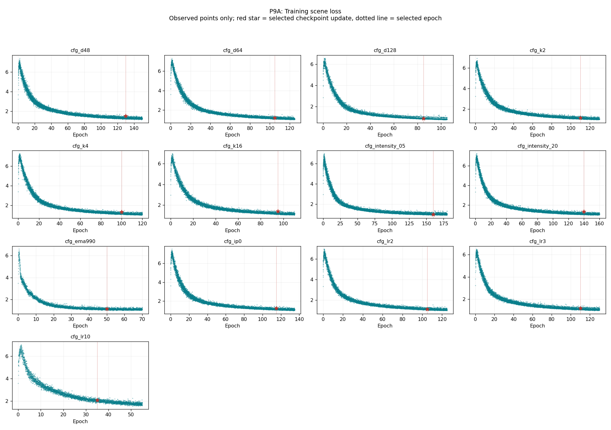

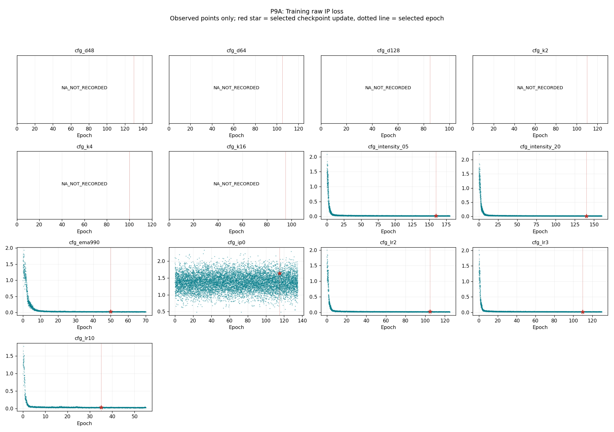

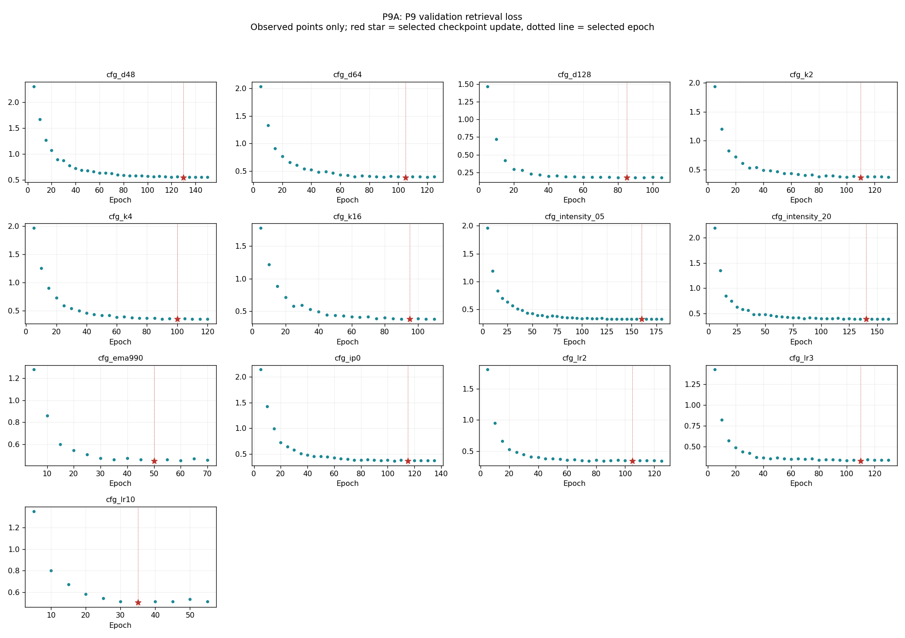

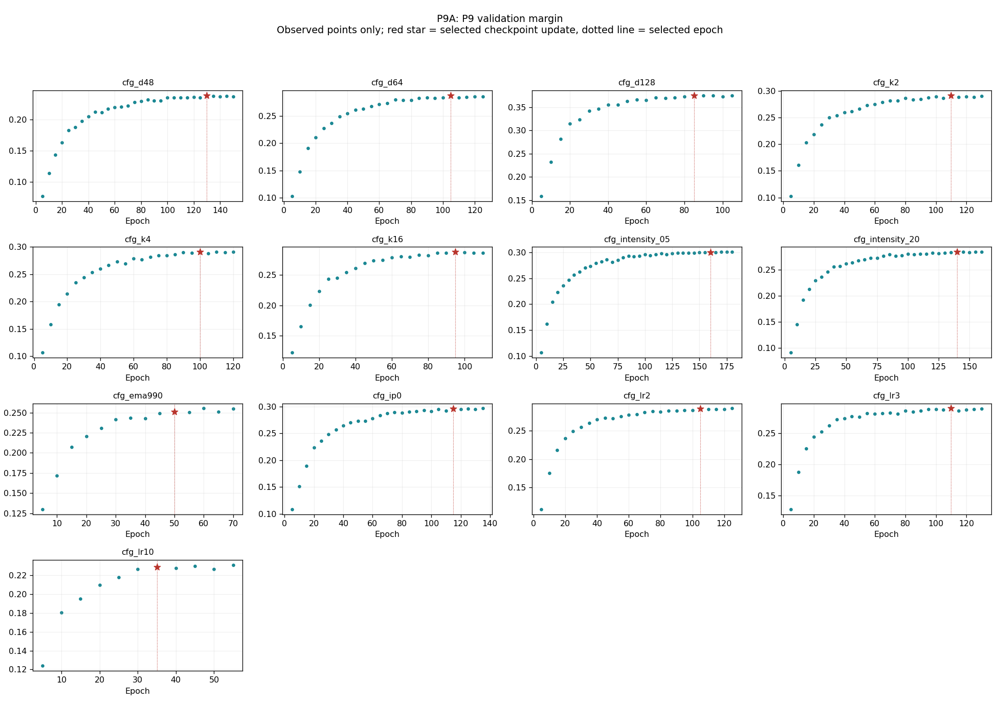

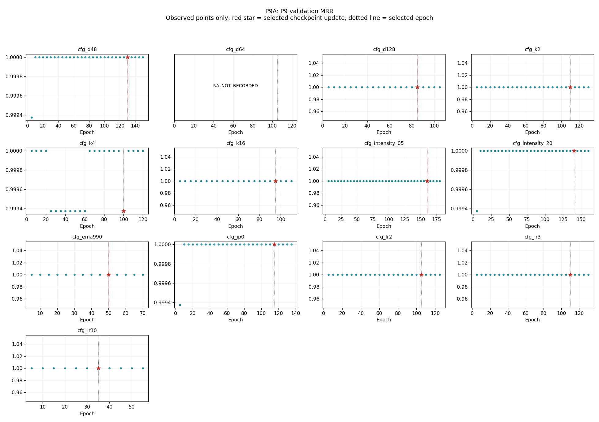

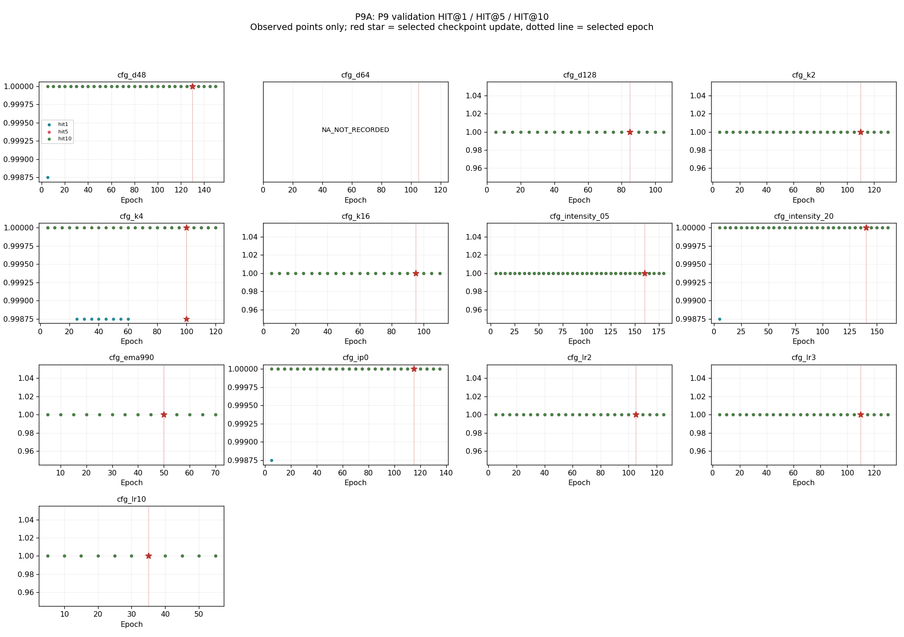

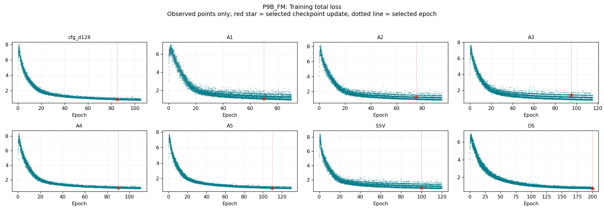

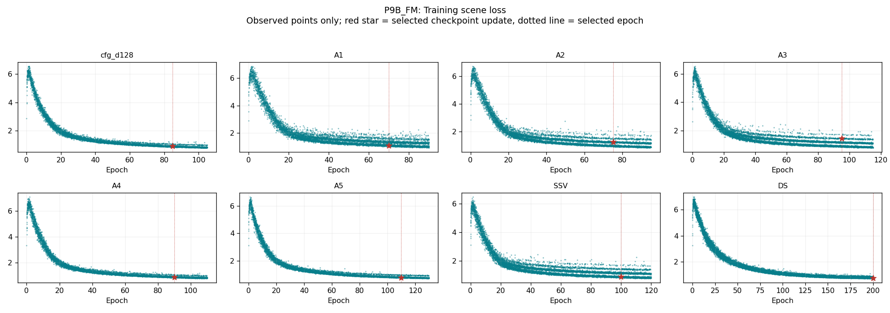

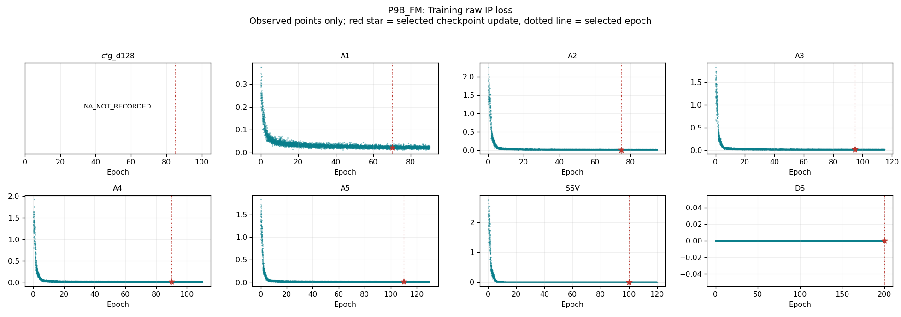

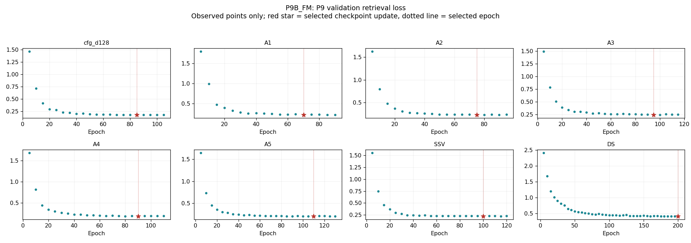

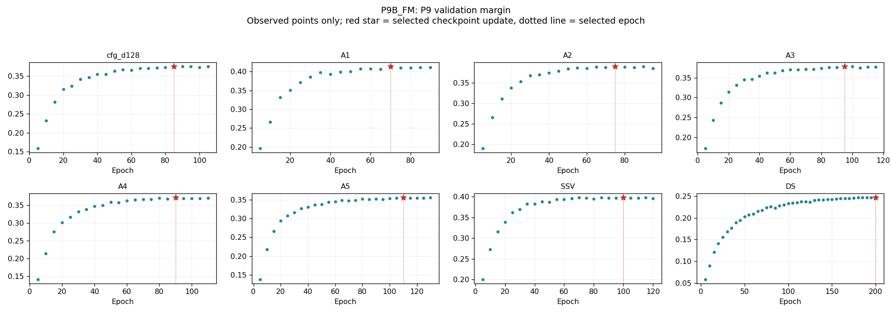

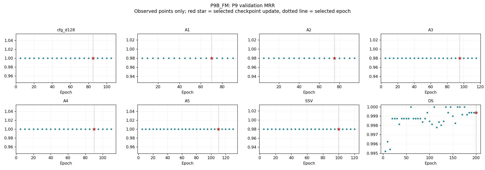

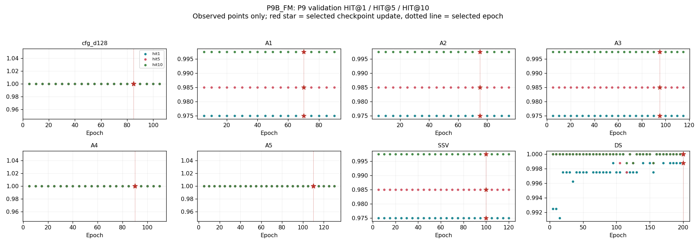

## 11. Canonical P10 Held-Out Evaluation

Only the frozen eight-model comparison set has accepted canonical P10 metrics. The other 12 primary models are **P10_NOT_EVALUATED**, not zero-performing. Canonical acceptance: `p10acc_6e5071beee7616750dec7907`; execution attempt: `p10exec_7fee193dac532190c79e02c6`. This report reads accepted evaluation.json metrics and checks the acceptance comparison, aggregate model-evaluation hash, and P9 checkpoint/acceptance bindings.

| Model | Held-out loss | Held-out margin | MRR | HIT@1 | HIT@5 | HIT@10 | Queries | Gallery | Checkpoint | P10 acceptance | Result SHA-256 |
| --- | --- | --- | --- | --- | --- | --- | --- | --- | --- | --- | --- |
| cfg_d128 | 0.589492917 | 0.285560012 | 0.997060776 | 0.995625019 | 0.999687493 | 1.000000000 | 3200 | 1600 | p9ck_56195e9ea3cd45d80cf5e23c | p10acc_6e5071beee7616750dec7907 | dcb44aa2002f9601e7ec7538268977c5baeb6f40db0438675259eda32b377f44 |
| A1 | 0.663633406 | 0.350111574 | 0.964189708 | 0.961875021 | 0.964375019 | 0.967499971 | 3200 | 1600 | p9ck_37979e7a36f6b189ecf674d0 | p10acc_6e5071beee7616750dec7907 | f7845ae3e909e15680a4a3d69bc308d206fa52fed5176bb768e006611a9769d6 |
| A2 | 0.662105620 | 0.328833401 | 0.964575708 | 0.962187529 | 0.964999974 | 0.968124986 | 3200 | 1600 | p9ck_74cc9b14a7d294463bfd5a9c | p10acc_6e5071beee7616750dec7907 | a32b124522c5b7cad0f6f2d4c5e8dafab6e3f1c32eeeddee5a16c7a3b12f0fa9 |
| A3 | 0.709324419 | 0.305761635 | 0.964653850 | 0.962187529 | 0.964999974 | 0.968124986 | 3200 | 1600 | p9ck_c0784d438146deeaee04fd34 | p10acc_6e5071beee7616750dec7907 | 0ab1e86afced7c507683cb236ac441c178ef63cca94494da3e5debba020a6915 |
| A4 | 0.622689188 | 0.285455823 | 0.996596396 | 0.995312512 | 0.998437524 | 1.000000000 | 3200 | 1600 | p9ck_a71bec2d0fae827ee7c97879 | p10acc_6e5071beee7616750dec7907 | 08343903498b78d8ecc037a3ade3f9d170a593f4de7816b7f07531ae03d84959 |
| A5 | 0.651534140 | 0.272485107 | 0.997052133 | 0.995625019 | 0.999687493 | 1.000000000 | 3200 | 1600 | p9ck_0ee547be5473315d457bf104 | p10acc_6e5071beee7616750dec7907 | 1cda18441fbc228f0ca3e4e76ffb5c85af5bf3b14517da992f3e94927d0fd629 |
| SSV | 0.657797992 | 0.334757298 | 0.963987947 | 0.961562514 | 0.964062512 | 0.967812479 | 3200 | 1600 | p9ck_388bce700e35c96012e77b1a | p10acc_6e5071beee7616750dec7907 | fa4680991215d38748c0748ba949623911f70e30c6bb771494e97f59742d4e92 |
| DS | 1.073997617 | 0.171350345 | 0.992726445 | 0.989687502 | 0.996249974 | 0.998437524 | 3200 | 1600 | p9ck_65cc78a1a97330f3af05fba4 | p10acc_6e5071beee7616750dec7907 | 5837785a5b358bc5d71c8e011d76836470b6767caf19df603d6c14e70c55bba9 |

## 12. P9 Validation Versus P10 Held-Out

FM retains the lowest held-out loss (0.589492917) and highest MRR (0.997060776). A4 is closest on held-out loss (0.622689188); A5 is closest on MRR (0.997052133), and ties FM on HIT@1/HIT@5/HIT@10 at stored precision. A4 also ties HIT@10. No model exceeds FM on MRR or HIT. A1, A2, A3 and SSV exceed FM on held-out mean margin; thus a larger margin alone does not establish better overall retrieval performance.

P9 validation loss ordering (ascending): cfg_d128 < A4 < A5 < A1 < SSV < A2 < A3 < DS.

P10 held-out loss ordering (ascending): cfg_d128 < A4 < A5 < SSV < A2 < A1 < A3 < DS.

The lowest-loss FM conclusion is consistent across splits, but the complete ordering need not be. A1-A5 do not show monotonic improvement in both loss and margin. Adding semantic/object context alone yields mixed changes; raster completion materially improves held-out rank metrics relative to A1-A3, and FM improves held-out loss over the generic-relation A5. These are conditional controlled-configuration contrasts, not evidence that any component is universally beneficial. DS has high rank metrics but the weakest held-out loss/margin in this set, illustrating that rank saturation and softmax concentration measure different properties.

The later 10K gallery exists as a supplementary qualitative retrieval extension. It does not replace canonical P10 metrics; no 10K similarity values enter this report.

## 13. Metric Availability And Limitations

| Model | P9 val loss | P9 margin | P9 MRR | P9 HIT1 | P9 HIT5 | P9 HIT10 | Training raw IP | Training weighted IP | P10 metrics |
| --- | --- | --- | --- | --- | --- | --- | --- | --- | --- |
| cfg_d48 | AVAILABLE | AVAILABLE | AVAILABLE | AVAILABLE | AVAILABLE | AVAILABLE | NOT_RECORDED | NOT_RECORDED | NOT_EVALUATED |
| cfg_d64 | AVAILABLE | AVAILABLE | NOT_RECORDED | NOT_RECORDED | NOT_RECORDED | NOT_RECORDED | NOT_RECORDED | AVAILABLE | NOT_EVALUATED |
| cfg_d128 | AVAILABLE | AVAILABLE | AVAILABLE | AVAILABLE | AVAILABLE | AVAILABLE | NOT_RECORDED | NOT_RECORDED | AVAILABLE |
| cfg_k2 | AVAILABLE | AVAILABLE | AVAILABLE | AVAILABLE | AVAILABLE | AVAILABLE | NOT_RECORDED | NOT_RECORDED | NOT_EVALUATED |
| cfg_k4 | AVAILABLE | AVAILABLE | AVAILABLE | AVAILABLE | AVAILABLE | AVAILABLE | NOT_RECORDED | NOT_RECORDED | NOT_EVALUATED |
| cfg_k16 | AVAILABLE | AVAILABLE | AVAILABLE | AVAILABLE | AVAILABLE | AVAILABLE | NOT_RECORDED | NOT_RECORDED | NOT_EVALUATED |
| cfg_intensity_05 | AVAILABLE | AVAILABLE | AVAILABLE | AVAILABLE | AVAILABLE | AVAILABLE | AVAILABLE | AVAILABLE | NOT_EVALUATED |
| cfg_intensity_20 | AVAILABLE | AVAILABLE | AVAILABLE | AVAILABLE | AVAILABLE | AVAILABLE | AVAILABLE | AVAILABLE | NOT_EVALUATED |
| cfg_ema990 | AVAILABLE | AVAILABLE | AVAILABLE | AVAILABLE | AVAILABLE | AVAILABLE | AVAILABLE | AVAILABLE | NOT_EVALUATED |
| cfg_ip0 | AVAILABLE | AVAILABLE | AVAILABLE | AVAILABLE | AVAILABLE | AVAILABLE | AVAILABLE | AVAILABLE | NOT_EVALUATED |
| cfg_lr2 | AVAILABLE | AVAILABLE | AVAILABLE | AVAILABLE | AVAILABLE | AVAILABLE | AVAILABLE | AVAILABLE | NOT_EVALUATED |
| cfg_lr3 | AVAILABLE | AVAILABLE | AVAILABLE | AVAILABLE | AVAILABLE | AVAILABLE | AVAILABLE | AVAILABLE | NOT_EVALUATED |
| cfg_lr10 | AVAILABLE | AVAILABLE | AVAILABLE | AVAILABLE | AVAILABLE | AVAILABLE | AVAILABLE | AVAILABLE | NOT_EVALUATED |
| A1 | AVAILABLE | AVAILABLE | AVAILABLE | AVAILABLE | AVAILABLE | AVAILABLE | AVAILABLE | AVAILABLE | AVAILABLE |
| A2 | AVAILABLE | AVAILABLE | AVAILABLE | AVAILABLE | AVAILABLE | AVAILABLE | AVAILABLE | AVAILABLE | AVAILABLE |
| A3 | AVAILABLE | AVAILABLE | AVAILABLE | AVAILABLE | AVAILABLE | AVAILABLE | AVAILABLE | AVAILABLE | AVAILABLE |
| A4 | AVAILABLE | AVAILABLE | AVAILABLE | AVAILABLE | AVAILABLE | AVAILABLE | AVAILABLE | AVAILABLE | AVAILABLE |
| A5 | AVAILABLE | AVAILABLE | AVAILABLE | AVAILABLE | AVAILABLE | AVAILABLE | AVAILABLE | AVAILABLE | AVAILABLE |
| SSV | AVAILABLE | AVAILABLE | AVAILABLE | AVAILABLE | AVAILABLE | AVAILABLE | AVAILABLE | AVAILABLE | AVAILABLE |
| DS | AVAILABLE | AVAILABLE | AVAILABLE | AVAILABLE | AVAILABLE | AVAILABLE | AVAILABLE | AVAILABLE | AVAILABLE |

The dissertation states that supplementary P9 ranks were recorded; the historical cfg_d64 payload does not contain those fields. This is a recording-coverage discrepancy, reported here without changing the manuscript or inventing missing metrics. Native records are audited individually; AVAILABLE means recorded at every validation checkpoint, not reconstructed at selection. Machine-readable metrics use float64 nullable columns plus explicit status columns; null means NA_NOT_RECORDED. Training rows between validation events also carry NOT_A_VALIDATION_INTERVAL. CSV exports spell missing cells NA_NOT_RECORDED. Stored binary floating-point precision is preserved in Parquet; Markdown uses nine decimal places. Recorded IP arithmetic is checked at rtol=2e-7, atol=2e-6 solely for float32 addition/multiplication rounding; all accepted selection/P10 source metric comparisons are exact binary64 equality.

Historical import event timestamps are import times, not original training start/end timestamps. They are not relabeled as runtime. For cfg_d64, the v2-bound source attempt_state.json records its actual controller start and failure-classified terminal time. Their difference is reported only as controller elapsed time, including post-training termination, not an exact optimization duration. The accepted v2 import reconstructs scientific completion and patience stopping from the durable 125-epoch checkpoint despite that historical controller failure label. Native wall duration includes validation and interruptions between RUN_STARTED and TRAINING_COMPLETED; recorded per-update or validation-boundary-epoch operational intervals remain separately labeled. Boundary diagnostics measure the single epoch ending at each five-epoch validation boundary, not all five epochs. DS reaches the 200-epoch maximum without a patience trigger; the other 19 primary runs stop on patience. No missing elapsed time is estimated.

## 14. Artifact Inventory

Artifact directory: `artifacts/p9-p10-results-report/p9p10report_cd410155ce55a1658adf01fd`. `manifest.json` binds source hashes, derived files, schema, model universe, implementation and verification. `source_hashes.json` records before hashes; validation.json records the after check. Complete training trajectories are in training_history.parquet, complete validation in validation_history.parquet. Per-model CSV appendices contain every recorded validation checkpoint. Secondary traces live only in interaction_* tables.

- `model_inventory.parquet`: 20 rows.
- `training_history.parquet`: 186,580 rows.
- `validation_history.parquet`: 491 rows.
- `interaction_diagnostics.parquet`: 2 rows.
- `interaction_training_history.parquet`: 17,860 rows.
- `interaction_validation_history.parquet`: 47 rows.
- `p10_heldout_summary.parquet`: 8 rows.
- `training_epoch_summary.parquet`: 2,455 rows.
- `interaction_training_epoch_summary.parquet`: 235 rows.
- `selection_summary.parquet`: 20 rows.
- `p9a_summary.parquet`: 13 rows.
- `p9b_summary.parquet`: 8 rows.
- `selection_contract_validation.parquet`: 20 rows.
- `metric_availability.parquet`: 20 rows.
- `figure_inputs.parquet`: 189 rows.

## 15. Validation And Preservation

Assertions: {"comparison_models":8,"duplicate_models":0,"excluded_scope_rows":0,"p10_metric_rows":8,"p9_rank_trajectory_models":19,"p9a_models":13,"p9b_variants":7,"primary_models":20,"secondary_models":2,"selection_agreements":20,"source_preservation":{"changed_files":0,"files_checked":8473,"status":"PASS"},"status":"PASS","training_history_rows":186580,"validation_history_rows":491}

Checks include exact 20/13/7/8 counts, unique configuration mapping, 20 independent selection agreements, ledger patience/terminal agreement, checkpoint hash/locator validation, P10 metric/acceptance binding, per-update completeness, explicit missing-metric coverage, table roundtrip/schema, figure-input counts and Markdown numeric consistency. No targets were changed or executed; R target-manifest/network regeneration is not applicable.

Prohibited work counts: training=0; fine-tuning=0; new inference=0; checkpoint reselection/publication=0; model reselection=0; P9 rerun=0; P10 rerun=0; excluded-stage execution=0; downstream fitting=0; data rematerialization=0; dissertation mutation=0. Independent replay is a verification calculation, not an acceptance change.

## 16. Per-Model Appendix

Each block binds full per-update trajectories by model_id and links a complete validation CSV. Selected and terminal training metrics below are epoch means. Full source identities and effective configuration remain in model_inventory.parquet.

### cfg_d48

Run `p9runv2_79ab1abc43fb8e2ea13b8ce6`; source run `p9runv2_79ab1abc43fb8e2ea13b8ce6`; authority `p9authv2_d3ba1eb1b8204953e4f9292c`; bundle `p9rb_f71a1da232e6ee98e40f08a3`. Acceptance `p9accv2_15d9fb568e794b7efd0cfa8c`; selected checkpoint `p9ck_3704be6c57323160fd0365e9`; terminal `p9ck_2383d2b02f5fe01b200e5c4c`.

Effective config: `{"attention_heads":4,"checkpoint_selector":"validation_retrieval_loss_margin_1e-4_earlier_epoch","d":48,"d_c":48,"d_r":32,"d_t":16,"dropout":0.2,"effective_k":8,"ema":0.999,"ffn_dimension":96,"ffn_multiplier":2,"intensity":"main_1.0x","lambda_ip":1,"optimizer":"AdamW","peak_learning_rate":0.001,"per_head_dimension":12,"scheduler":"linear_warmup_then_cosine_zero","validation_interval_epochs":5,"validation_patience_events":4}`. Architecture: FM architecture; OFAT d.

Start 2026-09-01T03:14:37.987401Z; end 2026-09-01T05:21:59.315081Z; duration 7641.327680000 seconds (RUN_STARTED_TO_TRAINING_COMPLETED_INCLUDES_VALIDATION). Stop reason `EARLY_STOPPING_PATIENCE`; early stopping True; 150 epochs / 11400 updates / 30 validation checkpoints. Selected epoch/update 130/9880. Lowest recorded validation loss 0.548458278.

| Stage | Total | Scene | Raw IP | Weighted IP | P9 loss | P9 margin | MRR | HIT1 | HIT5 | HIT10 |
| --- | --- | --- | --- | --- | --- | --- | --- | --- | --- | --- |
| selected | 1.320138236 | 1.299837578 | NA_NOT_RECORDED | NA_NOT_RECORDED | 0.548458278 | 0.238220543 | 1.000000000 | 1.000000000 | 1.000000000 | 1.000000000 |
| terminal | 1.263205935 | 1.243273898 | NA_NOT_RECORDED | NA_NOT_RECORDED | 0.557466686 | 0.236442626 | 1.000000000 | 1.000000000 | 1.000000000 | 1.000000000 |

[Complete validation trajectory](../artifacts/p9-p10-results-report/p9p10report_cd410155ce55a1658adf01fd/per_model/cfg_d48_validation.csv). Training filter: `model_id == "cfg_d48"` in training_history.parquet. P10: `P10_NOT_EVALUATED`.

### cfg_d64

Run `p9runv2_d6ffbd951bc813f78defeacc`; source run `p9run_6887930091dd2f2bfedc3c96`; authority `p9authv2_47f350372bf94162db8f9142`; bundle `p9rb_78322173dfd691baf67a44a0`. Acceptance `p9accv2_d93b01ef13c3f26a22287ce7`; selected checkpoint `p9ck_42f7957d2ea998ac9e8ff705`; terminal `p9ck_f5eb10cb5744026013f54882`.

Effective config: `{"attention_heads":4,"checkpoint_selector":"validation_retrieval_loss_margin_1e-4_earlier_epoch","d":64,"d_c":64,"d_r":32,"d_t":16,"dropout":0.2,"effective_k":8,"ema":0.999,"ffn_dimension":128,"ffn_multiplier":2,"intensity":"main_1.0x","lambda_ip":1.0,"optimizer":"AdamW","peak_learning_rate":0.001,"per_head_dimension":16,"scheduler":"linear_warmup_then_cosine_zero","validation_interval_epochs":5,"validation_patience_events":4}`. Architecture: FM architecture; OFAT main.

Start 2026-08-31T08:11:13.805650+00:00; end NA_NOT_RECORDED; duration NA_NOT_RECORDED seconds (NA_IMPORTED_EVENT_TIMES_ARE_NOT_TRAINING_TIMES). Stop reason `LEGACY_EARLY_STOPPING_PATIENCE_RECONSTRUCTED`; early stopping True; 125 epochs / 9500 updates / 25 validation checkpoints. Selected epoch/update 105/7980. Lowest recorded validation loss 0.380689353.

| Stage | Total | Scene | Raw IP | Weighted IP | P9 loss | P9 margin | MRR | HIT1 | HIT5 | HIT10 |
| --- | --- | --- | --- | --- | --- | --- | --- | --- | --- | --- |
| selected | 1.188788434 | 1.170366248 | NA_NOT_RECORDED | 0.018422179 | 0.380689353 | 0.287602603 | NA_NOT_RECORDED | NA_NOT_RECORDED | NA_NOT_RECORDED | NA_NOT_RECORDED |
| terminal | 1.104956544 | 1.087449904 | NA_NOT_RECORDED | 0.017506645 | 0.396005809 | 0.285021067 | NA_NOT_RECORDED | NA_NOT_RECORDED | NA_NOT_RECORDED | NA_NOT_RECORDED |

[Complete validation trajectory](../artifacts/p9-p10-results-report/p9p10report_cd410155ce55a1658adf01fd/per_model/cfg_d64_validation.csv). Training filter: `model_id == "cfg_d64"` in training_history.parquet. P10: `P10_NOT_EVALUATED`.

Historical controller terminal: 2026-08-31T09:57:48.451079+00:00; elapsed 6394.645429 seconds; source status FAILED_NONRESUMABLE. Source `/mnt/hdd002/dhnyu/fusedata/models/reduced/formal_training/attempts/p9attempt_a754afd14ac87287afb04029/attempt_state.json` is hash-bound by the v2 source inventory. Sum of recorded optimizer-update runtimes: 6285.661736 seconds, excluding validation and controller overhead. The exact end-of-optimization timestamp remains NA_NOT_RECORDED.

### cfg_d128

Run `p9runv2_ae13c2259e3a73e1dfb209b6`; source run `p9runv2_ae13c2259e3a73e1dfb209b6`; authority `p9authv2_8a0d04b815f566e65d65a2c9`; bundle `p9rb_6c37cab1bb861c283f90bd56`. Acceptance `p9accv2_a1c00e32a882ddc4b7e2677b`; selected checkpoint `p9ck_56195e9ea3cd45d80cf5e23c`; terminal `p9ck_d0844e3d2b89e6082c8488cc`.

Effective config: `{"attention_heads":4,"checkpoint_selector":"validation_retrieval_loss_margin_1e-4_earlier_epoch","d":128,"d_c":128,"d_r":32,"d_t":16,"dropout":0.2,"effective_k":8,"ema":0.999,"ffn_dimension":256,"ffn_multiplier":2,"intensity":"main_1.0x","lambda_ip":1,"optimizer":"AdamW","peak_learning_rate":0.001,"per_head_dimension":32,"scheduler":"linear_warmup_then_cosine_zero","validation_interval_epochs":5,"validation_patience_events":4}`. Architecture: FM: four object modalities, raster branches, heterogeneous relations.

Start 2026-09-01T05:59:26.168427Z; end 2026-09-01T07:35:59.160932Z; duration 5792.992505000 seconds (RUN_STARTED_TO_TRAINING_COMPLETED_INCLUDES_VALIDATION). Stop reason `EARLY_STOPPING_PATIENCE`; early stopping True; 105 epochs / 7980 updates / 21 validation checkpoints. Selected epoch/update 85/6460. Lowest recorded validation loss 0.176506951.

| Stage | Total | Scene | Raw IP | Weighted IP | P9 loss | P9 margin | MRR | HIT1 | HIT5 | HIT10 |
| --- | --- | --- | --- | --- | --- | --- | --- | --- | --- | --- |
| selected | 0.907989207 | 0.893145879 | NA_NOT_RECORDED | NA_NOT_RECORDED | 0.176506951 | 0.375468940 | 1.000000000 | 1.000000000 | 1.000000000 | 1.000000000 |
| terminal | 0.829128080 | 0.814909539 | NA_NOT_RECORDED | NA_NOT_RECORDED | 0.178203523 | 0.375535518 | 1.000000000 | 1.000000000 | 1.000000000 | 1.000000000 |

[Complete validation trajectory](../artifacts/p9-p10-results-report/p9p10report_cd410155ce55a1658adf01fd/per_model/cfg_d128_validation.csv). Training filter: `model_id == "cfg_d128"` in training_history.parquet. P10: `/mnt/hdd002/dhnyu/fusedata/models/reduced/p10/canonical/execution_attempts/p10exec_7fee193dac532190c79e02c6/evaluations/cfg_d128/evaluation.json`.

### cfg_k2

Run `p9runv2_b684d7237a1e42f0c9553319`; source run `p9runv2_b684d7237a1e42f0c9553319`; authority `p9authv2_68b0eac864204e9c2499715f`; bundle `p9rb_4b67708e7689762261ac6c54`. Acceptance `p9accv2_e7c406083c6722a2ccf78920`; selected checkpoint `p9ck_c102332d5bc4513f6293cadb`; terminal `p9ck_735f70076a7145f31747b091`.

Effective config: `{"attention_heads":4,"checkpoint_selector":"validation_retrieval_loss_margin_1e-4_earlier_epoch","d":64,"d_c":64,"d_r":32,"d_t":16,"dropout":0.2,"effective_k":2,"ema":0.999,"ffn_dimension":128,"ffn_multiplier":2,"intensity":"main_1.0x","lambda_ip":1,"optimizer":"AdamW","peak_learning_rate":0.001,"per_head_dimension":16,"scheduler":"linear_warmup_then_cosine_zero","validation_interval_epochs":5,"validation_patience_events":4}`. Architecture: FM architecture; OFAT K.

Start 2026-09-01T07:36:29.236576Z; end 2026-09-01T09:25:02.545601Z; duration 6513.309025000 seconds (RUN_STARTED_TO_TRAINING_COMPLETED_INCLUDES_VALIDATION). Stop reason `EARLY_STOPPING_PATIENCE`; early stopping True; 130 epochs / 9880 updates / 26 validation checkpoints. Selected epoch/update 110/8360. Lowest recorded validation loss 0.364493638.

| Stage | Total | Scene | Raw IP | Weighted IP | P9 loss | P9 margin | MRR | HIT1 | HIT5 | HIT10 |
| --- | --- | --- | --- | --- | --- | --- | --- | --- | --- | --- |
| selected | 1.148997156 | 1.129255513 | NA_NOT_RECORDED | NA_NOT_RECORDED | 0.364493638 | 0.291342914 | 1.000000000 | 1.000000000 | 1.000000000 | 1.000000000 |
| terminal | 1.076686279 | 1.058359913 | NA_NOT_RECORDED | NA_NOT_RECORDED | 0.370630950 | 0.290411174 | 1.000000000 | 1.000000000 | 1.000000000 | 1.000000000 |

[Complete validation trajectory](../artifacts/p9-p10-results-report/p9p10report_cd410155ce55a1658adf01fd/per_model/cfg_k2_validation.csv). Training filter: `model_id == "cfg_k2"` in training_history.parquet. P10: `P10_NOT_EVALUATED`.

### cfg_k4

Run `p9runv2_7d2f4e3c093f9a757e0c613b`; source run `p9runv2_7d2f4e3c093f9a757e0c613b`; authority `p9authv2_aec9098a66038d741dcea054`; bundle `p9rb_810a3d8f19d9056de6ce177d`. Acceptance `p9accv2_e5195740f5411f57271ba080`; selected checkpoint `p9ck_dcf5f947b5830925d3ba6096`; terminal `p9ck_8754ddec9ebabc2acdaf5612`.

Effective config: `{"attention_heads":4,"checkpoint_selector":"validation_retrieval_loss_margin_1e-4_earlier_epoch","d":64,"d_c":64,"d_r":32,"d_t":16,"dropout":0.2,"effective_k":4,"ema":0.999,"ffn_dimension":128,"ffn_multiplier":2,"intensity":"main_1.0x","lambda_ip":1,"optimizer":"AdamW","peak_learning_rate":0.001,"per_head_dimension":16,"scheduler":"linear_warmup_then_cosine_zero","validation_interval_epochs":5,"validation_patience_events":4}`. Architecture: FM architecture; OFAT K.

Start 2026-09-01T09:25:28.492301Z; end 2026-09-01T11:07:53.675136Z; duration 6145.182835000 seconds (RUN_STARTED_TO_TRAINING_COMPLETED_INCLUDES_VALIDATION). Stop reason `EARLY_STOPPING_PATIENCE`; early stopping True; 120 epochs / 9120 updates / 24 validation checkpoints. Selected epoch/update 100/7600. Lowest recorded validation loss 0.352069885.

| Stage | Total | Scene | Raw IP | Weighted IP | P9 loss | P9 margin | MRR | HIT1 | HIT5 | HIT10 |
| --- | --- | --- | --- | --- | --- | --- | --- | --- | --- | --- |
| selected | 1.181018058 | 1.162249281 | NA_NOT_RECORDED | NA_NOT_RECORDED | 0.352069885 | 0.290824920 | 0.999374986 | 0.998749971 | 1.000000000 | 1.000000000 |
| terminal | 1.122484863 | 1.104753541 | NA_NOT_RECORDED | NA_NOT_RECORDED | 0.358398825 | 0.291065156 | 1.000000000 | 1.000000000 | 1.000000000 | 1.000000000 |

[Complete validation trajectory](../artifacts/p9-p10-results-report/p9p10report_cd410155ce55a1658adf01fd/per_model/cfg_k4_validation.csv). Training filter: `model_id == "cfg_k4"` in training_history.parquet. P10: `P10_NOT_EVALUATED`.

### cfg_k16

Run `p9runv2_7f99d72f96bf3a5bdbb19930`; source run `p9runv2_7f99d72f96bf3a5bdbb19930`; authority `p9authv2_1211e34ea422dbbf706770d2`; bundle `p9rb_48fc8bf84a72deda9c916f11`. Acceptance `p9accv2_039dec13e82ccb86f4cee20e`; selected checkpoint `p9ck_feb73bf6ab7c8bf0ab4d1dfa`; terminal `p9ck_4301ef426bcc5b4b9135320f`.

Effective config: `{"attention_heads":4,"checkpoint_selector":"validation_retrieval_loss_margin_1e-4_earlier_epoch","d":64,"d_c":64,"d_r":32,"d_t":16,"dropout":0.2,"effective_k":16,"ema":0.999,"ffn_dimension":128,"ffn_multiplier":2,"intensity":"main_1.0x","lambda_ip":1,"optimizer":"AdamW","peak_learning_rate":0.001,"per_head_dimension":16,"scheduler":"linear_warmup_then_cosine_zero","validation_interval_epochs":5,"validation_patience_events":4}`. Architecture: FM architecture; OFAT K.

Start 2026-09-01T11:08:17.650813Z; end 2026-09-01T12:42:54.226480Z; duration 5676.575667000 seconds (RUN_STARTED_TO_TRAINING_COMPLETED_INCLUDES_VALIDATION). Stop reason `EARLY_STOPPING_PATIENCE`; early stopping True; 110 epochs / 8360 updates / 22 validation checkpoints. Selected epoch/update 95/7220. Lowest recorded validation loss 0.377282679.

| Stage | Total | Scene | Raw IP | Weighted IP | P9 loss | P9 margin | MRR | HIT1 | HIT5 | HIT10 |
| --- | --- | --- | --- | --- | --- | --- | --- | --- | --- | --- |
| selected | 1.210579100 | 1.192128679 | NA_NOT_RECORDED | NA_NOT_RECORDED | 0.377282679 | 0.288145244 | 1.000000000 | 1.000000000 | 1.000000000 | 1.000000000 |
| terminal | 1.153023634 | 1.134812159 | NA_NOT_RECORDED | NA_NOT_RECORDED | 0.381359458 | 0.286709547 | 1.000000000 | 1.000000000 | 1.000000000 | 1.000000000 |

[Complete validation trajectory](../artifacts/p9-p10-results-report/p9p10report_cd410155ce55a1658adf01fd/per_model/cfg_k16_validation.csv). Training filter: `model_id == "cfg_k16"` in training_history.parquet. P10: `P10_NOT_EVALUATED`.

### cfg_intensity_05

Run `p9runv2_32e0c8be36a881b20384abd0`; source run `p9runv2_32e0c8be36a881b20384abd0`; authority `p9authv2_c86c42d341c6d3f7d651bc15`; bundle `p9rb_74b1ade8f71044b83ff4ca3b`. Acceptance `p9accv2_9cf610131a5a18c55e1ecfd7`; selected checkpoint `p9ck_a5c91b47650941ce260bdf76`; terminal `p9ck_dc8d3a391e261a550a4141a9`.

Effective config: `{"attention_heads":4,"checkpoint_selector":"validation_retrieval_loss_margin_1e-4_earlier_epoch","d":64,"d_c":64,"d_r":32,"d_t":16,"dropout":0.2,"effective_k":8,"ema":0.999,"ffn_dimension":128,"ffn_multiplier":2,"intensity":"weak_0.5x","lambda_ip":1,"optimizer":"AdamW","peak_learning_rate":0.001,"per_head_dimension":16,"scheduler":"linear_warmup_then_cosine_zero","validation_interval_epochs":5,"validation_patience_events":4}`. Architecture: FM architecture; OFAT intensity.

Start 2026-09-02T02:26:48.022981Z; end 2026-09-02T05:05:51.027053Z; duration 9543.004072000 seconds (RUN_STARTED_TO_TRAINING_COMPLETED_INCLUDES_VALIDATION). Stop reason `EARLY_STOPPING_PATIENCE`; early stopping True; 180 epochs / 13680 updates / 36 validation checkpoints. Selected epoch/update 160/12160. Lowest recorded validation loss 0.323341548.

| Stage | Total | Scene | Raw IP | Weighted IP | P9 loss | P9 margin | MRR | HIT1 | HIT5 | HIT10 |
| --- | --- | --- | --- | --- | --- | --- | --- | --- | --- | --- |
| selected | 1.029129625 | 1.011054922 | 0.018074701 | 0.018074701 | 0.323341548 | 0.299975187 | 1.000000000 | 1.000000000 | 1.000000000 | 1.000000000 |
| terminal | 1.006743785 | 0.988883511 | 0.017860274 | 0.017860274 | 0.324452281 | 0.300725818 | 1.000000000 | 1.000000000 | 1.000000000 | 1.000000000 |

[Complete validation trajectory](../artifacts/p9-p10-results-report/p9p10report_cd410155ce55a1658adf01fd/per_model/cfg_intensity_05_validation.csv). Training filter: `model_id == "cfg_intensity_05"` in training_history.parquet. P10: `P10_NOT_EVALUATED`.

### cfg_intensity_20

Run `p9runv2_9691a86bfe660903d18de9d5`; source run `p9runv2_9691a86bfe660903d18de9d5`; authority `p9authv2_95fc5f17918b033297e31fe8`; bundle `p9rb_98d7dfd4363d9d2cb2c63090`. Acceptance `p9accv2_8eb8718344da89701b156a90`; selected checkpoint `p9ck_c5877cfd5fa2e028c0154c9a`; terminal `p9ck_149671672dd671b8aef8b20b`.

Effective config: `{"attention_heads":4,"checkpoint_selector":"validation_retrieval_loss_margin_1e-4_earlier_epoch","d":64,"d_c":64,"d_r":32,"d_t":16,"dropout":0.2,"effective_k":8,"ema":0.999,"ffn_dimension":128,"ffn_multiplier":2,"intensity":"strong_2.0x","lambda_ip":1,"optimizer":"AdamW","peak_learning_rate":0.001,"per_head_dimension":16,"scheduler":"linear_warmup_then_cosine_zero","validation_interval_epochs":5,"validation_patience_events":4}`. Architecture: FM architecture; OFAT intensity.

Start 2026-09-02T05:06:19.499232Z; end 2026-09-02T07:18:03.696289Z; duration 7904.197057000 seconds (RUN_STARTED_TO_TRAINING_COMPLETED_INCLUDES_VALIDATION). Stop reason `EARLY_STOPPING_PATIENCE`; early stopping True; 160 epochs / 12160 updates / 32 validation checkpoints. Selected epoch/update 140/10640. Lowest recorded validation loss 0.383309454.

| Stage | Total | Scene | Raw IP | Weighted IP | P9 loss | P9 margin | MRR | HIT1 | HIT5 | HIT10 |
| --- | --- | --- | --- | --- | --- | --- | --- | --- | --- | --- |
| selected | 1.116289255 | 1.099902115 | 0.016387140 | 0.016387140 | 0.383309454 | 0.284097970 | 1.000000000 | 1.000000000 | 1.000000000 | 1.000000000 |
| terminal | 1.076962480 | 1.060282684 | 0.016679794 | 0.016679794 | 0.390809745 | 0.284173578 | 1.000000000 | 1.000000000 | 1.000000000 | 1.000000000 |

[Complete validation trajectory](../artifacts/p9-p10-results-report/p9p10report_cd410155ce55a1658adf01fd/per_model/cfg_intensity_20_validation.csv). Training filter: `model_id == "cfg_intensity_20"` in training_history.parquet. P10: `P10_NOT_EVALUATED`.

### cfg_ema990

Run `p9runv2_925cb75693059c854c74fdc1`; source run `p9runv2_925cb75693059c854c74fdc1`; authority `p9authv2_42e5141333b604aa62eb8603`; bundle `p9rb_4164611ae6b89c5dde09f9aa`. Acceptance `p9accv2_0a6fc8990ef1b1a67ba75358`; selected checkpoint `p9ck_b2c40f9a1f6ea34788134cb7`; terminal `p9ck_bca8ef1c0318d0a8378d746b`.

Effective config: `{"attention_heads":4,"checkpoint_selector":"validation_retrieval_loss_margin_1e-4_earlier_epoch","d":64,"d_c":64,"d_r":32,"d_t":16,"dropout":0.2,"effective_k":8,"ema":0.99,"ffn_dimension":128,"ffn_multiplier":2,"intensity":"main_1.0x","lambda_ip":1,"optimizer":"AdamW","peak_learning_rate":0.001,"per_head_dimension":16,"scheduler":"linear_warmup_then_cosine_zero","validation_interval_epochs":5,"validation_patience_events":4}`. Architecture: FM architecture; OFAT EMA.

Start 2026-09-02T07:18:30.965918Z; end 2026-09-02T08:18:46.329564Z; duration 3615.363646000 seconds (RUN_STARTED_TO_TRAINING_COMPLETED_INCLUDES_VALIDATION). Stop reason `EARLY_STOPPING_PATIENCE`; early stopping True; 70 epochs / 5320 updates / 14 validation checkpoints. Selected epoch/update 50/3800. Lowest recorded validation loss 0.448924094.

| Stage | Total | Scene | Raw IP | Weighted IP | P9 loss | P9 margin | MRR | HIT1 | HIT5 | HIT10 |
| --- | --- | --- | --- | --- | --- | --- | --- | --- | --- | --- |
| selected | 1.154521503 | 1.133391234 | 0.021130264 | 0.021130264 | 0.448924094 | 0.250989079 | 1.000000000 | 1.000000000 | 1.000000000 | 1.000000000 |
| terminal | 1.132690262 | 1.112423302 | 0.020266954 | 0.020266954 | 0.454755694 | 0.254960150 | 1.000000000 | 1.000000000 | 1.000000000 | 1.000000000 |

[Complete validation trajectory](../artifacts/p9-p10-results-report/p9p10report_cd410155ce55a1658adf01fd/per_model/cfg_ema990_validation.csv). Training filter: `model_id == "cfg_ema990"` in training_history.parquet. P10: `P10_NOT_EVALUATED`.

### cfg_ip0

Run `p9runv2_aca11ec5e122b31e220f7414`; source run `p9runv2_aca11ec5e122b31e220f7414`; authority `p9authv2_68ccb09ed4507f14d596e194`; bundle `p9rb_9cbbcb12089117364ad80b08`. Acceptance `p9accv2_b7351959991cdb537163eec8`; selected checkpoint `p9ck_4320508baca7ed3c7ebd52b8`; terminal `p9ck_fc9cad333f11310b03a1c477`.

Effective config: `{"attention_heads":4,"checkpoint_selector":"validation_retrieval_loss_margin_1e-4_earlier_epoch","d":64,"d_c":64,"d_r":32,"d_t":16,"dropout":0.2,"effective_k":8,"ema":0.999,"ffn_dimension":128,"ffn_multiplier":2,"intensity":"main_1.0x","lambda_ip":0,"optimizer":"AdamW","peak_learning_rate":0.001,"per_head_dimension":16,"scheduler":"linear_warmup_then_cosine_zero","validation_interval_epochs":5,"validation_patience_events":4}`. Architecture: FM architecture; OFAT lambda_IP.

Start 2026-09-02T08:19:08.157323Z; end 2026-09-02T10:14:49.348411Z; duration 6941.191088000 seconds (RUN_STARTED_TO_TRAINING_COMPLETED_INCLUDES_VALIDATION). Stop reason `EARLY_STOPPING_PATIENCE`; early stopping True; 135 epochs / 10260 updates / 27 validation checkpoints. Selected epoch/update 115/8740. Lowest recorded validation loss 0.367229640.

| Stage | Total | Scene | Raw IP | Weighted IP | P9 loss | P9 margin | MRR | HIT1 | HIT5 | HIT10 |
| --- | --- | --- | --- | --- | --- | --- | --- | --- | --- | --- |
| selected | 1.133023797 | 1.133023797 | 1.354473976 | 0.000000000 | 0.367229640 | 0.295699596 | 1.000000000 | 1.000000000 | 1.000000000 | 1.000000000 |
| terminal | 1.064832281 | 1.064832281 | 1.352152352 | 0.000000000 | 0.376351506 | 0.296441913 | 1.000000000 | 1.000000000 | 1.000000000 | 1.000000000 |

[Complete validation trajectory](../artifacts/p9-p10-results-report/p9p10report_cd410155ce55a1658adf01fd/per_model/cfg_ip0_validation.csv). Training filter: `model_id == "cfg_ip0"` in training_history.parquet. P10: `P10_NOT_EVALUATED`.

### cfg_lr2

Run `p9runv2_33e4444c800cb8e1cd95fab2`; source run `p9runv2_33e4444c800cb8e1cd95fab2`; authority `p9authv2_865f08312151d3117f7977bd`; bundle `p9rb_7e52cf8561b1f7e6ce7b24e0`. Acceptance `p9accv2_6bd7e6e70b3c3bedec4f79b4`; selected checkpoint `p9ck_eeb57924381792bdf99eb31c`; terminal `p9ck_8274cfa3517429eb980590cb`.

Effective config: `{"attention_heads":4,"checkpoint_selector":"validation_retrieval_loss_margin_1e-4_earlier_epoch","d":64,"d_c":64,"d_r":32,"d_t":16,"dropout":0.2,"effective_k":8,"ema":0.999,"ffn_dimension":128,"ffn_multiplier":2,"intensity":"main_1.0x","lambda_ip":1,"optimizer":"AdamW","peak_learning_rate":0.002,"per_head_dimension":16,"scheduler":"linear_warmup_then_cosine_zero","validation_interval_epochs":5,"validation_patience_events":4}`. Architecture: FM architecture; OFAT peak_LR.

Start 2026-09-02T10:15:15.742781Z; end 2026-09-02T12:02:30.089776Z; duration 6434.346995000 seconds (RUN_STARTED_TO_TRAINING_COMPLETED_INCLUDES_VALIDATION). Stop reason `EARLY_STOPPING_PATIENCE`; early stopping True; 125 epochs / 9500 updates / 25 validation checkpoints. Selected epoch/update 105/7980. Lowest recorded validation loss 0.343239278.

| Stage | Total | Scene | Raw IP | Weighted IP | P9 loss | P9 margin | MRR | HIT1 | HIT5 | HIT10 |
| --- | --- | --- | --- | --- | --- | --- | --- | --- | --- | --- |
| selected | 1.143280765 | 1.126533361 | 0.016747401 | 0.016747401 | 0.343239278 | 0.288937896 | 1.000000000 | 1.000000000 | 1.000000000 | 1.000000000 |
| terminal | 1.079924636 | 1.063354394 | 0.016570242 | 0.016570242 | 0.343860984 | 0.289736390 | 1.000000000 | 1.000000000 | 1.000000000 | 1.000000000 |

[Complete validation trajectory](../artifacts/p9-p10-results-report/p9p10report_cd410155ce55a1658adf01fd/per_model/cfg_lr2_validation.csv). Training filter: `model_id == "cfg_lr2"` in training_history.parquet. P10: `P10_NOT_EVALUATED`.

### cfg_lr3

Run `p9runv2_561f8a00aef0b3d480e7f752`; source run `p9runv2_561f8a00aef0b3d480e7f752`; authority `p9authv2_d98b0cdeabf70eb1b533efb9`; bundle `p9rb_b4575e483cb8a81be83ec67d`. Acceptance `p9accv2_1c42f030d852fa1a76722198`; selected checkpoint `p9ck_c261a142002c18c898a77e6b`; terminal `p9ck_8ce9e1582cfa46bcf2c372f3`.

Effective config: `{"attention_heads":4,"checkpoint_selector":"validation_retrieval_loss_margin_1e-4_earlier_epoch","d":64,"d_c":64,"d_r":32,"d_t":16,"dropout":0.2,"effective_k":8,"ema":0.999,"ffn_dimension":128,"ffn_multiplier":2,"intensity":"main_1.0x","lambda_ip":1,"optimizer":"AdamW","peak_learning_rate":0.003,"per_head_dimension":16,"scheduler":"linear_warmup_then_cosine_zero","validation_interval_epochs":5,"validation_patience_events":4}`. Architecture: FM architecture; OFAT peak_LR.

Start 2026-09-02T12:02:53.916622Z; end 2026-09-02T13:56:56.296088Z; duration 6842.379466000 seconds (RUN_STARTED_TO_TRAINING_COMPLETED_INCLUDES_VALIDATION). Stop reason `EARLY_STOPPING_PATIENCE`; early stopping True; 130 epochs / 9880 updates / 26 validation checkpoints. Selected epoch/update 110/8360. Lowest recorded validation loss 0.331801981.

| Stage | Total | Scene | Raw IP | Weighted IP | P9 loss | P9 margin | MRR | HIT1 | HIT5 | HIT10 |
| --- | --- | --- | --- | --- | --- | --- | --- | --- | --- | --- |
| selected | 1.120484589 | 1.103643174 | 0.016841413 | 0.016841413 | 0.331801981 | 0.289395839 | 1.000000000 | 1.000000000 | 1.000000000 | 1.000000000 |
| terminal | 1.075920296 | 1.060103692 | 0.015816609 | 0.015816609 | 0.342638463 | 0.288967311 | 1.000000000 | 1.000000000 | 1.000000000 | 1.000000000 |

[Complete validation trajectory](../artifacts/p9-p10-results-report/p9p10report_cd410155ce55a1658adf01fd/per_model/cfg_lr3_validation.csv). Training filter: `model_id == "cfg_lr3"` in training_history.parquet. P10: `P10_NOT_EVALUATED`.

### cfg_lr10

Run `p9runv2_aae99423db37bba163ba1ea2`; source run `p9runv2_aae99423db37bba163ba1ea2`; authority `p9authv2_df020f2fdacb3b4ffa0bab4e`; bundle `p9rb_87e7040ddf34b919cd9d944a`. Acceptance `p9accv2_e1f12dc82f991b6cbe3bb818`; selected checkpoint `p9ck_0a031fbdfb82362c105d8d7b`; terminal `p9ck_2f6525759cc05485774e0c23`.

Effective config: `{"attention_heads":4,"checkpoint_selector":"validation_retrieval_loss_margin_1e-4_earlier_epoch","d":64,"d_c":64,"d_r":32,"d_t":16,"dropout":0.2,"effective_k":8,"ema":0.999,"ffn_dimension":128,"ffn_multiplier":2,"intensity":"main_1.0x","lambda_ip":1,"optimizer":"AdamW","peak_learning_rate":0.01,"per_head_dimension":16,"scheduler":"linear_warmup_then_cosine_zero","validation_interval_epochs":5,"validation_patience_events":4}`. Architecture: FM architecture; OFAT peak_LR.

Start 2026-09-02T13:57:26.056530Z; end 2026-09-02T14:44:50.358204Z; duration 2844.301674000 seconds (RUN_STARTED_TO_TRAINING_COMPLETED_INCLUDES_VALIDATION). Stop reason `EARLY_STOPPING_PATIENCE`; early stopping True; 55 epochs / 4180 updates / 11 validation checkpoints. Selected epoch/update 35/2660. Lowest recorded validation loss 0.505942345.

| Stage | Total | Scene | Raw IP | Weighted IP | P9 loss | P9 margin | MRR | HIT1 | HIT5 | HIT10 |
| --- | --- | --- | --- | --- | --- | --- | --- | --- | --- | --- |
| selected | 2.064119662 | 2.032032441 | 0.032087231 | 0.032087231 | 0.505942345 | 0.229145736 | 1.000000000 | 1.000000000 | 1.000000000 | 1.000000000 |
| terminal | 1.755381992 | 1.727684292 | 0.027697688 | 0.027697688 | 0.516648352 | 0.231256410 | 1.000000000 | 1.000000000 | 1.000000000 | 1.000000000 |

[Complete validation trajectory](../artifacts/p9-p10-results-report/p9p10report_cd410155ce55a1658adf01fd/per_model/cfg_lr10_validation.csv). Training filter: `model_id == "cfg_lr10"` in training_history.parquet. P10: `P10_NOT_EVALUATED`.

### A1

Run `p9runv2_7fd1aaf555adcdebdad47275`; source run `p9runv2_7fd1aaf555adcdebdad47275`; authority `p9authv2_5511c301297029b0bfaa870d`; bundle `p9rb_79b08995140e7701500370a0`. Acceptance `p9accv2_9a207a914e17fbdc663f738a`; selected checkpoint `p9ck_37979e7a36f6b189ecf674d0`; terminal `p9ck_e2febaa35996fb402d349b4b`.

Effective config: `{"attention_heads":4,"checkpoint_selector":"validation_retrieval_loss_margin_1e-4_earlier_epoch","d":128,"d_c":128,"d_r":32,"d_t":16,"dropout":0.2,"effective_k":8,"ema":0.999,"ffn_dimension":256,"ffn_multiplier":2,"intensity":"main_1.0x","lambda_ip":1,"optimizer":"AdamW","peak_learning_rate":0.001,"per_head_dimension":32,"scheduler":"linear_warmup_then_cosine_zero","validation_interval_epochs":5,"validation_patience_events":4}`. Architecture: Relative position + intrinsic geometry; no semantic/context/raster/relation branches.

Start 2026-09-02T20:41:05.014528Z; end 2026-09-02T21:47:17.007065Z; duration 3971.992537000 seconds (RUN_STARTED_TO_TRAINING_COMPLETED_INCLUDES_VALIDATION). Stop reason `EARLY_STOPPING_PATIENCE`; early stopping True; 90 epochs / 6840 updates / 18 validation checkpoints. Selected epoch/update 70/5320. Lowest recorded validation loss 0.220193729.

| Stage | Total | Scene | Raw IP | Weighted IP | P9 loss | P9 margin | MRR | HIT1 | HIT5 | HIT10 |
| --- | --- | --- | --- | --- | --- | --- | --- | --- | --- | --- |
| selected | 1.288259977 | 1.265101444 | 0.023158533 | 0.023158533 | 0.220193729 | 0.414166689 | 0.980049729 | 0.975000024 | 0.985000014 | 0.997500002 |
| terminal | 1.203923252 | 1.181918121 | 0.022005126 | 0.022005126 | 0.224976659 | 0.412035435 | 0.980049729 | 0.975000024 | 0.985000014 | 0.997500002 |

[Complete validation trajectory](../artifacts/p9-p10-results-report/p9p10report_cd410155ce55a1658adf01fd/per_model/A1_validation.csv). Training filter: `model_id == "A1"` in training_history.parquet. P10: `/mnt/hdd002/dhnyu/fusedata/models/reduced/p10/canonical/execution_attempts/p10exec_7fee193dac532190c79e02c6/evaluations/cmp_a1_geometric_core/evaluation.json`.

### A2

Run `p9runv2_60c97cb2441ed3d6417ec805`; source run `p9runv2_60c97cb2441ed3d6417ec805`; authority `p9authv2_52799c5ebaa2b48f762d6af1`; bundle `p9rb_673c28a4bbb6326763f1e09f`. Acceptance `p9accv2_b603f92e47f7ffe6bdf3a5d3`; selected checkpoint `p9ck_74cc9b14a7d294463bfd5a9c`; terminal `p9ck_2f088b63c7d7c2fc37f131e6`.

Effective config: `{"attention_heads":4,"checkpoint_selector":"validation_retrieval_loss_margin_1e-4_earlier_epoch","d":128,"d_c":128,"d_r":32,"d_t":16,"dropout":0.2,"effective_k":8,"ema":0.999,"ffn_dimension":256,"ffn_multiplier":2,"intensity":"main_1.0x","lambda_ip":1,"optimizer":"AdamW","peak_learning_rate":0.001,"per_head_dimension":32,"scheduler":"linear_warmup_then_cosine_zero","validation_interval_epochs":5,"validation_patience_events":4}`. Architecture: A1 + semantic attributes; no object context/raster/relations.

Start 2026-09-02T21:47:39.661749Z; end 2026-09-02T23:02:33.370648Z; duration 4493.708899000 seconds (RUN_STARTED_TO_TRAINING_COMPLETED_INCLUDES_VALIDATION). Stop reason `EARLY_STOPPING_PATIENCE`; early stopping True; 95 epochs / 7220 updates / 19 validation checkpoints. Selected epoch/update 75/5700. Lowest recorded validation loss 0.230553895.

| Stage | Total | Scene | Raw IP | Weighted IP | P9 loss | P9 margin | MRR | HIT1 | HIT5 | HIT10 |
| --- | --- | --- | --- | --- | --- | --- | --- | --- | --- | --- |
| selected | 1.145835246 | 1.129834636 | 0.016000607 | 0.016000607 | 0.230553895 | 0.389702290 | 0.980049729 | 0.975000024 | 0.985000014 | 0.997500002 |
| terminal | 1.082433112 | 1.067462102 | 0.014971009 | 0.014971009 | 0.239990517 | 0.385349274 | 0.980049729 | 0.975000024 | 0.985000014 | 0.997500002 |

[Complete validation trajectory](../artifacts/p9-p10-results-report/p9p10report_cd410155ce55a1658adf01fd/per_model/A2_validation.csv). Training filter: `model_id == "A2"` in training_history.parquet. P10: `/mnt/hdd002/dhnyu/fusedata/models/reduced/p10/canonical/execution_attempts/p10exec_7fee193dac532190c79e02c6/evaluations/cmp_a2_semantic_enriched/evaluation.json`.

### A3

Run `p9runv2_169ecad406483c30f9e41b9d`; source run `p9runv2_169ecad406483c30f9e41b9d`; authority `p9authv2_f20843c1768945614086bd8c`; bundle `p9rb_49755ef6a54349c6bf729558`. Acceptance `p9accv2_90763f5a22a6aab791c42290`; selected checkpoint `p9ck_c0784d438146deeaee04fd34`; terminal `p9ck_05ea43fa70d02dd145fee0e5`.

Effective config: `{"attention_heads":4,"checkpoint_selector":"validation_retrieval_loss_margin_1e-4_earlier_epoch","d":128,"d_c":128,"d_r":32,"d_t":16,"dropout":0.2,"effective_k":8,"ema":0.999,"ffn_dimension":256,"ffn_multiplier":2,"intensity":"main_1.0x","lambda_ip":1,"optimizer":"AdamW","peak_learning_rate":0.001,"per_head_dimension":32,"scheduler":"linear_warmup_then_cosine_zero","validation_interval_epochs":5,"validation_patience_events":4}`. Architecture: A2 + object environmental context; no scene raster/relations.

Start 2026-09-02T23:02:58.535399Z; end 2026-09-03T00:34:49.087138Z; duration 5510.551739000 seconds (RUN_STARTED_TO_TRAINING_COMPLETED_INCLUDES_VALIDATION). Stop reason `EARLY_STOPPING_PATIENCE`; early stopping True; 115 epochs / 8740 updates / 23 validation checkpoints. Selected epoch/update 95/7220. Lowest recorded validation loss 0.244639874.

| Stage | Total | Scene | Raw IP | Weighted IP | P9 loss | P9 margin | MRR | HIT1 | HIT5 | HIT10 |
| --- | --- | --- | --- | --- | --- | --- | --- | --- | --- | --- |
| selected | 1.063763059 | 1.048300225 | 0.015462833 | 0.015462833 | 0.244639874 | 0.378450155 | 0.980049729 | 0.975000024 | 0.985000014 | 0.997500002 |
| terminal | 1.018795442 | 1.003424216 | 0.015371230 | 0.015371230 | 0.253482938 | 0.376838803 | 0.980049729 | 0.975000024 | 0.985000014 | 0.997500002 |

[Complete validation trajectory](../artifacts/p9-p10-results-report/p9p10report_cd410155ce55a1658adf01fd/per_model/A3_validation.csv). Training filter: `model_id == "A3"` in training_history.parquet. P10: `/mnt/hdd002/dhnyu/fusedata/models/reduced/p10/canonical/execution_attempts/p10exec_7fee193dac532190c79e02c6/evaluations/cmp_a3_object_context_enriched/evaluation.json`.

### A4

Run `p9runv2_4ed40f394e10e82eaa606742`; source run `p9runv2_4ed40f394e10e82eaa606742`; authority `p9authv2_a004703a7db067646f6071f8`; bundle `p9rb_b05b06ff95eaae22212b73be`. Acceptance `p9accv2_b25055427137c88c820dcc51`; selected checkpoint `p9ck_a71bec2d0fae827ee7c97879`; terminal `p9ck_cfbee71be8cfac62de31a6d0`.

Effective config: `{"attention_heads":4,"checkpoint_selector":"validation_retrieval_loss_margin_1e-4_earlier_epoch","d":128,"d_c":128,"d_r":32,"d_t":16,"dropout":0.2,"effective_k":8,"ema":0.999,"ffn_dimension":256,"ffn_multiplier":2,"intensity":"main_1.0x","lambda_ip":1,"optimizer":"AdamW","peak_learning_rate":0.001,"per_head_dimension":32,"scheduler":"linear_warmup_then_cosine_zero","validation_interval_epochs":5,"validation_patience_events":4}`. Architecture: A3 + scene LC/DEM raster branches; no relational contextualization.

Start 2026-09-03T00:35:15.299493Z; end 2026-09-03T02:03:39.234426Z; duration 5303.934933000 seconds (RUN_STARTED_TO_TRAINING_COMPLETED_INCLUDES_VALIDATION). Stop reason `EARLY_STOPPING_PATIENCE`; early stopping True; 110 epochs / 8360 updates / 22 validation checkpoints. Selected epoch/update 90/6840. Lowest recorded validation loss 0.186118782.

| Stage | Total | Scene | Raw IP | Weighted IP | P9 loss | P9 margin | MRR | HIT1 | HIT5 | HIT10 |
| --- | --- | --- | --- | --- | --- | --- | --- | --- | --- | --- |
| selected | 0.920196228 | 0.905005593 | 0.015190636 | 0.015190636 | 0.186118782 | 0.372294426 | 1.000000000 | 1.000000000 | 1.000000000 | 1.000000000 |
| terminal | 0.852677836 | 0.838121702 | 0.014556138 | 0.014556138 | 0.195595145 | 0.370112449 | 1.000000000 | 1.000000000 | 1.000000000 | 1.000000000 |

[Complete validation trajectory](../artifacts/p9-p10-results-report/p9p10report_cd410155ce55a1658adf01fd/per_model/A4_validation.csv). Training filter: `model_id == "A4"` in training_history.parquet. P10: `/mnt/hdd002/dhnyu/fusedata/models/reduced/p10/canonical/execution_attempts/p10exec_7fee193dac532190c79e02c6/evaluations/cmp_a4_raster_complete_non_relational/evaluation.json`.

### A5

Run `p9runv2_aff976956d1e06ae001350a1`; source run `p9runv2_aff976956d1e06ae001350a1`; authority `p9authv2_3ba6b1745d8b24fae5961459`; bundle `p9rb_8f49532de34504fdc33ee814`. Acceptance `p9accv2_0a4ac70cbf2ebcba233c6084`; selected checkpoint `p9ck_0ee547be5473315d457bf104`; terminal `p9ck_8a7cf76269be4cc536288f41`.

Effective config: `{"attention_heads":4,"checkpoint_selector":"validation_retrieval_loss_margin_1e-4_earlier_epoch","d":128,"d_c":128,"d_r":32,"d_t":16,"dropout":0.2,"effective_k":8,"ema":0.999,"ffn_dimension":256,"ffn_multiplier":2,"intensity":"main_1.0x","lambda_ip":1,"optimizer":"AdamW","peak_learning_rate":0.001,"per_head_dimension":32,"scheduler":"linear_warmup_then_cosine_zero","validation_interval_epochs":5,"validation_patience_events":4}`. Architecture: FM edge support unchanged; one generic relation embedding replaces relation identity.

Start 2026-09-03T02:04:09.355348Z; end 2026-09-03T04:03:41.438358Z; duration 7172.083010000 seconds (RUN_STARTED_TO_TRAINING_COMPLETED_INCLUDES_VALIDATION). Stop reason `EARLY_STOPPING_PATIENCE`; early stopping True; 130 epochs / 9880 updates / 26 validation checkpoints. Selected epoch/update 110/8360. Lowest recorded validation loss 0.205889493.

| Stage | Total | Scene | Raw IP | Weighted IP | P9 loss | P9 margin | MRR | HIT1 | HIT5 | HIT10 |
| --- | --- | --- | --- | --- | --- | --- | --- | --- | --- | --- |
| selected | 0.805987760 | 0.791912292 | 0.014075465 | 0.014075465 | 0.205889493 | 0.355755925 | 1.000000000 | 1.000000000 | 1.000000000 | 1.000000000 |
| terminal | 0.767756228 | 0.754125605 | 0.013630624 | 0.013630624 | 0.207544819 | 0.356140554 | 1.000000000 | 1.000000000 | 1.000000000 | 1.000000000 |

[Complete validation trajectory](../artifacts/p9-p10-results-report/p9p10report_cd410155ce55a1658adf01fd/per_model/A5_validation.csv). Training filter: `model_id == "A5"` in training_history.parquet. P10: `/mnt/hdd002/dhnyu/fusedata/models/reduced/p10/canonical/execution_attempts/p10exec_7fee193dac532190c79e02c6/evaluations/cmp_a5_relation_type_agnostic/evaluation.json`.

### SSV

Run `p9runv2_55119e5c1965d000c52bf9e6`; source run `p9runv2_55119e5c1965d000c52bf9e6`; authority `p9authv2_17728774130a67c2ae1e5f5e`; bundle `p9rb_24c5b99d0c88e586a9edfb64`. Acceptance `p9accv2_93c296bec0ffe6f1a3ccb8ee`; selected checkpoint `p9ck_388bce700e35c96012e77b1a`; terminal `p9ck_8e07bc566146a8c58845bdf8`.

Effective config: `{"attention_heads":4,"checkpoint_selector":"validation_retrieval_loss_margin_1e-4_earlier_epoch","d":128,"d_c":128,"d_r":32,"d_t":16,"dropout":0.2,"effective_k":8,"ema":0.999,"ffn_dimension":256,"ffn_multiplier":2,"intensity":"main_1.0x","lambda_ip":1,"optimizer":"AdamW","peak_learning_rate":0.001,"per_head_dimension":32,"scheduler":"linear_warmup_then_cosine_zero","validation_interval_epochs":5,"validation_patience_events":4}`. Architecture: Controlled SSV-like: relative position + semantics; no geometry/context/raster/relations.

Start 2026-09-03T04:04:16.467524Z; end 2026-09-03T05:27:46.284415Z; duration 5009.816891000 seconds (RUN_STARTED_TO_TRAINING_COMPLETED_INCLUDES_VALIDATION). Stop reason `EARLY_STOPPING_PATIENCE`; early stopping True; 120 epochs / 9120 updates / 24 validation checkpoints. Selected epoch/update 100/7600. Lowest recorded validation loss 0.223643109.

| Stage | Total | Scene | Raw IP | Weighted IP | P9 loss | P9 margin | MRR | HIT1 | HIT5 | HIT10 |
| --- | --- | --- | --- | --- | --- | --- | --- | --- | --- | --- |
| selected | 1.048145399 | 1.047485732 | 0.000659669 | 0.000659669 | 0.223643109 | 0.398282230 | 0.980049729 | 0.975000024 | 0.985000014 | 0.997500002 |
| terminal | 0.981457498 | 0.980842839 | 0.000614657 | 0.000614657 | 0.228944689 | 0.395596743 | 0.980049729 | 0.975000024 | 0.985000014 | 0.997500002 |

[Complete validation trajectory](../artifacts/p9-p10-results-report/p9p10report_cd410155ce55a1658adf01fd/per_model/SSV_validation.csv). Training filter: `model_id == "SSV"` in training_history.parquet. P10: `/mnt/hdd002/dhnyu/fusedata/models/reduced/p10/canonical/execution_attempts/p10exec_7fee193dac532190c79e02c6/evaluations/cmp_ssv_like/evaluation.json`.

### DS

Run `p9runv2_c63dfaa65295f1a2727b15a6`; source run `p9runv2_c63dfaa65295f1a2727b15a6`; authority `p9authv2_8610966f649fa6ae8b806afc`; bundle `p9rb_b98d354c193bf5009befe00f`. Acceptance `p9accv2_f4194b7c74f8dedb4c867e6b`; selected checkpoint `p9ck_65cc78a1a97330f3af05fba4`; terminal `p9ck_65cc78a1a97330f3af05fba4`.

Effective config: `{"attention_heads":4,"checkpoint_selector":"validation_retrieval_loss_margin_1e-4_earlier_epoch","d":128,"d_c":128,"d_r":32,"d_t":16,"dropout":0.2,"effective_k":8,"ema":0.999,"ffn_dimension":256,"ffn_multiplier":2,"intensity":"main_1.0x","lambda_ip":0,"optimizer":"AdamW","peak_learning_rate":0.001,"per_head_dimension":32,"scheduler":"linear_warmup_then_cosine_zero","validation_interval_epochs":5,"validation_patience_events":4}`. Architecture: Controlled DS-like: common 100x100, 26-channel raster; no entity/fusion/relation/IP modules.

Start 2026-09-03T14:43:48.683388Z; end 2026-09-03T16:58:26.565388Z; duration 8077.882000000 seconds (RUN_STARTED_TO_TRAINING_COMPLETED_INCLUDES_VALIDATION). Stop reason `MAXIMUM_EPOCH`; early stopping False; 200 epochs / 15200 updates / 40 validation checkpoints. Selected epoch/update 200/15200. Lowest recorded validation loss 0.414500237.

| Stage | Total | Scene | Raw IP | Weighted IP | P9 loss | P9 margin | MRR | HIT1 | HIT5 | HIT10 |
| --- | --- | --- | --- | --- | --- | --- | --- | --- | --- | --- |
| selected | 0.780754947 | 0.780754947 | 0.000000000 | 0.000000000 | 0.414500237 | 0.247260794 | 0.999374986 | 0.998749971 | 1.000000000 | 1.000000000 |
| terminal | 0.780754947 | 0.780754947 | 0.000000000 | 0.000000000 | 0.414500237 | 0.247260794 | 0.999374986 | 0.998749971 | 1.000000000 | 1.000000000 |

[Complete validation trajectory](../artifacts/p9-p10-results-report/p9p10report_cd410155ce55a1658adf01fd/per_model/DS_validation.csv). Training filter: `model_id == "DS"` in training_history.parquet. P10: `/mnt/hdd002/dhnyu/fusedata/models/reduced/p10/canonical/execution_attempts/p10exec_7fee193dac532190c79e02c6/evaluations/cmp_ds_like/evaluation.json`.

## 17. Main Findings

1. **FM:** cfg_d128 was selected from already executed candidates by the P9 validation rule, at epoch 85, loss 0.176506951 and margin 0.375468940. Neither joint diagnostic surpassed it.

2. **Hyperparameters:** dimension showed the largest tested loss spread; aggressive LR=.01 and EMA=.990 degraded the d64-reference result. K=4, weak augmentation and LR=.003 had favorable individual contrasts, but their combination did not improve FM.

3. **Held-out:** frozen FM retained the lowest canonical P10 loss and highest MRR, with tied best HIT values.

4. **Architecture:** raster-complete models showed stronger held-out rank metrics than the object-only A1-A3/SSV variants; FM improved loss over A5, while margin did not improve monotonically with added components.

5. **Consistency:** validation and held-out agree on the lowest-loss FM, not necessarily every secondary metric or full model ordering. No held-out value was used retrospectively for P9 selection.

6. **Missing evidence:** historical cfg_d64 has no P9 MRR/HIT trajectory; early raw/weighted IP and some timing records are absent. Twelve primary configurations have no accepted P10 evaluation. These remain explicit missing/not-evaluated entries.
